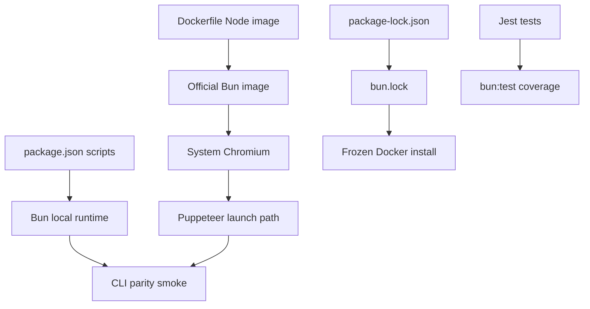

# refactor: Migrate Node runtime to Bun

## Summary

Migrate this CLI project from the current Node/npm runtime and lockfile model to Bun, including the Docker image, user-facing documentation, and test runner. The plan keeps downloader behavior unchanged and treats Puppeteer, Chromium, sharp, and Bun test coverage as the main verification gates.

---

## Problem Frame

The repository currently runs through Node/npm locally and inside Docker, while the requested direction is to standardize on Bun. Because Docker is the easiest path for end users to run this downloader reproducibly, the runtime change needs to cover both local scripts and the container image rather than only replacing one command.

---

## Assumptions

*This plan was authored without synchronous user confirmation. The items below are agent inferences that fill gaps in the input -- un-validated bets that should be reviewed before implementation proceeds.*

- The goal is to replace Node/npm as the default project runtime and package manager, not merely add Bun as an optional alternative.
- Existing downloader behavior, URL support, config semantics, output paths, and legal/ethical README positioning should stay unchanged.
- Docker should remain a first-class supported run path through the existing local image wrapper.
- A Debian-based Bun image is preferable to an Alpine-based Bun image unless implementation proves Alpine works reliably with Chromium and sharp.
- Existing Jest tests should be ported to Bun's test runner rather than kept on Jest compatibility paths.

---

## Requirements

- R1. Replace npm lockfile/install workflow with Bun's lockfile/install workflow for reproducible dependency installation.
- R2. Make local CLI scripts run through Bun by default without changing accepted CLI arguments or downloader behavior.
- R3. Make the Docker image build and run through Bun, including system Chromium support for Puppeteer.
- R4. Preserve compatibility for native/browser-sensitive dependencies, especially `puppeteer` and `sharp`.
- R5. Port existing Jest test coverage to Bun's test runner and keep lint workflows usable after the runtime migration.
- R6. Update repository documentation and ignore rules so contributors follow the Bun workflow.

---

## Scope Boundaries

- Do not change downloader logic, supported URL patterns, config keys, output directory semantics, or legal/ethical policy text beyond runtime command references.
- Do not introduce a new CLI framework or package the app as an installed binary in this migration.
- Do not add CI workflows unless a workflow already exists or implementation discovers one hidden outside the initial file scan.
- Do not optimize Docker image size beyond choosing a reliable Bun base image and preserving production dependency install semantics.

### Deferred to Follow-Up Work

- Publishing as a Bun-powered standalone executable: future enhancement after runtime parity is proven.
- Multi-arch Docker build hardening: future enhancement if users need published amd64/arm64 images.
- Capturing migration-specific learnings under `docs/solutions/`: follow-up after implementation verifies the actual Bun/Puppeteer/sharp behavior.

---

## Context & Research

### Relevant Code and Patterns

- `package.json` defines Node/npm scripts today: `start` runs `node run.js`, tests run Jest through Node's experimental VM modules, and lint runs ESLint.
- `package-lock.json` is the current committed npm lockfile; no `bun.lock` or `bun.lockb` exists yet.
- `Dockerfile` currently uses `node:22-alpine`, installs Alpine Chromium packages, runs `npm ci --omit=dev`, and starts with `node run.js`.
- `docker-download.sh` builds `scribd-dl:local`, mounts `output`, and runs the Docker image with the URL argument. It should keep working without needing Bun on the host.
- `run.js` is the CLI entry point and `src/App.js` dispatches supported URLs to downloader services.
- `src/utils/request/PuppeteerSg.js` is the highest-risk runtime integration because it uses Puppeteer, system Chromium, environment variables, and process lifecycle hooks.
- `test/ConfigLoader.test.js` is the currently visible test coverage; it validates config loading and should remain passing under the chosen test path.
- `README.md` documents Node/npm prerequisites, badges, setup, and usage commands that must be updated.

### Institutional Learnings

- No `docs/solutions/` directory or migration-specific institutional learning was found.
- `README.md` is the main local documentation source and currently encodes the Node/npm workflow.

### External References

- Bun lockfile docs: `https://bun.com/docs/pm/lockfile`
- Bun install docs: `https://bun.com/docs/pm/cli/install`
- Bun Docker guide: `https://bun.com/docs/guides/ecosystem/docker`
- Bun run docs: `https://bun.com/docs/cli/run`
- Bun test docs: `https://bun.com/docs/cli/test`
- Puppeteer Docker/troubleshooting docs: `https://pptr.dev/guides/docker`, `https://pptr.dev/troubleshooting`
- sharp install docs: `https://sharp.pixelplumbing.com/install`

---

## Key Technical Decisions

- Use `bun.lock` as the committed lockfile: Bun 1.2+ uses a text lockfile, which is reviewable and is the current reproducibility path.
- Remove `package-lock.json` only after `bun.lock` is generated and frozen Bun install works: this avoids losing the only reproducible dependency snapshot before proving the replacement.
- Prefer a Debian-based official Bun Docker image over Alpine: Chromium and sharp are less risky on glibc/Debian than on musl/Alpine, and Puppeteer documents Alpine Chrome compatibility as a special-case path.
- Keep host Docker usage independent from host Bun: `docker-download.sh` should continue requiring only Docker on the host because the image contains Bun.
- Port tests to Bun's test runner instead of retaining Jest: this removes the current Node-specific Jest invocation and makes tests part of the Bun migration rather than a compatibility exception.
- Keep Puppeteer system Chromium configuration explicit in Docker: the current image intentionally skips browser download and points Puppeteer at packaged Chromium, which should remain visible rather than implicit.

---

## Open Questions

### Resolved During Planning

- Should Docker be migrated too? Yes, the user explicitly said Docker should switch as well.
- Is this a feature or refactor? Refactor, because the intended external downloader behavior should not change.
- Does external research matter? Yes, because Bun + Docker + Puppeteer + sharp crosses package manager, native dependency, and browser runtime compatibility surfaces.

### Deferred to Implementation

- Exact Bun version to pin in `packageManager`: choose after checking the installed/local Bun version or a team-preferred version during implementation.
- Whether `bun install --frozen-lockfile --production` is safe for this dependency graph: verify because `sharp` can be sensitive to optional/platform dependency handling.
- Exact assertion/import adjustments needed for `bun:test`: defer to implementation while preserving the current config loader coverage.
- Whether the Debian Chromium package path differs from `/usr/bin/chromium-browser`: verify during Docker implementation and update the env var accordingly.

---

## High-Level Technical Design

> *This illustrates the intended approach and is directional guidance for review, not implementation specification. The implementing agent should treat it as context, not code to reproduce.*

---

## Implementation Units

- U1. **Adopt Bun lockfile and scripts**

**Goal:** Make Bun the default local package manager and runtime entry point while keeping CLI arguments and dependency declarations intact.

**Requirements:** R1, R2, R5

**Dependencies:** None

**Files:**
- Modify: `package.json`
- Delete: `package-lock.json`
- Create: `bun.lock`
- Test: `test/ConfigLoader.test.js`

**Approach:**
- Add a Bun `packageManager` declaration once the target Bun version is chosen.
- Replace Node-specific script invocations with Bun-compatible script invocations.
- Generate `bun.lock` from the existing dependency graph before removing the npm lockfile.
- Preserve the existing dependency list unless Bun install reveals a package-specific compatibility requirement.
- Port the existing config test to Bun's test runner with equivalent assertions.

**Execution note:** Start by preserving the existing test expectations, then change the runtime scripts so test failures identify compatibility issues rather than behavior changes.

**Patterns to follow:**
- `package.json` as the single source of project scripts.
- `test/ConfigLoader.test.js` as the current minimal regression test surface.

**Test scenarios:**
- Happy path: installing dependencies from `bun.lock` with frozen lockfile semantics succeeds without modifying the lockfile.
- Happy path: running the start script with a supported URL still passes the URL argument through to `run.js`.
- Happy path: the existing config loader test still reports `DIRECTORY.output` as `output`.
- Error path: the existing config loader test still throws `TypeError` for unknown section and unknown key lookups.
- Integration: importing the runtime dependency graph through Bun does not fail on ESM module loading before CLI argument validation.

**Verification:**
- Bun is the documented/default local package manager.
- The committed lockfile is Bun's lockfile, not npm's lockfile.
- Current test coverage is ported to Bun's test runner and passing.

---

- U2. **Migrate Docker runtime to Bun**

**Goal:** Build and run the container through Bun while preserving system Chromium support for Puppeteer and the existing URL argument interface.

**Requirements:** R2, R3, R4

**Dependencies:** U1

**Files:**
- Modify: `Dockerfile`
- Modify: `docker-download.sh`
- Test: `Dockerfile`

**Approach:**
- Replace the Node base image with an official Bun image, favoring a Debian variant for browser and native package reliability.
- Replace npm install with frozen Bun install semantics using the committed Bun lockfile.
- Preserve production-only dependency intent, but verify whether `sharp` requires avoiding an install mode that omits optional/platform dependencies.
- Keep `PUPPETEER_SKIP_DOWNLOAD`, `PUPPETEER_EXECUTABLE_PATH`, and `CI` explicit, adjusting only the Chromium binary path if the Debian package differs.
- Replace the Node entrypoint with a Bun entrypoint that forwards the URL argument to the same CLI entry file or package script.
- Keep `docker-download.sh` image naming, output mount, and URL forwarding stable unless the image interface changes unexpectedly.

**Patterns to follow:**
- Existing `Dockerfile` environment-variable approach for Puppeteer.
- Existing `docker-download.sh` build-and-run wrapper shape.

**Test scenarios:**
- Happy path: Docker build completes from a clean context using the committed Bun lockfile.
- Happy path: Docker run with a supported URL passes the URL into the same application entry flow as local execution.
- Integration: Puppeteer launches the system Chromium binary inside the container without attempting to download a bundled browser.
- Integration: `sharp` imports and can execute a minimal image-processing path inside the built image.
- Error path: Docker run without a URL still fails through the application's existing argument validation path rather than a missing runtime binary.

**Verification:**
- The built image no longer depends on Node/npm commands for install or execution.
- The wrapper still works for users with Docker only.
- Browser/native dependency smoke checks pass in the container.

---

- U3. **Align ignore rules and documentation**

**Goal:** Update contributor-facing docs and repository hygiene so the Bun workflow is discoverable and stale npm/Node instructions do not persist.

**Requirements:** R1, R2, R3, R6

**Dependencies:** U1, U2

**Files:**
- Modify: `README.md`
- Modify: `.gitignore`
- Modify: `.dockerignore`

**Approach:**
- Replace Node/npm badges, prerequisites, setup, and usage examples with Bun equivalents.
- Keep Docker usage documented as an alternative path for users who do not want local Bun setup.
- Add Bun-specific generated artifacts to ignore rules only when they are not supposed to be committed; do not ignore `bun.lock`.
- Preserve README legal/ethical sections unchanged except where runtime command examples require edits.

**Patterns to follow:**
- Existing README section ordering and concise command examples.
- Existing ignore style in `.gitignore` and `.dockerignore`.

**Test scenarios:**
- Test expectation: none -- documentation and ignore-rule updates do not introduce runtime behavior, but they must be reviewed against the actual scripts and generated files from U1/U2.

**Verification:**
- README commands match the implemented Bun scripts and Docker wrapper.
- Ignore rules do not accidentally exclude `bun.lock` or include stale npm-only artifacts as the primary workflow.

---

- U4. **Verify compatibility gates and document residual risks**

**Goal:** Prove the migration did not break core runtime surfaces and capture any remaining Bun-specific caveats for follow-up.

**Requirements:** R4, R5, R6

**Dependencies:** U1, U2, U3

**Files:**
- Modify: `README.md`
- Test: `test/ConfigLoader.test.js`
- Test: `Dockerfile`

**Approach:**
- Run local test, lint, and CLI smoke coverage through the new Bun scripts.
- Run Docker build and container smoke coverage, including Chromium launch and a minimal supported URL path where legally/ethically appropriate.
- If a compatibility caveat remains, document it in README rather than hiding it behind a passing narrow test.
- If implementation discovers a non-obvious Bun/Puppeteer/sharp workaround, defer a `docs/solutions/` learning capture to follow-up rather than expanding this migration.

**Execution note:** Use characterization-first verification for downloader behavior: establish that the same inputs reach the same downloader paths before changing or debugging business logic.

**Patterns to follow:**
- Existing README disclaimer that users must only download content they are authorized to access.
- Existing `docker-download.sh` as the user-facing Docker smoke path.

**Test scenarios:**
- Happy path: local Bun test workflow passes the existing config loader tests.
- Happy path: lint workflow remains runnable under the Bun-managed dependency tree.
- Integration: local Bun CLI invocation reaches the same app dispatch path for each supported URL family: Scribd, SlideShare, and Everand.
- Integration: Docker wrapper builds the image, mounts `output`, and forwards the URL argument to the Bun entrypoint.
- Error path: unsupported or missing URLs still fail with existing application-level behavior rather than Bun/Docker runtime errors.

**Verification:**
- Local and Docker verification cover package install, tests, CLI startup, Puppeteer/Chromium, and sharp.
- Any limitations discovered during migration are visible in docs or deferred follow-up notes.

---

## System-Wide Impact

- **Interaction graph:** `package.json` scripts, `run.js`, Docker entrypoint, `docker-download.sh`, and README examples all need to agree on the same CLI entry path.
- **Error propagation:** Runtime failures should surface as Bun/Docker compatibility errors during verification, while application input errors should remain application-level errors.
- **State lifecycle risks:** Puppeteer child processes and Chromium cleanup remain the main lifecycle risk; the migration should not introduce zombie browser processes or browser download side effects.
- **API surface parity:** CLI URL argument behavior and Docker wrapper environment variables should remain stable.
- **Integration coverage:** Unit tests alone are insufficient; Docker and Puppeteer/sharp smoke checks are required because those dependencies cross runtime, OS package, and native binary boundaries.
- **Unchanged invariants:** Supported URL families, config keys, output directory behavior, and legal/ethical usage policy remain unchanged.

---

## Risks & Dependencies

| Risk | Mitigation |
|------|------------|
| Bun's production install mode omits optional/platform dependencies needed by `sharp` | Verify `sharp` inside Docker and switch install flags only if needed while preserving dev dependency omission. |
| Chromium package path differs between Alpine and Debian images | Verify the binary path during Docker implementation and update `PUPPETEER_EXECUTABLE_PATH` accordingly. |
| Jest invocation is Node-specific today | Port the small existing suite to Bun's test runner with equivalent coverage. |
| Bun ESM compatibility differs from Node in a downloader module | Use CLI import/startup smoke checks before deeper downloader smoke tests to isolate module-loading problems. |
| Docker image grows when moving from Alpine to Debian | Accept size growth initially in favor of reliability; optimize only after runtime parity is proven. |

---

## Documentation / Operational Notes

- README should clearly state Bun as the local prerequisite and Docker as an alternative that does not require host Bun.
- Docker documentation should keep the output mount behavior visible so users know where downloaded files are written.
- If exact Bun version pinning is added to `package.json`, README prerequisites should match that version policy.
- Any Bun-specific caveat for Puppeteer, Chromium, or sharp should be documented near setup or Docker usage, not buried in implementation comments.

---

## Sources & References

- Related code: `package.json`
- Related code: `Dockerfile`
- Related code: `docker-download.sh`
- Related code: `src/utils/request/PuppeteerSg.js`
- Related tests: `test/ConfigLoader.test.js`
- Related docs: `README.md`
- External docs: `https://bun.com/docs/pm/lockfile`
- External docs: `https://bun.com/docs/pm/cli/install`
- External docs: `https://bun.com/docs/guides/ecosystem/docker`
- External docs: `https://bun.com/docs/cli/run`
- External docs: `https://bun.com/docs/cli/test`
- External docs: `https://pptr.dev/guides/docker`
- External docs: `https://pptr.dev/troubleshooting`
- External docs: `https://sharp.pixelplumbing.com/install`
