# feat: Bun executable with Chromium auto-installer

## Summary

Package `scribd-dl` as a single-file Bun executable (`bun build --compile`) for macOS arm64 so it can be shared with non-technical friends as one download. On first run the binary auto-installs Chromium into a user-local cache via `@puppeteer/browsers`, with a progress bar. CLI behavior (`<url-or-file>` arg, batch mode, `config.ini` overrides) is preserved. Output defaults to `~/Downloads/scribd-dl/`. Config defaults are baked into the code; `~/.config/scribd-dl/config.ini` is an optional override.

Tauri GUI work (`docs/brainstorms/2026-06-09-tauri-app-requirements.md`) is a separate track and not addressed here. Playwright migration is explicitly deferred.

---

## Problem Frame

The current distribution model is "clone repo, `bun install`, `bun start <url>`" — fine for the author, useless for non-technical friends. Shipping a single executable removes the toolchain barrier, but two things break in a compiled artifact:

1. `puppeteer` bundles Chromium at `bun install` time and stores it in `node_modules/.cache`. That cache isn't portable into a `--compile` binary, and end users wouldn't have `node_modules` anyway.
2. `ConfigLoader.js` reads `config.ini` as a relative path at module-load time. In an executable launched from anywhere, this fails because `cwd` ≠ binary location.

The plan addresses both, plus adds a friendly first-run experience (Chromium download with progress) and choose-once defaults that work without an `ini` file.

---

## Requirements

- **R1.** Produce a single-file macOS arm64 executable via `bun build --compile`.
- **R2.** On first launch with no cached Chromium, download it via `@puppeteer/browsers` with a visible progress bar, then proceed with the requested download.
- **R3.** On subsequent launches with cached Chromium, start immediately (no network call, no banner).
- **R4.** Preserve all existing CLI behavior: single URL, batch file, exit codes, progress bar per document.
- **R5.** Default output to `~/Downloads/scribd-dl/`. Allow override via `~/.config/scribd-dl/config.ini` `[DIRECTORY] output=`.
- **R6.** Default config values are baked into the code; the binary runs correctly with no ini file present.
- **R7.** Binary is ad-hoc codesigned to avoid `Killed: 9` on Apple Silicon.
- **R8.** README documents two distribution paths (curl vs browser download) and quarantine handling.

---

## Key Technical Decisions

### KTD1. `puppeteer` → `puppeteer-core` + `@puppeteer/browsers`

`puppeteer` bundles Chromium at install time, which is the wrong shape for an executable that ships to users without `node_modules`. `puppeteer-core` is the same API surface without the bundled browser. `@puppeteer/browsers` is the official, supported API for installing and resolving browser binaries at runtime — same package powers `puppeteer`'s own install script.

Pin a specific `buildId` (Chrome stable revision known to work) so behavior is reproducible across users and across binary releases. Bumping the pin is a deliberate update.

### KTD2. Chromium cache lives in `~/.cache/scribd-dl/chromium/`

Not the default Puppeteer cache (`~/.cache/puppeteer/`) — keeping it scoped avoids conflicts with any host-installed Puppeteer and makes uninstall trivial (delete one directory). Path resolved via `os.homedir()` so it works regardless of where the binary is invoked from.

### KTD3. Config defaults in code, ini as optional override

Three-layer resolution at startup, first hit wins:
1. Hard-coded defaults in a new `defaults.js` module
2. `~/.config/scribd-dl/config.ini` if present (XDG-style user config)
3. `config.ini` next to `process.execPath` if present (dev convenience — current dev workflow keeps working)

`ConfigLoader.js` is rewritten to lazy-load and merge these layers instead of reading a hardcoded relative path at module-load time. Module-load-time file reads are incompatible with `--compile` semantics and need to go regardless.

### KTD4. Output default = `~/Downloads/scribd-dl/`

`~/Downloads/` is the universally discoverable folder for non-technical users. A `scribd-dl/` subfolder avoids polluting the root. Overridable via ini.

### KTD5. Single-platform release (macOS arm64) for v1

Apple Silicon only. Other targets (mac-x64, linux-x64, windows-x64) are trivial to add later (`bun build --target=...`) but each adds testing surface. Ship narrow, expand if friends ask.

### KTD6. Build is manual, no CI yet

`bun run build` produces the artifact + ad-hoc signs it. GitHub Actions / Releases automation deferred until release cadence justifies it.

### KTD7. Playwright migration explicitly deferred

Step 2 from the discussion. Re-evaluate after v1 ships and we see whether 170MB first-run download is a real pain point for friends.

---

## High-Level Technical Design

First-run vs. cached-run flow:

```mermaid
flowchart TD
    A[Binary launched] --> B[run.js parses argv]
    B --> C[chromiumInstaller.ensure&#40;&#41;]
    C --> D{Chromium at<br/>~/.cache/scribd-dl/<br/>chromium/?}
    D -->|yes| E[Return executablePath]
    D -->|no| F[Print: 'Installing Chromium ~170MB, one-time setup…']
    F --> G[&commat;puppeteer/browsers install<br/>with cli-progress bar]
    G --> E
    E --> H[app.execute / app.executeBatch]
    H --> I[puppeteerSg.launch&#40;&#41; with<br/>executablePath from installer]
    I --> J[Existing download pipeline]
```



Config resolution (called once at startup, cached by `ConfigLoader` singleton):

```mermaid
flowchart LR
    A[configLoader.load&#40;section, key&#41;] --> B[Load defaults from code]
    B --> C{~/.config/<br/>scribd-dl/<br/>config.ini?}
    C -->|yes| D[Parse + merge over defaults]
    C -->|no| E[Skip]
    D --> F{config.ini next<br/>to execPath?}
    E --> F
    F -->|yes| G[Parse + merge]
    F -->|no| H[Skip]
    G --> I[Return merged value]
    H --> I
```



This is directional — exact merge semantics and error handling per implementation unit below.

---

## Implementation Units

### U1. Switch puppeteer dependency to puppeteer-core + @puppeteer/browsers

**Goal:** Remove the Chromium-at-install-time behavior and gain runtime browser installation API.

**Requirements:** R1, R2

**Dependencies:** none

**Files:**
- `package.json` — swap `puppeteer` for `puppeteer-core` and add `@puppeteer/browsers`
- `src/utils/request/PuppeteerSg.js` — change import only in this unit; install wiring is U3

**Approach:**
- Use the latest stable `puppeteer-core` and `@puppeteer/browsers` major. Run `bun install` to update `bun.lock`.
- Existing `puppeteer.launch()` call still works identically against `puppeteer-core` — the API is the same; only the bundled-browser behavior differs. No code logic changes in this unit.
- After this unit lands, `bun start <url>` will **fail at launch** because no Chromium is resolved. That's expected — U2 and U3 fix it. Keep this unit small; do not try to make the app runnable mid-migration.

**Patterns to follow:** existing dependency style in `package.json`; pinned to caret ranges.

**Test scenarios:**
- `bun test` still passes (no runtime change yet — tests mock `puppeteerSg`).
- `Test expectation: minimal -- dependency-swap unit. Full first-run/cached behavior is covered in U3 and U6.`

**Verification:** `bun install` succeeds; `node_modules/puppeteer` is gone; `node_modules/puppeteer-core` and `node_modules/@puppeteer/browsers` are present; tests green.

---

### U2. ChromiumInstaller singleton module

**Goal:** A reusable, idempotent `chromiumInstaller.ensure()` that returns the path to a working Chromium binary, downloading it once if needed.

**Requirements:** R2, R3

**Dependencies:** U1

**Files:**
- `src/utils/request/ChromiumInstaller.js` (new)
- `test/ChromiumInstaller.test.js` (new)

**Approach:**
- Follow the singleton pattern used in `src/utils/request/PuppeteerSg.js` and `src/utils/io/ConfigLoader.js` (`if (!Class.instance) Class.instance = this; return Class.instance`; exported lowercase instance).
- Constants module-local: `BROWSER = 'chrome'`, `BUILD_ID = '<pinned stable revision>'` (pick at implementation time from `@puppeteer/browsers` resolveBuildId for `stable`), `CACHE_DIR = path.join(os.homedir(), '.cache', 'scribd-dl', 'chromium')`.
- Public method `async ensure()`:
  1. Call `computeExecutablePath({ browser, buildId, cacheDir })` and check `existsSync()`. If present, return immediately. This is the hot path on second+ runs.
  2. If missing, print a one-line banner: `Installing Chromium (~170MB, one-time setup)…`.
  3. Create a `cli-progress` bar (mirror the style already used elsewhere in the codebase).
  4. Call `install({ browser, buildId, cacheDir, downloadProgressCallback: (downloaded, total) => bar.update(...) })`.
  5. Stop the bar, print a one-line `Chromium installed.` confirmation.
  6. Return the executable path.
- Network failure handling: let `install()` errors propagate with the original message — the binary is useless without Chromium and we don't want to swallow the cause. `run.js` will print the error and exit non-zero via existing top-level await behavior.

**Patterns to follow:** singleton instance pattern in `src/utils/request/PuppeteerSg.js`; `cli-progress` usage in downloader services (see `src/service/ScribdDownloader.js`).

**Test scenarios:**
- Happy path (cached): when `computeExecutablePath` returns an existing file, `ensure()` resolves with that path and does **not** call `install`. Use `spyOn` per the `test/App.test.js` mocking pattern.
- Happy path (uncached): when `computeExecutablePath` returns a non-existent path, `ensure()` calls `install` exactly once and resolves with the post-install path.
- Idempotence: calling `ensure()` twice in the same process triggers `install` at most once (singleton + caching). Memoize the resolved path on the instance.
- Install failure propagation: a thrown error from `install` is re-thrown by `ensure()` with the original message intact.
- Singleton identity: importing `chromiumInstaller` twice returns the same instance.

**Verification:** `bun test test/ChromiumInstaller.test.js` green; manual smoke test deferred to U6.

---

### U3. Wire installer into PuppeteerSg.launch()

**Goal:** Use the installer-resolved Chromium path when launching.

**Requirements:** R2, R3

**Dependencies:** U1, U2

**Files:**
- `src/utils/request/PuppeteerSg.js`
- `test/PuppeteerSg.test.js` (create if absent; otherwise update)

**Approach:**
- In `launch()`, before calling `puppeteer.launch(...)`, call `await chromiumInstaller.ensure()` to get the executable path.
- Pass that path as `executablePath` in the launch options.
- Preserve the existing `PUPPETEER_EXECUTABLE_PATH` env-var override — if set, skip `chromiumInstaller.ensure()` entirely and use the env value (useful for CI and dev with host Chrome).
- Sandbox/args logic stays as-is.

**Patterns to follow:** existing `launch()` structure in `src/utils/request/PuppeteerSg.js`; env-override pattern already present (`PUPPETEER_NO_SANDBOX`).

**Test scenarios:**
- `launch()` calls `chromiumInstaller.ensure()` and passes the returned path as `executablePath`. Mock both `chromiumInstaller` and `puppeteer.launch`.
- When `PUPPETEER_EXECUTABLE_PATH` is set, `chromiumInstaller.ensure()` is **not** called and the env value is passed through.
- Second `getPage()` call in the same process reuses the already-launched browser (existing behavior preserved).

**Verification:** unit tests green; `bun start <known-good-url>` end-to-end works in dev (uses installer path on a clean machine, env override in dev).

---

### U4. Config + output path resolution that works in a compiled binary

**Goal:** Replace the module-load-time relative `config.ini` read with a lazy, layered resolver. Default output to `~/Downloads/scribd-dl/`.

**Requirements:** R4, R5, R6

**Dependencies:** none (parallel-safe with U1–U3)

**Files:**
- `src/utils/io/ConfigLoader.js` — rewrite
- `src/utils/io/defaults.js` (new) — hard-coded default config object
- `test/ConfigLoader.test.js` (create if absent; otherwise update)
- `config.ini` — keep in repo as a dev convenience reference; document in README that the binary ignores it unless placed next to `execPath` or at `~/.config/scribd-dl/config.ini`

**Approach:**
- `defaults.js` exports a plain object mirroring the current ini shape:
  ```text
  SCRIBD: { rendertime: 100 }
  SLIDESHARE: { rendertime: 100 }
  DIRECTORY: { output: '~/Downloads/scribd-dl', filename: 'title' }
  ```
  Resolve `~` to `os.homedir()` once at load time. Keep this directional — exact key list mirrors what `configLoader.load(...)` is called with across the codebase. Grep for `configLoader.load(` to enumerate before writing defaults.
- `ConfigLoader` becomes lazy: defer all file reads until first `load()` call. Cache the merged result on the instance.
- Lookup order (first hit wins per key, NOT per file — merging is shallow over the defaults):
  1. `~/.config/scribd-dl/config.ini` if readable
  2. `path.join(path.dirname(process.execPath), 'config.ini')` if readable
  3. Defaults from `defaults.js`
- Missing file at a layer is not an error — just skip. Malformed ini at a layer is an error (throw with the path).
- Update `App.js` / wherever `[DIRECTORY] output=` is consumed: the value should pass through `path.resolve()` and any `~` expansion. Confirm during implementation that no caller assumes a relative path.

**Patterns to follow:** singleton + lowercase export per `src/utils/io/ConfigLoader.js`; `ini` package already a dep.

**Test scenarios:**
- No ini files anywhere → returns defaults (output path is `~/Downloads/scribd-dl`).
- Only `~/.config/scribd-dl/config.ini` present with `[DIRECTORY] output=/tmp/foo` → returns `/tmp/foo` for that key, defaults for others.
- Only `execPath`-adjacent `config.ini` present → same behavior with the execPath layer.
- Both present → `~/.config/scribd-dl/` wins for keys it defines; execPath fills gaps; defaults fill remaining gaps.
- `~` in ini value is expanded to `os.homedir()`.
- Malformed ini at any layer throws with the file path in the error message.
- Multiple `configLoader.load(...)` calls in the same process read each ini file at most once (lazy + cached).

**Verification:** `bun test test/ConfigLoader.test.js` green; running `bun start <url>` with no ini lands the output in `~/Downloads/scribd-dl/`.

---

### U5. First-run banner from run.js

**Goal:** Surface the installer step before any downloader logic runs, so a non-technical user sees what's happening on first launch.

**Requirements:** R2

**Dependencies:** U2

**Files:**
- `run.js`

**Approach:**
- Add `await chromiumInstaller.ensure()` as the **first** await in `run.js`, before the argv check. Rationale: even `--help` or a usage error benefits from having Chromium ready; and on first launch this gives the install its own moment instead of mixing it with download progress.
- Actually, keep the argv check first (it's synchronous and fast — bad usage shouldn't trigger a 170MB download). Order: argv validation → `chromiumInstaller.ensure()` → existing branch on `existsSync(arg)`.
- No banner logic in `run.js` itself — the installer module owns its banner. `run.js` just awaits.

**Patterns to follow:** existing top-level-await style in `run.js`.

**Test scenarios:**
- `Test expectation: integration -- behavior is exercised by U2's unit tests (installer) plus the U6 manual smoke test. Adding a unit test here would duplicate the installer mock setup.`

**Verification:** `bun start <url>` with cached Chromium starts instantly; deleting `~/.cache/scribd-dl/chromium/` and running again triggers the banner and progress bar.

---

### U6. Build script + ad-hoc codesign + README distribution section

**Goal:** A one-command build that produces a runnable, shareable `.app`-less binary.

**Requirements:** R1, R7, R8

**Dependencies:** U1, U2, U3, U4, U5

**Files:**
- `package.json` — add `build`, `build:sign` scripts
- `README.md` — add "Download the binary" section
- `.gitignore` — add `dist/`

**Approach:**
- Scripts:
  ```text
  build:        bun build ./run.js --compile --target=bun-darwin-arm64 --outfile dist/scribd-dl
  build:sign:   codesign --sign - --force dist/scribd-dl
  build:all:    bun run build && bun run build:sign
  ```
  `--force` on codesign is intentional — if Bun already ad-hoc signed during `--compile`, we re-sign without an error. Tested at implementation time on the actual artifact.
- Verify the resulting binary runs from a path it wasn't built at (e.g., `cp dist/scribd-dl /tmp/ && /tmp/scribd-dl <url>`) to catch any leftover relative-path assumptions.
- README section:
  - Where to download (GitHub release link — placeholder until first release)
  - Two install paths:
    - `curl -LO <url> && chmod +x scribd-dl && ./scribd-dl <url-or-file>` (no quarantine)
    - Browser download: `xattr -d com.apple.quarantine ./scribd-dl` once, then `chmod +x` and run
  - First-run note: «На первом запуске скачается Chromium (~170MB), это нормально».
  - Default output location (`~/Downloads/scribd-dl/`)
  - How to override config via `~/.config/scribd-dl/config.ini`

**Patterns to follow:** existing script style in `package.json` (Bun-native, no separate build tool).

**Test scenarios:**
- **Manual smoke test (no unit test):** delete `~/.cache/scribd-dl/`, run `dist/scribd-dl <known-good-scribd-url>` from `/tmp/` on the build machine. Expect: banner + progress bar + Chromium install + document downloads to `~/Downloads/scribd-dl/<title>.pdf`.
- **Second-run smoke test:** run again with the same URL. Expect: no banner, no progress bar, instant launch, file saved with `(1)` suffix or overwrite per existing behavior.
- **Binary size check:** record final `dist/scribd-dl` size in the PR — sanity check that it's ~80MB, not e.g. 800MB (would indicate `sharp` or another native dep bloating the bundle).
- **Apple Silicon launch:** confirm no `Killed: 9` after `codesign --sign -`.

**Verification:** smoke tests pass on the build machine; binary runs after being moved to a different directory; README renders correctly on GitHub.

---

## Scope Boundaries

### In scope

- macOS arm64 single-file executable
- Auto-install of Chromium with progress UI
- Config defaults in code + optional ini override
- Output default `~/Downloads/scribd-dl/`
- README distribution instructions
- Ad-hoc codesigning in build script

### Deferred to follow-up work

- **Playwright migration** (KTD7) — re-evaluate after v1 ships
- **Other build targets** (mac-x64, linux-x64, windows-x64) — trivial to add when needed
- **GitHub Actions release automation** — manual builds for now
- **Bundling Chromium into the binary** — would remove first-run download but ~200MB binary is its own problem; Playwright with system-Chrome fallback is a better path if first-run pain materializes
- **Auto-update mechanism** — out of scope; friends re-download for new versions

### Outside this work's identity

- **Tauri GUI app** — separate brainstorm at `docs/brainstorms/2026-06-09-tauri-app-requirements.md`, independent track
- **Full code signing + notarization** ($99/year Apple Developer) — overkill for personal sharing
- **Auto-watch clipboard, tray app, global hotkey** — Tauri-track concerns, not relevant here

---

## Risks & Mitigations

- **`@puppeteer/browsers` ABI/API drift between releases.** Pin both `puppeteer-core` and `@puppeteer/browsers` to the same major used by upstream `puppeteer` at the time of build. If they ever drift, the `install()` result might point to a Chromium that `puppeteer-core` can't drive. Mitigation: pin both deps; smoke test (U6) catches it.
- **`sharp` (native dep) bundling behavior under `bun build --compile`.** Bun's compile target supports prebuilt native modules but the artifact size and platform-binding need verification. Mitigation: U6 smoke test includes a copy-to-different-dir launch on a clean machine path; if `sharp` fails to load, fall back to evaluating alternatives (`bun:ffi`, removing `sharp` if unused, or accepting a larger binary).
- **`ConfigLoader` module-load file read is brittle in test environments too.** The current synchronous load at import time can fail if tests are run from a different cwd. U4's rewrite to lazy + layered lookup fixes this as a side effect — note it in the PR.
- **`~/.cache/scribd-dl/chromium/` permissions on shared machines.** A second user on the same machine downloading would re-download into their own homedir, which is fine; just call it out in README to avoid confusion.
- **First-run network failure leaves the binary half-installed.** `@puppeteer/browsers` install is atomic per its docs (writes to a temp dir, renames), so a failed install shouldn't leave a partial Chromium that `computeExecutablePath` would then find. Verify in U2 — if it doesn't, add explicit cleanup on install failure.

---

## Open Questions (defer to implementation)

- Exact `BUILD_ID` pin for Chromium stable — pick at implementation time from `@puppeteer/browsers resolveBuildId('chrome', 'stable')`. Record in `ChromiumInstaller.js` with a comment about how to bump.
- Whether `bun build --compile` already ad-hoc signs the artifact on arm64. Test at implementation time; if yes, drop the explicit `codesign` step. If no, keep it.
- Final binary size after `--compile`. If it's wildly larger than expected (>200MB), investigate which dep is responsible before shipping.
- Whether `~/.config/scribd-dl/config.ini` should be created on first run with example content, or left absent until the user explicitly creates it. Leaning **absent** (less file-system noise) but reconsider during U4.

---

## Sources & Research

- `docs/brainstorms/2026-06-09-tauri-app-requirements.md` — adjacent track (GUI), informed scope boundary
- `src/utils/request/PuppeteerSg.js`, `src/utils/io/ConfigLoader.js`, `run.js`, `config.ini`, `package.json` — current behavior reference
- `CLAUDE.md` — singleton pattern convention, ESM `.js` imports, runtime version
- `@puppeteer/browsers` — official runtime browser installer API used by `puppeteer` itself
- `bun build --compile` documentation — single-file executable mechanics and platform targets
