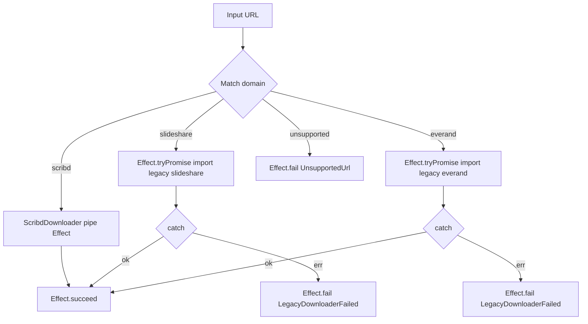

# refactor: Effect.ts structural rewrite — Scribd vertical

## Summary

Перевести `scribd-dl` с JS-синглтонов на TypeScript + Effect, по подходу "широкая первая вертикаль через Scribd". Все пять utils-модулей переписываются как Layer-сервисы; `ScribdDownloader`, `App`-роутер и entry-point — на Effect. `SlideshareDownloader.js` и `EverandDownloader.js` остаются на legacy JS и вызываются через `Effect.tryPromise` обёртку в роутере. Старые `.js`-файлы utils-модулей **сохраняются параллельно новым `.ts`** до второй фазы, так как legacy downloader'ы их импортируют. CLI-поведение (`bun start <url-or-file>`, batch summary, exit codes) сохраняется бит-в-бит.

Reliability hardening (`Schedule.retry`, exponential backoff, явные таймауты, глубокие иерархии ошибок) не входит в скоуп — felt pain отсутствует. Tauri- и Bun-exec треки ждут после landing этой работы (see origin: `docs/brainstorms/2026-06-09-effect-ts-rewrite-requirements.md`).

---

## Problem Frame

Текущий код — JS+ESM с singleton-инстансами utils (`if (!Class.instance) Class.instance = this`), module-load-time `fs.readFileSync("config.ini")`, ручным `process.on("exit")` cleanup в `PuppeteerSg`, и `spyOn(singleton, "method")` тестами. Архитектура работает; реальных инцидентов нет.

В очереди два user-facing трека (Tauri-GUI и Bun-executable), оба расширяют поверхность downloader-слоя. Перед их началом нужна структурная база, в которой:
- DI работает через Layer вместо синглтон-импортов
- Cleanup ресурсов (`PuppeteerSg.browser`) гарантирован через `Scope`, а не best-effort `process.on("exit")`
- Конфиг читается lazy через `Config` (что устраняет module-load file-read brittleness, попутно решая Bun-exec U4 без изменений на нашей стороне)
- Тесты подменяют сервисы через `Layer.succeed`, а не через `spyOn`

Эта работа — упреждающий refactor "на вырост", не реакция на боль. Готовая Layer/error/Schema форма валидируется на одной вертикали (Scribd), затем во **второй фазе** (отдельный трек, не часть этого плана) копируется на slideshare/everand.

---

## Requirements

Трассируется к origin requirements doc.

- **R1.** Полный переход репо на TypeScript: `.js` файлы первой вертикали мигрируют в `.ts` со strict `tsconfig.json` (`strict: true`, `exactOptionalPropertyTypes: true`). Файлы legacy downloader'ов (slideshare/everand) и legacy utils-файлов остаются `.js`.
- **R2.** Все пять utils (`PuppeteerSg`, `PdfGenerator`, `ConfigLoader`, `DirectoryIo`, `UrlListReader`) переписаны как Effect Layer-сервисы рядом со старыми `.js` версиями.
- **R3.** `ScribdDownloader` переписан как Effect, потребляющий все пять Layer-сервисов через DI.
- **R4.** `App`-роутер на Effect: scribd-URL — Effect-цепочка через новые Layer; slideshare/everand — `Effect.tryPromise(() => import('./service/Slideshare|EverandDownloader.js').then(m => m.{singleton}.execute(url)))`.
- **R5.** Entry-point `run.ts` использует `@effect/cli` для парсинга единственного позиционного аргумента (URL или путь к файлу).
- **R6.** `PuppeteerSg` использует `Effect.acquireRelease` для browser launch/close — текущий `process.on("exit")` cleanup уходит.
- **R7.** `ConfigLoader` использует Effect `Config` для lazy lookup. На этой фазе читает только текущий `config.ini` в `cwd`; форма принимает layered lookup без переписки.
- **R8.** Базовые tagged errors (Schema-tagged, один уровень) на доменных границах. Стартовый набор — см. KTD1; точный список уточняется при реализации.
- **R9.** Тесты переписываются на `Layer.test` с mock-Layer для unit-coverage. Реальный Chromium в тестах не используется. Smoke validation — ручной прогон.
- **R10.** CLI-поведение сохраняется бит-в-бит: `bun start <url>` и `bun start <file>` производят те же артефакты с теми же exit codes; batch summary формат сохраняется; `cli-progress` бары на месте.
- **R11.** `bun test`, `bun run lint`, `bun run format:check` зелёные на смешанной `.ts`/`.js` кодовой базе.

---

## Key Technical Decisions

### KTD1. Tagged errors через `Data.TaggedError` — один уровень, узкий набор

Стартовый набор:
- `BrowserLaunchFailed` — `PuppeteerSg.launch()` падение
- `PageLoadFailed` — `page.goto()` / network до Scribd
- `PageProcessFailed` — `page.evaluate(...)` падение в `processPage`
- `PdfGenerationFailed` — `page.pdf(...)` или `pdf-lib` ошибка
- `PdfMergeFailed` — `pdfGenerator.merge(...)` падение
- `ConfigInvalid` — `Config` lookup / Schema validation падение
- `DirectoryIoFailed` — `mkdir`/`rm` падение
- `UrlListUnreadable` — `Bun.file(path).text()` падение
- `UnsupportedUrl` — роутер не нашёл match
- `LegacyDownloaderFailed` — wrap для `Effect.tryPromise` ошибок slideshare/everand

Без иерархий, без discriminated unions глубже одного уровня. Если при реализации выясняется, что какие-то ошибки сливаются (например, `PdfGenerationFailed` и `PdfMergeFailed`) — сливаем. Список — рабочая гипотеза.

### KTD2. `Scope`-based browser lifecycle в `PuppeteerSg`

`PuppeteerSg.launch` оборачивается в `Effect.acquireRelease`:

```text
const acquire = Effect.tryPromise({ try: () => puppeteer.launch(...), catch: BrowserLaunchFailed })
const release = (browser) => Effect.promise(() => browser.close())
const browser = Effect.acquireRelease(acquire, release)
```

Текущий `process.on("exit", () => this.close())` удаляется. Scope сам гарантирует cleanup при выходе из `Effect.scoped` блока, включая cancellation/interrupt сценарии (это сильнее текущего `process.on("exit")`, который не await'ит promise).

В первой вертикали singleton-`PuppeteerSg.js` физически **остаётся** для legacy downloader'ов — они продолжат launches/closes своим способом. Coexistence не конфликтует, так как только один из путей активен в любой момент (роутер вызывает либо Effect-pipe для Scribd, либо `Effect.tryPromise` для legacy — не параллельно).

### KTD3. `ConfigLoader` через Effect `Config` + Schema

Текущий module-load-time `fs.readFileSync("config.ini")` заменяется на:

```text
const ConfigSchema = Schema.Struct({
  SCRIBD: Schema.Struct({ rendertime: Schema.NumberFromString }),
  SLIDESHARE: Schema.Struct({ rendertime: Schema.NumberFromString }),
  DIRECTORY: Schema.Struct({ output: Schema.String, filename: Schema.String })
})

const live = Layer.effect(ConfigLoader, Effect.gen(...))
```

Lookup на этой фазе — единственный источник `path.join(cwd, "config.ini")`. Форма (Layered `Config`) принимает второй источник (`~/.config/scribd-dl/config.ini`) и третий (execPath-adjacent) без изменений в потребителях — Bun-exec U4 добавит эти источники в `ConfigLoaderLive` без переписки `ScribdDownloader.ts`.

### KTD4. `@effect/cli` для entry в `run.ts`

Подтверждено в Phase 5.1.5 синтезе. `@effect/cli` `Args.text` + ручная ветка через `Effect.flatMap` на `existsSync(arg)`. Выгода — bundled help/usage и понятная форма Effect-CLI, готовая принять флаги (`--config`, `--output`) во второй фазе или Bun-exec треке без переписки entry.

Cost: одна дополнительная dependency (`@effect/cli`, `@effect/platform`, `@effect/platform-bun`).

### KTD5. `Layer.test` mock-at-boundary для тестов; реальный Chromium только в ручном smoke

Подтверждено в Phase 5.1.5. Unit-тесты подменяют Layer через `Layer.succeed(PuppeteerSg, MockPuppeteerSg)`. Это даёт детерминизм, скорость, и не требует Chromium в test environment.

Integration validation — ручной smoke: запуск `bun start <real-scribd-url>` на 2–3 URL разных размеров, сравнение PDF с baseline. Без CI integration testing на этой фазе.

### KTD6. Старые `.js` utils-файлы НЕ удаляются в этом плане

`SlideshareDownloader.js` и `EverandDownloader.js` на module-load делают `configLoader.load("DIRECTORY", "output")` через старый `configLoader.js`. Удаление старых `.js` utils-файлов сломает их.

**Правило:** в этом плане старые `.js`-файлы utils сохраняются. Они удаляются во **второй фазе** (отдельный трек) после миграции slideshare/everand на Effect. Финальный cleanup в U12 — удаляем только те `.js`-файлы, на которые не осталось ни одного импорта.

### KTD7. Структура папок и расположение типов

Сохраняем текущую структуру `src/` (`service/`, `utils/io/`, `utils/request/`, `const/`, `object/`). Новые `.ts` файлы — siblings к существующим `.js`.

Общие типы (`DocumentMeta`, `PageDimensions`) — в `src/types/` (новая папка). Типы Effect-сервисов (Service tag, interface) — co-located с реализацией: `PuppeteerSg.ts` экспортирует и `PuppeteerSg` (Service tag), и `PuppeteerSgLive` (Layer).

Реорганизация в feature-based структуру (`scribd/`, `core/`) откладывается до второй фазы.

### KTD8. `cli-progress` остаётся, оборачивается в `Effect.sync`

Не выбрасываем, не заменяем на Effect-нативные прогресс-механизмы (`@effect/cli` имеет свои, но это лишний скоуп). Существующий `cli-progress.SingleBar` оборачивается в side-effect блоки: `Effect.sync(() => bar.start(...))`, `Effect.sync(() => bar.update(i))`. CLI output идентичен текущему.

---

## High-Level Technical Design

### Layer graph (целевая форма)

```mermaid
flowchart TD
    Main[run.ts Main Effect] --> CliArgs[/&commat;effect/cli Args/]
    Main --> AppLive

    AppLive[AppLive Layer] --> ScribdDownloaderLive
    AppLive --> DirectoryIoLive

    ScribdDownloaderLive[ScribdDownloaderLive] --> PuppeteerSgLive
    ScribdDownloaderLive --> PdfGeneratorLive
    ScribdDownloaderLive --> ConfigLoaderLive
    ScribdDownloaderLive --> DirectoryIoLive

    PuppeteerSgLive[PuppeteerSgLive Scope-based]
    PdfGeneratorLive[PdfGeneratorLive merge only]
    ConfigLoaderLive[ConfigLoaderLive Config plus Schema]
    DirectoryIoLive[DirectoryIoLive]
    UrlListReaderLive[UrlListReaderLive]

    AppLive --> UrlListReaderLive

    Legacy[Legacy Slideshare/Everand .js singletons] -.imported via Effect.tryPromise.-> AppLive
```

Это направляющая форма, не implementation spec. Точные сигнатуры Service tag и Layer composition уточняются при реализации.

### Router flow (App.ts)



### Batch flow (executeBatch)

Текущий императивный `for` цикл с `try/catch` заменяется на `Effect.forEach` с `{ mode: "either" }` (или эквивалентом — сохраняет behaviour "не падать на одной ошибке, агрегировать результаты"). Финальный summary вычисляется через `Effect.sync` на собранных Either-результатах.

---

## Output Structure

Файлы, создаваемые этим планом (старые `.js`-файлы остаются на местах, не показаны):

```text
scribd-dl/
├── run.ts                                   # entry, @effect/cli
├── tsconfig.json                            # strict
├── src/
│   ├── App.ts                               # Effect router with legacy interop
│   ├── types/
│   │   ├── DocumentMeta.ts                  # { title, id, pages }
│   │   └── PageDimensions.ts                # { width, height, id }
│   ├── errors/
│   │   └── DomainErrors.ts                  # All Data.TaggedError classes (KTD1)
│   ├── service/
│   │   └── ScribdDownloader.ts              # Effect-based, consumes Layers
│   ├── utils/
│   │   ├── io/
│   │   │   ├── ConfigLoader.ts              # Layer + Config + Schema
│   │   │   ├── DirectoryIo.ts               # Layer
│   │   │   ├── PdfGenerator.ts              # Layer, merge only
│   │   │   └── UrlListReader.ts             # Layer
│   │   └── request/
│   │       └── PuppeteerSg.ts               # Layer with Scope
└── test/
    ├── ConfigLoader.test.ts                 # Layer.test
    ├── DirectoryIo.test.ts                  # Layer.test
    ├── PdfGenerator.test.ts                 # Layer.test, merge only
    ├── PuppeteerSg.test.ts                  # Layer.test, mock puppeteer
    ├── UrlListReader.test.ts                # Layer.test
    ├── ScribdDownloader.test.ts             # Layer.test
    └── App.test.ts                          # Layer.test, including legacy interop
```

Это scope declaration. Имплементер может скорректировать layout (например, `errors/` объединить в `types/` если они мелкие).

---

## Implementation Units

Сгруппированы в четыре фазы. Внутри фазы — топологический dependency-порядок.

### Phase A — TypeScript foundation

### U1. TypeScript setup (tsconfig, @types/bun, dual JS/TS support)

**Goal:** Бун запускает смешанную `.ts`/`.js` кодовую базу; `oxlint` и `oxfmt` обрабатывают `.ts` файлы; `bun test` зелёный без изменений в существующих `.js` тестах.

**Requirements:** R1, R11

**Dependencies:** none

**Files:**
- `tsconfig.json` (new) — strict TypeScript конфиг
- `package.json` — добавить `@types/bun` в `devDependencies`; обновить скрипты `lint`, `format` чтобы включали `.ts` glob (например, `oxlint run.js run.ts src test`)
- `.gitignore` — добавить `*.tsbuildinfo`, `*.d.ts.map` (если применимо)

**Approach:**
- `tsconfig.json` со strict настройками: `"strict": true`, `"exactOptionalPropertyTypes": true`, `"module": "esnext"`, `"moduleResolution": "bundler"`, `"target": "esnext"`, `"verbatimModuleSyntax": true`, `"allowImportingTsExtensions": false`, `"noEmit": true`, `"isolatedModules": true`.
- `include`: `["run.ts", "src/**/*.ts", "test/**/*.ts"]`. JS-файлы намеренно НЕ включены — TS-проверка только для новых TS-файлов; легаси-JS обрабатывается Bun runtime без типизации.
- Проверить, что `oxlint` и `oxfmt` корректно работают на `.ts` (запустить с пустой `.ts` файлом).
- Скрипты в `package.json`: дополнить glob паттерны явно. `bun test` и `bun start` уже работают с `.ts` без изменений (Bun-нативная поддержка).

**Patterns to follow:** существующая структура `package.json` (Bun-нативные команды без отдельного build-инструмента).

**Test scenarios:**
- `bun test` зелёный на исходном `.js`-тест сюите (regression — TS setup ничего не сломал).
- `bun run lint` зелёный.
- `bun run format:check` зелёный.
- Создать пустой `src/_smoke.ts` с `export const ok: string = "ok"`, убедиться что Bun импортирует его без ошибок; удалить файл.
- `Test expectation: minimal -- infrastructure-only unit. Behavior validation comes in subsequent units.`

**Verification:** все три скрипта (`test`, `lint`, `format:check`) зелёные; временный `.ts` файл успешно импортируется в Bun.

---

### U2. Effect dependencies + ambient project setup

**Goal:** Эффект-зависимости установлены и импортируются; готова базовая папочная структура (`src/errors/`, `src/types/`) под последующие units.

**Requirements:** R2, R3, R5, R6, R7, R8

**Dependencies:** U1

**Files:**
- `package.json` — добавить в `dependencies`: `effect`, `@effect/cli`, `@effect/platform`, `@effect/platform-bun`. Версии — последняя стабильная major на дату реализации (`bun add` с кареткой).
- `src/errors/.gitkeep` (или сразу с U3), `src/types/.gitkeep` (или сразу с U10)

**Approach:**
- `bun add effect @effect/cli @effect/platform @effect/platform-bun`. Зафиксировать lock.
- Создать минимальный smoke-test: `import { Effect } from "effect"; await Effect.runPromise(Effect.succeed("ok"))` — убедиться что runtime поднимается в Bun.
- Не вводить никаких Effect-сервисов в этой фазе — только зависимости.

**Patterns to follow:** dependency style в `package.json` (caret ranges).

**Test scenarios:**
- `bun install` успешен, `bun.lock` обновлён.
- `bun test` зелёный (без изменений).
- Inline smoke в комментарии или временном файле: `Effect.runPromise(Effect.succeed("ok"))` возвращает `"ok"`. Удалить файл после проверки.
- `Test expectation: minimal -- dependency setup unit.`

**Verification:** новые пакеты в `node_modules`, lock-файл изменён; smoke Effect import работает.

---

### Phase B — Tagged errors and Layer-сервисы utils

### U3. Domain tagged errors module

**Goal:** Centralized place для всех `Data.TaggedError` классов, на которые ссылаются Layer-сервисы и downloader.

**Requirements:** R8

**Dependencies:** U2

**Files:**
- `src/errors/DomainErrors.ts` (new)
- `test/DomainErrors.test.ts` (new) — минимальная smoke

**Approach:**
- Все ошибки из KTD1 как отдельные `Data.TaggedError` классы. Каждая принимает контекст-payload (URL, путь, cause).

```text
class BrowserLaunchFailed extends Data.TaggedError("BrowserLaunchFailed")<{
  readonly cause: unknown
}> {}
```

- Класс на ошибку, без иерархий. Союз `DomainError = BrowserLaunchFailed | PageLoadFailed | ...` — экспортировать только если он реально используется (вероятно, нет — Effect выводит union сам).

**Patterns to follow:** Effect.ts стандарт для `Data.TaggedError` (см. Sources).

**Test scenarios:**
- Каждая ошибка корректно конструируется: `new BrowserLaunchFailed({ cause: new Error("x") })._tag === "BrowserLaunchFailed"`.
- `Effect.fail(new BrowserLaunchFailed({ cause: new Error("x") }))` → `Effect.runPromiseExit` возвращает `Exit.Failure` с правильным `_tag`.
- Минимум 2 ошибки протестировать паттерном; остальные — структурно идентичны, не дублируем coverage.

**Verification:** `bun test test/DomainErrors.test.ts` зелёный.

---

### U4. PuppeteerSg as Scope-based Layer-сервис

**Goal:** `PuppeteerSg` доступен как Effect-сервис с гарантированным cleanup через Scope; интерфейс для запуска браузера, открытия страницы, генерации PDF.

**Requirements:** R2, R6

**Dependencies:** U2, U3

**Files:**
- `src/utils/request/PuppeteerSg.ts` (new — sibling к существующему `.js`)
- `test/PuppeteerSg.test.ts` (new)

**Approach:**
- Определить сервис: `class PuppeteerSg extends Context.Tag("PuppeteerSg")<PuppeteerSg, PuppeteerSgService>() {}` где `PuppeteerSgService` — interface с методами `getPage(url): Effect<Page, PageLoadFailed, never>`, `generatePDF(page, path, opts): Effect<void, PdfGenerationFailed, never>`.
- `PuppeteerSgLive` — `Layer.scoped`, использует `Effect.acquireRelease(launch, browser => Effect.promise(() => browser.close()))`. Sandbox/env-флаги (`PUPPETEER_NO_SANDBOX`, `PUPPETEER_EXECUTABLE_PATH`) сохраняются один-в-один как в legacy.
- `getPage(url)` под капотом делает `browser.newPage()` + `page.goto(url, { waitUntil: "load" })` + `injectHelperFunctions(page)` + sleep 1000ms (тот же `buffer = 1000`). Helper-функции (`__helpers__`) переносятся как inline-строка из legacy без изменений.
- НЕ закрывает страницу автоматически — caller (`ScribdDownloader`) сам управляет page lifecycle через свой Scope.
- Legacy `process.on("exit")` НЕ переносится — Scope гарантирует cleanup.

**Patterns to follow:**
- Effect `Context.Tag` + `Layer.scoped` + `Effect.acquireRelease` стандарт (см. Sources).
- Legacy `src/utils/request/PuppeteerSg.js` для browser launch args, helper-функций, viewport setup.

**Test scenarios:**
- Happy path: запуск `PuppeteerSgLive` под `Effect.scoped`, mock `puppeteer.launch` через DI или module mock. `getPage("about:blank")` возвращает mocked page; после выхода из scope `browser.close()` вызван ровно один раз.
- Cleanup на ошибке: `getPage` падает (mock `page.goto` throws) → Scope всё равно вызывает `browser.close()`.
- Cleanup на interrupt: `Effect.scoped(scope => scope.use(getPage(url)))` interrupted извне → `browser.close()` вызван.
- Env-override: `PUPPETEER_EXECUTABLE_PATH=foo` приводит к `puppeteer.launch({ executablePath: "foo" })`.
- Env-override: `PUPPETEER_NO_SANDBOX=true` добавляет sandbox-args.
- `generatePDF` создаёт parent directory через `DirectoryIo` (или явный fs call) и зовёт `page.pdf(...)` с переданными опциями.

**Verification:** `bun test test/PuppeteerSg.test.ts` зелёный; mock-Puppeteer не оставляет открытых ресурсов; legacy `.js` файл не модифицирован.

---

### U5. PdfGenerator as Layer-сервис (merge only)

**Goal:** Effect-Layer обёртка над `pdf-lib` `merge` — единственный метод, нужный Scribd-вертикали.

**Requirements:** R2

**Dependencies:** U2, U3

**Files:**
- `src/utils/io/PdfGenerator.ts` (new)
- `test/PdfGenerator.test.ts` (new)

**Approach:**
- Сервис: `class PdfGenerator extends Context.Tag("PdfGenerator")<PdfGenerator, { merge(inputs: string[], output: string): Effect<void, PdfMergeFailed, never> }>() {}`.
- `PdfGeneratorLive`: `Layer.succeed` с реализацией через `Effect.tryPromise` оборачивающим `PDFDocument.create()` + `copyPages` + `save` + `fs.writeFile`. Логика читается один-в-один с `PdfGenerator.js` `merge` (без `generate` — он Slideshare-only, остаётся в legacy `.js`).
- НЕ переносить `generate(images, path)` в Effect-версию. Slideshare продолжает использовать `pdfGenerator.generate(...)` из legacy `.js` файла напрямую.

**Patterns to follow:** legacy `PdfGenerator.js` для алгоритма merge; Effect `Layer.succeed` + `Effect.tryPromise` стандарт.

**Test scenarios:**
- Happy path: merge двух валидных in-memory PDF (создать через `pdf-lib` в setup) → output файл существует и содержит сумму страниц обоих.
- Empty input: `merge([], "out.pdf")` → `Effect.runPromiseExit` returns `Failure` с `PdfMergeFailed`.
- Invalid PDF: один из inputs — text-файл с расширением `.pdf` → `Failure` с `PdfMergeFailed` (cause from pdf-lib).
- Output write failure: output путь — non-existent directory → `Failure` с `PdfMergeFailed`.

**Verification:** `bun test test/PdfGenerator.test.ts` зелёный; legacy `PdfGenerator.js` не модифицирован.

---

### U6. ConfigLoader as Layer-сервис via Effect Config + Schema

**Goal:** Lazy config lookup через Effect `Config` с Schema-валидацией; форма принимает добавление layered sources без переписки потребителей.

**Requirements:** R2, R7

**Dependencies:** U2, U3

**Files:**
- `src/utils/io/ConfigLoader.ts` (new)
- `test/ConfigLoader.test.ts` (rewrite — старый test станет невалиден, так как тестирует singleton-singleton ConfigLoader)
- `config.ini` — без изменений в этом unit

**Approach:**
- Сервис: `class ConfigLoader extends Context.Tag("ConfigLoader")<ConfigLoader, ConfigData>() {}` где `ConfigData` — типизированная структура (`{ scribd: { rendertime: number }, slideshare: { rendertime: number }, directory: { output: string, filename: string } }`).
- `ConfigLoaderLive`: `Layer.effect(ConfigLoader, Effect.gen(...))` — читает `config.ini` через `Bun.file("config.ini").text()`, парсит через `ini` package, валидирует через Schema, возвращает структурный объект.
- Schema:

```text
const ConfigSchema = Schema.Struct({
  SCRIBD: Schema.Struct({ rendertime: Schema.NumberFromString }),
  SLIDESHARE: Schema.Struct({ rendertime: Schema.NumberFromString }),
  DIRECTORY: Schema.Struct({ output: Schema.String, filename: Schema.String })
})
```

- Внутренняя нормализация (UPPER_CASE из `ini` → camelCase в API) — на усмотрение имплементера, главное: потребители (Scribd) видят типизированный объект, не строки.
- Старый `ConfigLoader.js` НЕ удаляется (KTD6) — legacy downloader'ы продолжают его использовать.
- Layered lookup (`~/.config/scribd-dl/`, execPath-adjacent) в этой фазе НЕ реализуется (KTD3 — оставляем форму готовой к расширению, но не реализуем сейчас).

**Patterns to follow:** Effect `Config` + Schema стандарт (см. Sources); legacy `ConfigLoader.js` для ini-parsing; CLAUDE.md "[DIRECTORY] filename=title".

**Test scenarios:**
- Happy path: с валидным `config.ini` в test-tmp dir, `ConfigLoaderLive` поднимается через `Effect.runPromise`; полученный `ConfigData` содержит ожидаемые значения (`SCRIBD.rendertime: 100`, `DIRECTORY.filename: "title"`).
- Schema failure: malformed ini (например, `rendertime=abc` — не число) → `Failure` с `ConfigInvalid` и понятной cause.
- Missing key: `[DIRECTORY]` без `output` → `Failure` с `ConfigInvalid` называющим missing key.
- Missing file: `config.ini` отсутствует → `Failure` с `ConfigInvalid`.
- Layer reuse: два `Effect.gen` блока, оба используют `ConfigLoader.use(c => ...)` в рамках одного `Effect.runPromise` под `Layer.merge(ConfigLoaderLive)` — `Bun.file(...)` вызывается один раз (Layer мемоизирует).

**Verification:** `bun test test/ConfigLoader.test.ts` зелёный; legacy `ConfigLoader.js` не модифицирован; новый `.ts` lazy (читает файл только когда Layer впервые используется в `Effect.runPromise`).

---

### U7. DirectoryIo as Layer-сервис

**Goal:** Effect-Layer обёртка над `fs.mkdir`/`fs.rm` с tagged errors.

**Requirements:** R2

**Dependencies:** U2, U3

**Files:**
- `src/utils/io/DirectoryIo.ts` (new)
- `test/DirectoryIo.test.ts` (new)

**Approach:**
- Сервис: `class DirectoryIo extends Context.Tag("DirectoryIo")<DirectoryIo, { create(path: string): Effect<void, DirectoryIoFailed, never>; remove(path: string): Effect<void, DirectoryIoFailed, never> }>() {}`.
- `DirectoryIoLive`: `Layer.succeed` с реализацией через `Effect.tryPromise` оборачивающим async `fs.promises.mkdir({ recursive: true })` и `fs.promises.rm({ recursive: true, force: true })`. Использовать **async** версии (legacy `mkdirSync` вызывался с callback-аргументом — это broken pattern, sync функции не принимают callback; не воспроизводим эту ошибку).

**Patterns to follow:** legacy `DirectoryIo.js` для API сигнатуры (но не для sync-with-callback антипаттерна).

**Test scenarios:**
- Happy path create: новый путь → директория создана.
- Idempotent create: уже существующий путь → success без ошибки (recursive флаг).
- Nested path create: `a/b/c/d` где ничего не существует → вся цепочка создана.
- Happy path remove: существующий путь → удалён.
- Idempotent remove: несуществующий путь → success без ошибки (force флаг).
- Failure: попытка создать в пути, на который нет permissions → `Failure` с `DirectoryIoFailed`.

**Verification:** `bun test test/DirectoryIo.test.ts` зелёный; используются temp directories (`os.tmpdir()`), не загрязняем cwd.

---

### U8. UrlListReader as Layer-сервис

**Goal:** Effect-Layer обёртка над парсингом списка URL из файла с сохранением tolerance-режима.

**Requirements:** R2

**Dependencies:** U2, U3

**Files:**
- `src/utils/io/UrlListReader.ts` (new)
- `test/UrlListReader.test.ts` (rewrite — старый тест на singleton invalid)

**Approach:**
- Сервис: `class UrlListReader extends Context.Tag("UrlListReader")<UrlListReader, { read(path: string): Effect<string[], UrlListUnreadable, never> }>() {}`.
- Парсинг логика — bit-в-bit копия legacy `UrlListReader.js`: split на `\n`, trim, skip empty/`#`-prefixed, first regex match (`/(https?:\/\/\S+)/`).
- I/O через `Bun.file(path).text()` обёрнутый в `Effect.tryPromise`.

**Patterns to follow:** legacy `UrlListReader.js` для regex и парсинг-логики (она "intentionally tolerant" — см. CLAUDE.md).

**Test scenarios:**
- Happy path: файл с тремя URL → массив из трёх строк.
- Empty lines: blank lines и lines с whitespace игнорируются.
- Comment lines: lines начинающиеся с `#` пропускаются.
- Markdown bullets: `- https://example.com` → `https://example.com` (regex first-match).
- Inline text: `Check this: https://example.com — interesting` → `https://example.com`.
- Empty file: `[]`.
- File doesn't exist: `Failure` с `UrlListUnreadable`.
- Mixed: реальный markdown-список с заголовками, комментариями и bullets — возвращает только URL в правильном порядке.

**Verification:** `bun test test/UrlListReader.test.ts` зелёный; покрытие сохраняет behaviour текущего `UrlListReader.test.js`.

---

### Phase C — Scribd vertical + router + entry

### U9. ScribdDownloader as Effect, consuming Layer-сервисы

**Goal:** Переписать `ScribdDownloader` как Effect-функцию, потребляющую `PuppeteerSg`, `PdfGenerator`, `ConfigLoader`, `DirectoryIo` через DI. Сохранить весь output behaviour (PDF идентичный legacy для тех же URL).

**Requirements:** R3, R10

**Dependencies:** U4, U5, U6, U7

**Files:**
- `src/service/ScribdDownloader.ts` (new — sibling к существующему `.js`)
- `src/types/DocumentMeta.ts` (new) — `{ title: string | null, id: string, pages: PageDimensions[] }`
- `src/types/PageDimensions.ts` (new) — `{ id: string, width: number, height: number }`
- `test/ScribdDownloader.test.ts` (new)
- `src/const/ScribdRegex.js` — без изменений (regex остаётся `.js`, импортируется в `.ts` нормально)

**Approach:**
- Service tag: `class ScribdDownloader extends Context.Tag("ScribdDownloader")<ScribdDownloader, { execute(url: string): Effect<void, ScribdError, never> }>() {}`.
- `ScribdDownloaderLive`: `Layer.effect`, потребляет 4 утилитарных сервиса (`Layer.scoped` для browser ownership).
- Логика `execute(url)`:
  1. Regex-match URL → `EMBED` или `DOCUMENT` форма → если ни одна не подходит → `Effect.fail(UnsupportedUrl)`.
  2. `puppeteerSg.getPage(embedUrl)` под Scope.
  3. `processPage(page)` — page.evaluate тот же, что в legacy (инжекция CSS, lazy load, scraping pages array, title extraction).
  4. Решение: все ли страницы одинаковые dimensions? → один прямой `puppeteerSg.generatePDF`. Иначе → grouping + multi-PDF + `pdfGenerator.merge` + temp dir cleanup.
  5. `console.log` финального `Generated: <path>` сохраняется (`Effect.sync(() => console.log(...))`).
- Page closure (`page.close()`) обёрнута в Scope finalizer, не вручную в `finally`. Browser closure — на уровне calling Effect.scoped.
- `cli-progress` — обёрнут в `Effect.sync` блоки в helper-функциях `groupPagesByDimensions` и `generatePDFs`.

**Patterns to follow:** legacy `src/service/ScribdDownloader.js` для всей scraping/page.evaluate логики, regex matching, dimension grouping. Effect `Layer.effect` + `Effect.gen` для композиции.

**Execution note:** Параллельно с переписыванием — поддерживать ручной smoke-call на реальный Scribd URL (например, известный публичный документ). После каждого подэтапа (regex, processPage, single-dim PDF, multi-dim merge) — запустить и сравнить PDF с baseline (legacy `bun start <same-url>`). Это catch-net для regression в page.evaluate / dimension grouping.

**Test scenarios:**
- Happy path single-dim: mock `PuppeteerSg` возвращает page чья `processPage` отдаёт 5 страниц одинаковых dimensions; mock `page.pdf` записывает stub файл; результат — один вызов `puppeteerSg.generatePDF`, один файл, `pdfGenerator.merge` НЕ вызван.
- Happy path multi-dim: 5 страниц с двумя разными dimensions → два вызова `generatePDF` в temp dir, один `pdfGenerator.merge`, temp dir удалён через `DirectoryIo.remove`.
- Unsupported URL: `execute("https://random.com")` → `Failure` с `UnsupportedUrl`.
- Scope cleanup на error: mock `page.evaluate` throws → page closed, browser closed (Scope finalizers сработали).
- DOCUMENT URL form: `https://www.scribd.com/document/123/foo` → внутрь идёт `https://www.scribd.com/embeds/123/content` (regex extraction); один вызов `getPage` с embed URL.
- Filename from title vs id: с `filename=title` в Config → output путь содержит sanitized title; с `filename=id` → содержит id.
- Sanitize: title содержит `/` или `*` → попадает в путь как `_` (через `sanitize-filename`).

**Verification:** `bun test test/ScribdDownloader.test.ts` зелёный; ручной smoke на 1 реальном Scribd URL даёт PDF, идентичный legacy output (содержательно — идентичный текст, картинки; byte-identity не требуется, так как pdf-lib не детерминистично пишет метаданные).

---

### U10. App router with Effect-interop for legacy downloaders

**Goal:** Effect-роутер по доменам: scribd → новая Scribd-Effect цепочка; slideshare/everand → тонкая `Effect.tryPromise` обёртка, импортирующая legacy `.js` модули. Batch-режим сохраняет behaviour (continue-on-fail + summary report).

**Requirements:** R4, R10

**Dependencies:** U9

**Files:**
- `src/App.ts` (new — sibling к существующему `.js`)
- `test/App.test.ts` (rewrite — старый test на `spyOn(app, "execute")` invalid)

**Approach:**
- Service tag: `class App extends Context.Tag("App")<App, { execute(url: string): Effect<void, AppError, never>; executeBatch(urls: string[]): Effect<BatchReport, never, never> }>() {}`.
- `AppLive`: `Layer.effect`, потребляет `ScribdDownloader`, `DirectoryIo`, `ConfigLoader`. Slideshare/Everand legacy НЕ являются Layer-зависимостями — их вызовы делаются inline через `Effect.tryPromise(() => import(...))`.
- `execute(url)`:
  - `DirectoryIo.create(output)` (output берётся из Config).
  - Regex-match по доменам (`scribdRegex.DOMAIN`, `slideshareRegex.DOMAIN`, `everandRegex.DOMAIN`).
  - Scribd → `ScribdDownloader.use(d => d.execute(url))`.
  - Slideshare → `Effect.tryPromise({ try: async () => { const m = await import('./service/SlideshareDownloader.js'); return m.slideshareDownloader.execute(url); }, catch: (cause) => new LegacyDownloaderFailed({ domain: "slideshare", cause }) })`.
  - Everand → симметрично slideshare.
  - Иначе → `Effect.fail(new UnsupportedUrl({ url }))`.
- `executeBatch(urls)`:
  - `Effect.forEach(urls, (url, i) => Effect.sync(() => console.log(`\n[${i+1}/${urls.length}] ${url}`)).pipe(Effect.flatMap(() => execute(url))).pipe(Effect.either))` — за каждым URL Either-результат.
  - На основе Either-array — формирует `BatchReport { total, ok, failed, results: Array<{ url, status, error? }> }`.
  - Никогда не fails сам — всегда `Effect.succeed(report)`.

**Patterns to follow:** legacy `src/App.js` для router-логики и domain regex matching; legacy `executeBatch` для shape отчёта и console-output формата (`\n[N/M] url`, `[FAIL] url: msg`).

**Test scenarios:**
- Routing scribd: `execute("scribd-url")` зовёт `ScribdDownloader.execute` ровно один раз; slideshare/everand mocks НЕ вызваны.
- Routing slideshare: `execute("slideshare-url")` — `Effect.tryPromise` импортирует mock'нутый модуль (через `Layer.test` подменив `import` или используя dependency injection через wrapper) и зовёт его. Slideshare-error правильно мапится в `LegacyDownloaderFailed`.
- Routing everand: симметрично slideshare.
- Routing unsupported: `execute("https://random.com")` → `Failure` с `UnsupportedUrl`.
- `executeBatch` empty: `executeBatch([])` → `{ total: 0, ok: 0, failed: 0, results: [] }`, `execute` не вызван. **Covers AE: zero-counts report for empty list** (из исходных тестов).
- `executeBatch` all-success: три URL, все scribd, mock `ScribdDownloader.execute` succeeds → `{ total: 3, ok: 3, failed: 0 }`.
- `executeBatch` mixed: средний URL fails → report содержит `{ url, status: "fail", error: <msg> }` для него; первый и третий — `ok`.
- `executeBatch` all-fail: все URL падают → `ok: 0, failed: N`.
- `DirectoryIo.create` вызван перед каждым `execute` (как в legacy).

**Verification:** `bun test test/App.test.ts` зелёный; покрытие сохраняет коренные test cases из исходного `App.test.js` (zero-empty, all-ok, mixed, all-fail).

---

### U11. run.ts entry via @effect/cli

**Goal:** Entry-point на `@effect/cli`: единственный позиционный аргумент `<url-or-file>`; внутренняя ветка на `existsSync(arg)` определяет single vs batch; main effect собирает корневой Layer и запускает.

**Requirements:** R5, R10

**Dependencies:** U10

**Files:**
- `run.ts` (new — заменит `run.js` после smoke validation в U12)
- `package.json` — обновить `"start": "bun run.ts"` (заменяет `run.js`)

**Approach:**
- `@effect/cli` `Command.make("scribd-dl", { arg: Args.text({ name: "url-or-file" }) }, ({ arg }) => mainEffect(arg))`.
- `mainEffect(arg)`:
  - `Effect.sync(() => existsSync(arg))` → branching.
  - Batch branch: `UrlListReader.use(r => r.read(arg))` → если `urls.length === 0` → `Effect.sync(() => { console.error(...); process.exit(1) })`; иначе `App.use(a => a.executeBatch(urls))` → форматировать summary и `process.exit(1)` если failed > 0.
  - Single branch: `App.use(a => a.execute(arg))`.
- Корневой Layer: `Layer.mergeAll(PuppeteerSgLive, PdfGeneratorLive, ConfigLoaderLive, DirectoryIoLive, UrlListReaderLive, ScribdDownloaderLive, AppLive)`.
- `@effect/cli` run: `BunRuntime.runMain(Command.run(command, { name: "scribd-dl", version: "1.0.0" })(process.argv).pipe(Effect.provide(rootLayer)))`.
- Exit codes:
  - Невалидные args (`@effect/cli` ловит сам) → ненулевой exit с usage сообщением.
  - Single URL fail → ненулевой exit с error.
  - Batch all-ok → 0.
  - Batch with failures → 1, с summary.
- Batch summary console.log формат — bit-в-bit как в legacy `run.js`: `\n=== Batch summary ===`, `Total: N, OK: M, Failed: K`, `Failed URLs:` + список.

**Patterns to follow:** legacy `run.js` для shape вывода summary; Effect `Command.make` + `BunRuntime.runMain` стандарт (см. Sources).

**Test scenarios:**
- `Test expectation: integration -- behavior is exercised by U9, U10 unit tests (downloader, App) plus U12 manual smoke. Adding unit test for run.ts would re-test Bun runtime integration.`

**Verification:** ручной запуск `bun run.ts https://www.scribd.com/document/<known-good>` — PDF создаётся в `output/`. `bun run.ts --help` показывает корректный help от `@effect/cli`. `bun run.ts` без аргумента — ненулевой exit с usage.

---

### Phase D — Validation and cleanup

### U12. Smoke validation, legacy run.js removal, dead-code cleanup

**Goal:** Подтвердить что Effect-вертикаль работает на реальных URL, legacy slideshare/everand продолжают работать через interop, и удалить файлы которые больше никем не используются.

**Requirements:** R10, R11

**Dependencies:** U11

**Files:**
- `run.js` — удалить (заменён на `run.ts`)
- `src/App.js` — удалить (заменён на `src/App.ts`)
- `src/service/ScribdDownloader.js` — удалить (заменён на `.ts`)
- `src/utils/io/UrlListReader.js` — удалить ТОЛЬКО если legacy slideshare/everand его не импортируют (проверить grep'ом).
- Legacy utils, которые ещё импортируются slideshare/everand (`ConfigLoader.js`, `DirectoryIo.js`, `PdfGenerator.js`, `PuppeteerSg.js`) — **оставить**. (KTD6.)
- `README.md` — короткая правка про TS в "Conventions" секции; обновлённая структура `src/` если она менялась видимо.

**Approach:**
- **Smoke validation pass** (вручную перед удалением legacy):
  - `bun start https://www.scribd.com/document/<small-doc>` — single-page PDF.
  - `bun start https://www.scribd.com/document/<multi-dim-doc>` — известный документ со смешанными dimensions, чтобы покрыть `merge`-ветку.
  - `bun start https://www.slideshare.net/<known-good>` — legacy interop.
  - `bun start https://www.everand.com/podcast-episode/<known-good>` — legacy interop, audio output.
  - `bun start ./links.md` — batch с миксом доменов; проверить summary вывод.
  - Все PDF сравнить с baseline (запуск той же команды на pre-refactor branch, до удаления `.js` файлов).
- После прохождения smoke — удалить legacy файлы из списка `Files` выше.
- Grep по репо: `rg "from .*ConfigLoader\.js"` / `from .*DirectoryIo\.js"` / `from .*PdfGenerator\.js"` / `from .*PuppeteerSg\.js"` — подтвердить, что они импортируются ТОЛЬКО из `SlideshareDownloader.js` и `EverandDownloader.js`. Если найдётся другой импорт — оставить файл.
- Удалить `page_html.txt` если он не используется (быстрый grep по репо подтвердит).
- README pass: добавить в `## Conventions` строку про `.ts`/Effect, обновить структуру `src/` если она менялась видимо.

**Patterns to follow:** CLAUDE.md рекомендация запускать `bun run format` перед коммитом; legacy smoke tests pattern из brainstorm (2-3 URL на critical paths).

**Test scenarios:**
- Регрессия: `bun test` зелёный после удаления legacy `.js` файлов.
- `bun run lint` и `bun run format:check` зелёные.
- `Test expectation: integration -- smoke validation на реальных URL (см. Approach). Никаких новых юнит-тестов не добавляем.`

**Verification:** все четыре smoke-сценария проходят; baseline-сравнение PDF (визуально, не byte-equal) показывает идентичные документы; `bun test` зелёный; нет broken imports.

---

## Scope Boundaries

### In scope

- TypeScript foundation (tsconfig, types, tooling)
- Effect-зависимости и shared tagged errors module
- Пять utils-модулей как Layer-сервисы
- `ScribdDownloader` на Effect, потребляющий Layer
- `App`-роутер на Effect с `Effect.tryPromise` обёрткой для legacy downloader'ов
- `run.ts` через `@effect/cli`
- Layer-based testing pattern (`Layer.test`, mock-at-boundary)
- Удаление legacy `.js` файлов первой вертикали после smoke validation
- Минимальная правка README

### Deferred to follow-up work

- **Миграция `SlideshareDownloader.js` на Effect** — отдельный трек после landing этого. Использует валидированный паттерн Layer/error/Schema.
- **Миграция `EverandDownloader.js` на Effect** — отдельный трек, симметрично slideshare.
- **Удаление legacy `.js` utils-файлов** (`ConfigLoader.js`, `DirectoryIo.js`, `PdfGenerator.js`, `PuppeteerSg.js`) — после миграции обоих legacy downloader'ов.
- **`PdfGenerator.generate(images, ...)` на Effect** — нужен только Slideshare, мигрирует в её фазе.
- **Реорганизация `src/` в feature-based структуру** (`scribd/`, `core/`) — после второй фазы.

### Deferred for later (carried from origin)

- **Reliability hardening**: `Schedule.retry`, exponential backoff, явные таймауты, deep error иерархии. Без felt pain — carrying cost без обратной связи.
- **Изменения CLI surface**: structured-progress JSON output (Tauri F3 trigger), новые флаги, новые команды.
- **Удаление `cli-progress`**: оборачивается в Effect, не выбрасывается.
- **Глубокое Schema-покрытие**: Schema используется для `ConfigLoader` (где ценность очевидна); остальные границы — стандартные TS-типы. Точечно добавится по мере появления нужды.
- **Изменения output формата PDF**, sanitize-filename логики, имени файла.

### Outside this work's identity

- **Tauri-обёртка** (`docs/brainstorms/2026-06-09-tauri-app-requirements.md`) — отдельный трек, начинается после второй фазы Effect-миграции.
- **Bun-executable + ChromiumInstaller** (`docs/plans/2026-06-09-002-feat-bun-executable-with-chromium-installer-plan.md`) — отдельный трек. Этот план **готовит форму** `ConfigLoader` под их U4 layered lookup, но НЕ реализует layered sources.
- **Возможный Rust-rewrite downloader** — далёкий future track из Tauri-брейншторма, решение по нему откладывается до появления реальных сигналов.

---

## Risks & Mitigations

- **Effect.ts version drift / API изменения.** Effect — активно эволюционирующая библиотека; код, написанный сегодня, может потребовать миграции через 6 месяцев. Mitigation: пин major-версии через каретку (`^`), фиксируем `bun.lock`. KTD-блоки с "Verify at implementation time" — для имплементера: проверить актуальный API на дату начала каждого unit.

- **PDF regression на multi-dimension Scribd документах.** Логика dimension-grouping в legacy `ScribdDownloader.js` нетривиальная (`groupPagesByDimensions` + `generatePDFs` + merge). При переписке на Effect-цепочки легко ошибиться в порядке операций. Mitigation: `Execution note` в U9 — параллельно поддерживать ручной smoke-call на реальный URL; в U12 smoke pass — обязательное сравнение с baseline PDF.

- **`Effect.tryPromise` обёртка вокруг legacy downloader'ов теряет console output / прогресс-бары.** Legacy downloader'ы пишут в stdout напрямую (`console.log`, `cli-progress`). Effect не перехватывает это, так что вывод должен идти как был. Mitigation: U10 smoke validation проверяет, что прогресс-бар slideshare/everand виден; если не виден — debug в interop wrapper (потенциально `stdio` буферизация Effect.tryPromise).

- **Bun-нативная поддержка `.ts` с conditional `import()` для legacy `.js`.** В `App.ts` — `await import('./service/SlideshareDownloader.js')`. Bun должен это нормально съесть, но edge: если bundler-mode Bun применяет к динамическим импортам какие-то правила. Mitigation: smoke validation в U10 + U12 покрывает реальный запуск.

- **Mock-at-boundary тесты для Puppeteer недостаточны.** Реальные баги Puppeteer (timing, page lifecycle, evaluate context) тесты не поймают. Mitigation: KTD5 явно фиксирует, что unit-тесты — за форму Layer/error, а validation — ручной smoke. Если в U12 ловим bug, который mock-тест не поймал — это нормально; добавляем integration test (mock-Chromium через [chromiumoxide-rs](https://github.com/mattsse/chromiumoxide) или playwright headless) на будущее, но не в этом плане.

- **Slideshare/Everand legacy зависят от ВСЕХ старых utils** (`configLoader`, `directoryIo`, `pdfGenerator`, `puppeteerSg`). Удаление любого из этих `.js` файлов в U12 сломает их. Mitigation: U12 явно перечисляет: удалить только те, которые не импортируются legacy кодом; grep-проверка перед удалением.

- **Layer composition порядок и dependency cycles.** Если случайно ввести цикл (`ScribdDownloader` зависит от `PuppeteerSg`, который через transitive ссылается обратно), TypeScript / Effect это поймает на этапе типизации, но debugging error message может быть тяжёлым. Mitigation: КЛР U9 дизайн с явным графом зависимостей; layer composition в `run.ts` (U11) — flat `Layer.mergeAll`, не nested.

---

## Open Questions

Resolved during planning; deferred items here.

- **Точный набор tagged errors.** KTD1 даёт стартовый список (10 классов). При имплементации могут слиться (`PdfGenerationFailed` + `PdfMergeFailed` → один) или расщепиться. Не пытаемся predict — фиксируем при первой реализации, обновляем список retroactively.
- **`Effect.tryPromise` для legacy downloader'ов: dynamic import vs eager.** Eager `import` верхнего уровня `App.ts` означает, что Bun загружает все три downloader'а при старте, даже когда вызывается только один. Dynamic `import()` отложит загрузку. Дефолт: dynamic (lazy). Сменим на eager если smoke покажет, что dynamic-import latency заметна.
- **Layer scope в `App.executeBatch`.** Один общий Scope на весь batch (один browser launch, все URL внутри) — нарушает текущий paradigm "browser per URL". Текущий: launch + close на каждый URL. Effect-default через `Effect.scoped` внутри `execute` — то же. Но если в будущем захочется share browser между батч-URL — это лёгкая оптимизация на уровне корневого Scope. Сейчас сохраняем legacy behaviour (launch+close per URL).
- **CI integration testing для Effect-вертикали.** Решение: не вводим в этом плане (KTD5). Если после landing появится reliability concern — добавляем отдельным треком.
- **Удаление `page_html.txt` debug-артефакта.** В U12 — grep по репо, если он реально не пишется/читается — удаляем. Не блокер.
- **Будущая форма `ConfigLoader` для Bun-exec U4 layered lookup.** Договорились в KTD3: форма принимает расширение без переписки. Конкретный код layered fallback пишется в Bun-exec плане; здесь только проектируем форму `Config` чтобы это было возможно.

---

## Sources & Research

- Origin brainstorm: `docs/brainstorms/2026-06-09-effect-ts-rewrite-requirements.md` — все scope-решения и КЛР высокого уровня.
- Adjacent track plan: `docs/plans/2026-06-09-002-feat-bun-executable-with-chromium-installer-plan.md` — форма `ConfigLoader` в этом плане готовится к их U4 layered lookup.
- Adjacent track brainstorm: `docs/brainstorms/2026-06-09-tauri-app-requirements.md` — Tauri ожидает завершения этой работы.
- Effect.ts docs: https://effect.website
  - Layer и Context.Tag: https://effect.website/docs/requirements-management/layers
  - Scope / acquireRelease: https://effect.website/docs/resource-management/scope
  - Config + Schema: https://effect.website/docs/configuration
  - Data.TaggedError: https://effect.website/docs/error-management/expected-errors
- `@effect/cli`: https://effect.website/docs/cli/introduction
- Legacy code reference: `run.js`, `src/App.js`, `src/service/ScribdDownloader.js`, `src/service/SlideshareDownloader.js`, `src/service/EverandDownloader.js`, `src/utils/**`, `test/**`.
- Project conventions: `CLAUDE.md`.
