# refactor: Extract DownloadEngine from CLI into a reusable Effect service

## Summary

Извлечь download-engine из CLI-роутинга в отдельный Effect-сервис `DownloadEngine` (`Context.Tag` + `Layer`) с явным контрактом из пяти методов (`enqueue / remove / retry / snapshot / events`). Переписать `run.ts` как первый клиент этого сервиса. Удалить `App.ts` и `UrlListReader.ts` — их обязанности переезжают внутрь engine'а (классификация и URL-extraction) или в `run.ts` (CLI-orchestration). Внешнее поведение CLI остаётся идентичным.

Цель не в новой функциональности, а в фиксации контракта, к которому будущие UI (Ink-TUI, Tauri через HTTP-адаптер) подключатся без переписывания ядра.

---

## Problem Frame

См. `docs/brainstorms/2026-06-09-download-engine-extraction-requirements.md` для полной мотивации. Краткая суть:

- Сегодня `run.ts` → `App.execute(url) | App.executeBatch(urls)` — синхронный one-shot роутер. Нет очереди как состояния, нет потока событий, нет remove/retry.
- Эта форма блокирует любой интерактивный UI (TUI с paste-add-queue, браузерный UI через Tauri).
- Переделать `App` под каждый новый UI — путь к разъезжающемуся дублированию. Чистое решение — один контракт, много клиентов.

Решение из origin-документа: `DownloadEngine` как Effect-сервис, in-process, без daemon, без HTTP. HTTP-слой добавляется отдельно когда появится out-of-process UI.

---

## Requirements

Перенесены из `origin` (см. `docs/brainstorms/2026-06-09-download-engine-extraction-requirements.md` для полного контекста):

- **R1.** `DownloadEngine` — новый `Context.Tag` + `Layer.scoped`-Live с методами `enqueue`, `remove`, `retry`, `snapshot`, `events`.
- **R2.** `enqueue(text: string)` принимает сырой текст (URL, paste-blob, содержимое batch-файла); сама извлекает URL-ы tolerant-логикой; классифицирует scribd vs остальное; supported → Queued, unsupported → Failed с `reason: "Unsupported domain"`, `retryable: false`.
- **R3.** `enqueue` возвращает массив созданных Job-ей синхронно (после планирования в очередь, до начала исполнения).
- **R4.** `remove(id)` удаляет только Queued. Иначе — `NotRemovable` tagged error.
- **R5.** `retry(id)` доступен только для Failed с `retryable: true`. Переносит Job в конец очереди со статусом Queued. Иначе — `NotRetryable` tagged error.
- **R6.** `snapshot: Effect<EngineSnapshot>` отдаёт текущее состояние всей очереди в порядке добавления.
- **R7.** `events: Stream<JobEvent>` — поток событий через `PubSub.subscribe`. Snapshot + subscribe в одном scope не дают race.
- **R8.** Внутри: `Queue<JobId>` + один воркер-fiber тащит по одной job-е, делегирует `ScribdDownloader.execute`. Concurrency = 1, фиксированно.
- **R9.** `run.ts` переписан как клиент. Внешнее поведение CLI идентично сегодняшнему: argv, exit-коды, прогресс.
- **R10.** `UrlListReader` удалён; tolerant per-line extraction переезжает в `enqueue`.
- **R11.** Все существующие тесты остаются зелёными (с миграцией покрытия `App.test.ts` → `DownloadEngine.test.ts`).

---

## Key Technical Decisions

### KTD1. Структура `DownloadEngine` — один Tag, один Live Layer, один воркер-fiber

`DownloadEngine` — стандартный Effect-паттерн уже используемый в проекте (см. `PuppeteerSg`, `ConfigLoader`, `ScribdDownloader`): `Context.Tag` + `Layer.effect`/`Layer.scoped`. Внутреннее состояние держим в трёх примитивах:

- `Queue.unbounded<JobId>()` — pending work
- `Ref<HashMap<JobId, Job>> | Ref<Map<JobId, Job>>` — source-of-truth по статусам
- `PubSub.unbounded<JobEvent>()` — fan-out для подписчиков

Воркер-fiber запускается в `Layer.scoped` через `Effect.acquireRelease` (так же как браузер в `PuppeteerSg`). При сворачивании scope (CLI exit, interrupt) fiber корректно прерывается.

### KTD2. Sequencing — additive first, swap last

Engine приземляется как **новый** код рядом со старым `App` (U1 + U2). Тесты engine'а зелёные, поведение CLI не тронуто. Затем (U3) `run.ts` переписывается на engine, `App.ts` и `UrlListReader.ts` удаляются вместе с их тестами, золотой CLI-тест добавляется. Это даёт промежуточное состояние с зелёным `bun test`, что упрощает review и снижает риск дрейфа поведения.

Альтернатива — атомарный single-commit refactor — была бы короче, но при появлении регрессии её сложнее локализовать.

### KTD3. URL extraction + classification — внутри `enqueue`, единым проходом

`enqueue(text)` делает:

1. Per-line split → trim → skip пустых и `#`-prefixed.
2. На каждой строке — first-match `URL_REGEX` (та же `/(https?:\/\/\S+)/` что в текущем `UrlListReader`).
3. Каждый извлечённый URL прогоняется через `scribdRegex.DOMAIN.test(url)` (`src/const/ScribdRegex.ts`).
4. Match → создаём Job со статусом `Queued`, `Queue.offer(jobId)`, публикуем `JobAdded` + `JobQueued`.
5. No-match → создаём Job со статусом `Failed { reason: "Unsupported domain", retryable: false }`, публикуем `JobAdded` + `JobFailed`. Job НЕ попадает в `Queue`.

Возврат — массив всех созданных Job-ей в порядке появления. UI получает синхронный snapshot того что добавилось, до того как воркер начал что-либо тащить.

### KTD4. `displayTitle` — derive из URL при `enqueue`

Сразу при создании Job-а вычисляем `displayTitle` из URL: для scribd URL — extract document ID через `scribdRegex.DOCUMENT` → `"Scribd document <id>"`. Для unsupported — просто sanitized URL host или строка `"Unsupported link"`. Это бесплатно из уже существующих regex-ов, соответствует спеке TUI, и не требует дожидаться scraper-а.

После успешного скачивания реальный title (`meta.title` из `ScribdDownloader`) НЕ переписывает `displayTitle` в этой итерации — стат-машина "Queued → Downloading → Downloaded" наблюдаема через `JobCompleted`-событие и без апдейта title. Реальный title уходит только в имя файла (как сегодня).

### KTD5. Unsupported URL = Failed Job, не Effect failure

Существующий `UnsupportedUrl` tagged error не пропадает (он используется внутри `ScribdDownloader.resolveEmbedUrl/extractId`), но **на уровне engine API он не вылетает** — превращается в Job со статусом Failed, retryable: false. CLI смотрит на финальный snapshot: если есть хоть один Failed — exit-code 1. Это сохраняет сегодняшнее наблюдаемое поведение (unsupported URL = non-zero exit) при изменении внутренней семантики.

### KTD6. `App.ts` удаляется полностью; CLI-logic переезжает в `run.ts`

Сегодняшний `App.ts` — тонкий роутер (~85 строк, половина из которых `errorMessage` helper). После переезда классификации в `enqueue` и batch-агрегации в engine via snapshot, в `App.ts` не остаётся ничего самостоятельного. Удаляем целиком.

Чтобы сохранить тестируемость CLI-orchestration без `BunRuntime.runMain`, выделяем именованную функцию из `run.ts`:

```ts
export const runCli = (arg: string): Effect.Effect<void, never, DownloadEngine>
```

`runCli` инкапсулирует "is file? → read → enqueue : enqueue argv directly → subscribe → render → exit semantic". `BunRuntime.runMain` остаётся в конце `run.ts` и просто вызывает `runCli` с провайженным `DownloadEngineLive`.

### KTD7. `UrlListReader` полностью удаляется

Его tolerant-extraction логика переезжает в helper внутри engine (`extractUrls(text): readonly string[]`). Существующий `test/UrlListReader.test.ts` поглощается тест-сценариями `test/DownloadEngine.test.ts` для `enqueue` (см. test scenarios U2). Файлы `src/utils/io/UrlListReader.ts` и `test/UrlListReader.test.ts` удаляются.

### KTD8. Прогресс-рендеринг остаётся в `ScribdDownloader`

`ScribdDownloader` сегодня сам управляет двумя `cli-progress` барами (page grouping, PDF generation). Engine **не** перехватывает прогресс на уровне событий в этой итерации — `JobProgress` событие пока не публикуется. Воркер делегирует `ScribdDownloader.execute(url)` целиком, тот пишет в stdout как и раньше. Это приемлемо потому что CLI = единственный наблюдатель, и stdout-прогресс ему достаточно. Когда появится Ink-TUI — добавится `JobProgress` через колбек, который `ScribdDownloader` будет принимать опционально (defer).

---

## High-Level Technical Design

### Контракт `DownloadEngine`

```ts
// directional — exact shape resolves during U1/U2 implementation

type JobId = string & { readonly _brand: "JobId" }
type JobStatus = "Queued" | "Downloading" | "Downloaded" | "Failed"

interface Job {
  readonly id: JobId
  readonly url: string                       // raw URL as extracted
  readonly domain: "scribd" | "unsupported"
  readonly displayTitle: string              // derived from URL at enqueue
  readonly status: JobStatus
  readonly failure?: { readonly reason: string; readonly retryable: boolean }
}

interface EngineSnapshot {
  readonly jobs: ReadonlyArray<Job>          // insertion order
}

type JobEvent =
  | { readonly _tag: "JobAdded";       readonly job: Job }
  | { readonly _tag: "JobStarted";     readonly id: JobId }
  | { readonly _tag: "JobCompleted";   readonly id: JobId }
  | { readonly _tag: "JobFailed";      readonly id: JobId; readonly reason: string; readonly retryable: boolean }
  | { readonly _tag: "JobRemoved";     readonly id: JobId }
  | { readonly _tag: "JobRequeued";    readonly id: JobId }  // retry

interface DownloadEngineService {
  readonly enqueue:  (text: string) => Effect.Effect<readonly Job[], never, never>
  readonly remove:   (id: JobId) => Effect.Effect<void, JobNotFound | NotRemovable, never>
  readonly retry:    (id: JobId) => Effect.Effect<void, JobNotFound | NotRetryable, never>
  readonly snapshot: Effect.Effect<EngineSnapshot, never, never>
  readonly events:   Stream.Stream<JobEvent, never, never>
}
```

### Lifecycle и поток исполнения

```mermaid
flowchart TD
  A[run.ts: argv] --> B{is existing file?}
  B -->|yes| C[Bun.file&#40;arg&#41;.text&#40;&#41;]
  B -->|no| D[arg as text]
  C --> E[engine.enqueue&#40;text&#41;]
  D --> E
  E --> F[returns Job&#91;&#93; synchronously]
  F --> G[subscribe to engine.events]
  G --> H{worker loop}
  H -->|take JobId from Queue| I[update Ref: Downloading]
  I --> J[publish JobStarted]
  J --> K[ScribdDownloader.execute&#40;url&#41;]
  K -->|success| L[update Ref: Downloaded]
  K -->|failure| M[update Ref: Failed, retryable: true]
  L --> N[publish JobCompleted]
  M --> O[publish JobFailed]
  N --> H
  O --> H
  G --> P{all jobs terminal?}
  P -->|yes| Q[exit 0 if no Failed, else exit 1]
  P -->|no| G
```



Это direction, не спецификация — точная форма state-update helper-а, выбор `Map` vs `HashMap`, и реализация "wait for terminal" через Stream-take-while определяются при имплементации U2 и U3.

---

## Implementation Units

### U1. Domain types and errors for DownloadEngine

**Goal:** Зафиксировать общую модель данных engine'а отдельным модулем — Job, JobId, JobStatus, JobEvent, EngineSnapshot, новые tagged errors. Никакой логики, чисто типы.

**Requirements:** R1, R2, R3, R4, R5, R6, R7

**Dependencies:** none

**Files:**
- `src/service/DownloadEngine.ts` (new) — экспортирует только типы и Tag-decl в этой итерации; Live приходит в U2
- `src/errors/DomainErrors.ts` — добавить `JobNotFound`, `NotRemovable`, `NotRetryable` рядом с существующими

**Approach:**
- Сохранить файл `DownloadEngine.ts` сразу под `src/service/` (рядом со `ScribdDownloader.ts`) — это будущий сервис, не утилита.
- `JobId` — branded `string`, генерация через `crypto.randomUUID()` (доступно в Bun без импорта).
- `Job` поля: `id`, `url`, `domain`, `displayTitle`, `status`, `failure?` (см. HLD).
- `JobEvent` — discriminated union с `_tag`-ами через `Data.TaggedEnum` или явный union; выбрать при имплементации, предпочесть тот же стиль что уже в проекте (`DomainErrors.ts` использует `Data.TaggedError`).
- Tagged errors через `Data.TaggedError` — копируем паттерн `UnsupportedUrl`:
  ```ts
  // directional
  class JobNotFound  extends Data.TaggedError("JobNotFound")<{ readonly id: JobId }> {}
  class NotRemovable extends Data.TaggedError("NotRemovable")<{ readonly id: JobId; readonly status: JobStatus }> {}
  class NotRetryable extends Data.TaggedError("NotRetryable")<{ readonly id: JobId; readonly status: JobStatus }> {}
  ```
- `Context.Tag` declared, Live ещё нет (приходит в U2). Это позволяет U2 импортировать `DownloadEngine` без циркулярности.

**Patterns to follow:** `Data.TaggedError` в `src/errors/DomainErrors.ts`; `Context.Tag` + service-interface naming в `src/service/ScribdDownloader.ts`.

**Test scenarios:**
- `Test expectation: none -- pure types and error class declarations; behavior arrives in U2.`

**Verification:** `bun run lint` зелёный; `bun test` зелёный (старые тесты не задеты); `bun run format:check` зелёный.

---

### U2. DownloadEngine Live — queue, worker, PubSub, API methods

**Goal:** Реализовать `DownloadEngineLive` Layer целиком: enqueue с URL-extraction и классификацией, remove, retry, snapshot, events, single-fiber воркер. Старый `App` ещё на месте — это аддитивный шаг.

**Requirements:** R1, R2, R3, R4, R5, R6, R7, R8

**Dependencies:** U1

**Files:**
- `src/service/DownloadEngine.ts` — добавить `DownloadEngineLive`
- `test/DownloadEngine.test.ts` (new)

**Approach:**
- `Layer.scoped(DownloadEngine, Effect.gen(function*() { ... }))`. Acquire-release воркера через `Effect.forkScoped` или `Effect.acquireRelease` с явным `Fiber.interrupt`.
- Внутреннее состояние:
  - `state = yield* Ref.make(new Map<JobId, Job>())` — `Map` достаточно (порядок вставки сохраняется JS-нативно, в snapshot отдаём `Array.from(map.values())`).
  - `queue = yield* Queue.unbounded<JobId>()`
  - `pubsub = yield* PubSub.unbounded<JobEvent>()`
- Helper `updateJob(id, mut, event)` — единственная точка изменения Ref + публикации в PubSub, чтобы они не расходились.
- `enqueue(text)`:
  - Helper `extractUrls(text): readonly string[]` — перенос из `UrlListReader.read` (per-line, trim, skip `""` и `#`-prefixed, first `URL_REGEX` match).
  - Для каждого URL:
    - Если `scribdRegex.DOMAIN.test(url)` → создать Job со статусом `Queued`, `Map.set`, `Queue.offer(id)`, опубликовать `JobAdded`.
    - Иначе → создать Job со статусом `Failed { reason: "Unsupported domain", retryable: false }`, `Map.set`, `PubSub.publish(JobAdded)` + `PubSub.publish(JobFailed)`. В `Queue` НЕ кладём.
  - Вернуть массив всех созданных Job-ей.
  - `displayTitle`: для scribd — `scribdRegex.DOCUMENT.exec(url)` → `"Scribd document ${match[2]}"`; fallback (embed/no-match) → `"Scribd document"`; для unsupported — `"Unsupported link"`.
- `remove(id)`:
  - Read Ref → if missing → fail `JobNotFound`.
  - If status ≠ Queued → fail `NotRemovable`.
  - Update Ref (delete), publish `JobRemoved`.
  - Воркер при `Queue.take`-е проверяет, есть ли job в Ref; если нет — skip и тащит следующего (lazy invalidation).
- `retry(id)`:
  - Read Ref → if missing → fail `JobNotFound`.
  - If status ≠ Failed OR failure.retryable === false → fail `NotRetryable`.
  - Update Ref (status = Queued, failure cleared), `Queue.offer(id)`, publish `JobRequeued`.
- `snapshot`: `Ref.get(state).pipe(Effect.map(map => ({ jobs: Array.from(map.values()) })))`.
- `events`: `Stream.fromPubSub(pubsub)`.
- Воркер-fiber:
  ```ts
  // directional
  const worker = Effect.forever(
    Effect.gen(function*() {
      const id = yield* Queue.take(queue)
      const current = yield* Ref.get(state).pipe(Effect.map(m => m.get(id)))
      if (!current || current.status !== "Queued") return  // removed mid-flight
      yield* updateJob(id, j => ({ ...j, status: "Downloading" }), JobStarted)
      const exit = yield* Effect.exit(scribd.execute(current.url))
      if (Exit.isSuccess(exit)) {
        yield* updateJob(id, j => ({ ...j, status: "Downloaded" }), JobCompleted)
      } else {
        const reason = errorMessage(exit.cause)
        yield* updateJob(id, j => ({ ...j, status: "Failed", failure: { reason, retryable: true } }), JobFailed)
      }
    })
  )
  yield* Effect.forkScoped(worker)
  ```
- `errorMessage` — портируется из существующего `App.ts` (его и так удалять; перенести helper в `DownloadEngine.ts` private).

**Patterns to follow:**
- `Layer.scoped` + `Effect.acquireRelease` — см. `src/utils/request/PuppeteerSg.ts` (browser scope).
- `Context.Tag` + service interface — см. `src/service/ScribdDownloader.ts`.
- `Data.TaggedError` — см. `src/errors/DomainErrors.ts`.

**Test scenarios:** (Layer-mock pattern — `Layer.succeed(ScribdDownloader, mockSvc)`, как в `test/App.test.ts`)

Happy path / поведение enqueue:
- `enqueue` одной scribd-URL: возвращает массив из 1 Job-а со статусом Queued, snapshot содержит этот Job, в events приходит `JobAdded`.
- `enqueue` paste-blob `"link1\nrandom text\nlink2\n# comment\n  link3  "`: возвращает 3 Job-а в порядке, snapshot содержит 3.
- `enqueue` unsupported URL `"https://example.com/foo"`: возвращает Job со статусом Failed, `failure.reason === "Unsupported domain"`, `failure.retryable === false`, в events приходят `JobAdded` + `JobFailed`.
- `enqueue` mixed scribd + unsupported: оба Job-а возвращены, scribd → Queued, unsupported → сразу Failed.
- `enqueue` пустого/whitespace-only/comments-only текста: возвращает пустой массив, snapshot не меняется.
- `displayTitle` для `https://www.scribd.com/document/123/foo` — `"Scribd document 123"`.

Воркер и lifecycle:
- После enqueue scribd-URL воркер сам тащит job, `ScribdDownloader.execute` вызывается ровно с raw URL, события идут `JobStarted` → `JobCompleted`, snapshot финальный — Downloaded.
- `ScribdDownloader.execute` fail-нувший Effect → job уходит в Failed с `failure.retryable === true`, событие `JobFailed`.
- Job, удалённый через `remove` до того как воркер его взял (lazy invalidation), не вызывает `ScribdDownloader.execute`.
- Две enqueue подряд — воркер обрабатывает их строго sequentially (по одному `JobStarted` в момент времени, проверяется через order событий).

remove API:
- `remove(id)` на Queued: snapshot его не содержит после, событие `JobRemoved`, последующий `Queue.take` его skip-ает.
- `remove(id)` на Downloading: fails `NotRemovable`, snapshot не меняется.
- `remove(id)` на Downloaded: fails `NotRemovable`.
- `remove(id)` на Failed: fails `NotRemovable`.
- `remove(unknownId)`: fails `JobNotFound`.

retry API:
- `retry(id)` на Failed с retryable=true: статус Queued, snapshot обновлён, событие `JobRequeued`, воркер возьмёт его.
- `retry(id)` на Failed с retryable=false (unsupported): fails `NotRetryable`.
- `retry(id)` на Queued / Downloading / Downloaded: fails `NotRetryable`.
- `retry(unknownId)`: fails `JobNotFound`.

snapshot + events ordering:
- subscribe → enqueue → первый event = `JobAdded` для добавленного Job-а.
- enqueue → snapshot вернёт Job-ы в порядке вставки.

**Verification:** `bun test test/DownloadEngine.test.ts` зелёный; `bun test` целиком зелёный (старый `App.test.ts` ещё работает, его трогаем в U3); `bun run lint` зелёный.

---

### U3. Rewrite run.ts as engine client; delete App and UrlListReader

**Goal:** Заменить `App.execute/executeBatch` на `DownloadEngine.enqueue` + Stream-подписку в `run.ts`. Удалить `src/App.ts` и `src/utils/io/UrlListReader.ts` со всеми их тестами. Добавить golden CLI-тест.

**Requirements:** R9, R10, R11

**Dependencies:** U2

**Files:**
- `run.ts` — переписать
- `src/App.ts` — удалить
- `test/App.test.ts` — удалить
- `src/utils/io/UrlListReader.ts` — удалить
- `test/UrlListReader.test.ts` — удалить
- `test/runCli.test.ts` (new) — golden CLI-тест поверх engine с mocked `ScribdDownloader`

**Approach:**

`runCli` структура (directional):
```ts
export const runCli = (arg: string): Effect.Effect<void, never, DownloadEngine | DirectoryIo | ConfigLoader> =>
  Effect.gen(function* () {
    const engine = yield* DownloadEngine
    const config = yield* ConfigLoader
    const dir = yield* DirectoryIo
    yield* dir.create(config.directory.output)

    const text = (yield* Effect.sync(() => existsSync(arg)))
      ? yield* Effect.tryPromise({ try: () => Bun.file(arg).text(), catch: ... })   // file branch
      : arg                                                                          // single-URL branch

    const jobs = yield* engine.enqueue(text)
    if (jobs.length === 0) {
      // no URLs found anywhere → preserve today's "No URLs found" error + exit 1
      yield* Effect.sync(() => console.error(`No URLs found in ${arg}`))
      yield* Effect.sync(() => process.exit(1))
      return
    }

    // wait for all jobs to reach terminal status via events
    yield* engine.events.pipe(
      Stream.takeUntilEffect(() => Effect.gen(function*() {
        const snap = yield* engine.snapshot
        return snap.jobs.every(j => j.status === "Downloaded" || j.status === "Failed")
      })),
      Stream.runDrain,
    )

    const final = yield* engine.snapshot
    const failed = final.jobs.filter(j => j.status === "Failed")
    // batch-summary preserved when jobs.length > 1 (matches today's output)
    if (jobs.length > 1) yield* renderBatchSummary(final)
    if (failed.length > 0) yield* Effect.sync(() => process.exit(1))
  })
```

- `existsSync` branch + `Bun.file(arg).text()` — сохраняет сегодняшнюю file-vs-URL семантику в CLI-слое, не в engine.
- Batch summary (`=== Batch summary === Total/OK/Failed/Failed URLs:`) — порт из текущего `run.ts:31-43`, только данные читаются из `snapshot` вместо `BatchReport`. Появляется ТОЛЬКО когда argv был file (>1 job) — сохраняет UX single-URL run.
- exit-код: 1 если есть Failed в финальном snapshot, иначе 0.
- BunRuntime.runMain провязка остаётся внизу файла; `runCli` — экспортируемая функция для теста.
- Слой:
  ```ts
  const EngineDeps = Layer.mergeAll(PdfGeneratorLive, ConfigLoaderLive, DirectoryIoLive, PuppeteerSgLive)
  const ScribdLive  = Layer.provide(ScribdDownloaderLive, EngineDeps)
  const EngineLive  = Layer.provide(DownloadEngineLive, Layer.mergeAll(ScribdLive))
  const CliLayer    = Layer.mergeAll(EngineLive, ConfigLoaderLive, DirectoryIoLive)
  ```
  `PuppeteerSgLive` НЕ попадает в top-level CLI layer для `@effect/cli --help` (see current `run.ts` comment in origin) — но `ScribdDownloader` от него зависит. Решение из текущего `run.ts`: `PuppeteerSgLive` идёт через `Layer.provide` для `ScribdDownloaderLive` (внутрь), а не в HandlerLayer mergeAll напрямую. Сохранить ту же форму.

Сценарии CLI (поведение должно остаться байт-в-байт):
- `bun start <scribd-url>` (single) — Запускает скачивание, никакого batch summary, exit 0.
- `bun start <unsupported-url>` (single) — `"No URLs found"` НЕ срабатывает (URL найден), но добавляется как Failed. Один Failed → exit 1. Batch summary не показывается (только 1 job).
- `bun start <batch-file>` (>1 job) — Скачивает по очереди, batch summary в конце, exit 0 или 1.
- `bun start <empty-file>` или argv не существующий файл и не URL — `enqueue` вернул пустой массив → "No URLs found in <arg>" → exit 1.

**Patterns to follow:**
- Effect.cli wiring — см. сегодняшний `run.ts`.
- `Effect.tryPromise` + tagged error — см. `src/utils/io/UrlListReader.ts:14-17`.
- BDD test style `#given/#when/#then` — см. `test/App.test.ts`.

**Test scenarios:** (`test/runCli.test.ts`, mock `ScribdDownloader` + minimal real `DownloadEngineLive`)

- single scribd URL success: `runCli("https://www.scribd.com/document/123/foo")` → `ScribdDownloader.execute` вызвался с этим URL ровно 1 раз, Effect завершился без ошибок, `process.exit` НЕ вызывался.
- single scribd URL failure: `ScribdDownloader.execute` фейлит → `runCli` завершается, `process.exit(1)` вызван.
- single unsupported URL: `runCli("https://example.com/foo")` → `ScribdDownloader.execute` НЕ вызван, `process.exit(1)` вызван (Failed job).
- batch file path (mock `existsSync` + `Bun.file`): 3 URL-а в файле, два scribd + один unsupported → `ScribdDownloader.execute` вызван 2 раза, summary вывелось, `process.exit(1)`.
- batch file with zero URLs (только комментарии и пустые строки): "No URLs found in <path>" в stderr, `process.exit(1)`.
- `Covers F1/AE1` (если origin содержит acceptance examples — origin не вводил A/F/AE структуру, поэтому AE-привязок нет).

**Verification:** `bun test` целиком зелёный; ручная проверка `bun start <known-good-scribd-url>` скачивает PDF в `output/` (или куда указывает `config.ini`), как сегодня; `bun start docs/brainstorms/.../links.md`-style batch file работает идентично; `grep -r "App" src/ test/` не находит ссылок на удалённый класс; `grep -r "UrlListReader" src/ test/` — то же.

---

## Scope Boundaries

### In scope

- `DownloadEngine` Tag + DownloadEngineLive (queue, voркер, PubSub, snapshot, events)
- enqueue с URL-extraction и классификацией внутри
- remove / retry семантика и tagged errors
- Перепись `run.ts` как клиента engine'а
- Удаление `App.ts`, `UrlListReader.ts` и их тестов
- Миграция test-coverage в `test/DownloadEngine.test.ts` + `test/runCli.test.ts`
- Golden CLI-сценарии для всех сегодняшних argv-вариантов

### Deferred to Follow-Up Work

- **`JobProgress` событие** — `ScribdDownloader` пока не публикует прогресс через engine; CLI всё ещё видит cli-progress бары напрямую через stdout. Добавится когда первый interactive UI потребует.
- **Cancel запущенной job-ы** — не требуется CLI, не требуется планируемому TUI (TUI на exit-time убивает процесс целиком).
- **Параллельные Job-ы** — concurrency = 1 фиксированно.

### Outside this work's identity

- **Ink-TUI / Tauri / браузерный UI** — отдельные tracks, потребители этого контракта в будущем (см. origin).
- **HTTP/WebSocket адаптер** — добавляется когда появится первый out-of-process клиент.
- **Persistence очереди между запусками** — session-only по дизайну.
- **Bun executable + Chromium installer** — `docs/plans/2026-06-09-002-feat-bun-executable-with-chromium-installer-plan.md`, независимый track.

---

## Risks & Mitigations

- **Race между `snapshot` и `events`.** Если клиент сначала `snapshot`, потом `subscribe`, событие в зазоре теряется. **Митигация:** в `runCli` подписаться **до** первого `enqueue`. Document этот ordering в JSDoc на `events`. U2 тест-сценарий проверяет ordering ("subscribe → enqueue → первый event = JobAdded").
- **Воркер-fiber interrupt на CLI exit.** При `Ctrl+C` или нормальном завершении fiber должен корректно прерваться, иначе zombie-Puppeteer-процесс. **Митигация:** `Effect.forkScoped` или `acquireRelease` с явным `Fiber.interrupt` — оба гарантируют cleanup при сворачивании Layer scope. Паттерн уже отработан в `PuppeteerSg`.
- **`Bun.file(arg).text()` падает на не-utf8 / огромном файле.** Сегодняшний `UrlListReader` имеет ту же проблему — `UrlListUnreadable` tagged error. **Митигация:** в `runCli` оборачиваем `Bun.file` в `Effect.tryPromise` с тем же сообщением; на лимит размера не делаем, поведение идентично сегодняшнему.
- **Lazy invalidation для remove-mid-flight в `Queue`.** Job убран из `Map`, но `Queue.take` его вернёт. Воркер должен проверять Map перед обработкой. **Митигация:** явная проверка в воркере (см. KTD2 / U2 approach); test-сценарий "Job, удалённый через `remove` до того как воркер его взял" покрывает это.
- **Изменение semantics `UnsupportedUrl`.** Сегодня — Effect failure из `App.execute`, наблюдаемый через `Exit.isFailure`. После — Failed Job, наблюдаемый через snapshot. Если где-то ещё в коде ловится `UnsupportedUrl` tagged-error разрядкой (ScribdDownloader использует его внутренне — ОК, там семантика та же). **Митигация:** `grep -r "UnsupportedUrl" src/` перед началом U3, убедиться что внешнего ловителя нет — сегодня его только `App.errorMessage` и читает. После удаления `App.ts` — внешних потребителей `UnsupportedUrl` для классификации не остаётся.
- **Behavior drift в batch-summary.** Сегодня формат:
  ```
  === Batch summary ===
  Total: N, OK: K, Failed: M
  Failed URLs:
    - <url>: <message>
  ```
  **Митигация:** golden test в `test/runCli.test.ts` снимает stdout-капчуру и сверяет с этим форматом (или хотя бы ключевые подстроки), плюс сохраняем helper `errorMessage` из старого `App.ts` для сообщения по Failed-у.

---

## Open Questions (defer to implementation)

- Точный shape `JobEvent`-union — discriminated union вручную или `Data.TaggedEnum` (Effect-нативный). Решится при имплементации U1 по эргономике pattern-matching в воркере и тестах.
- `Map<JobId, Job>` vs `HashMap` (effect/HashMap). `Map` достаточен (insertion-order, мутации через `Ref.update`); `HashMap` — если захочется persistent semantics для будущей сериализации. Default — `Map`.
- Capture stdout в `test/runCli.test.ts` — через `mock(console.log)`/`console.error` или через прямую spy на `process.stdout.write`. Выбрать по простоте; первый вариант стандартен для `bun:test`.
- В `runCli` нужно ли вернуть осмысленный exit-code через Effect (e.g. `Effect.fail` с `BatchHadFailures`) вместо явного `process.exit(1)`? Дефолт — оставить `process.exit` чтобы не ломать @effect/cli runtime semantics; revisit если test-обвязка станет неудобной.

---

## Sources & Research

- **Origin:** `docs/brainstorms/2026-06-09-download-engine-extraction-requirements.md`
- **Текущий код:**
  - `run.ts` — argv → App routing, Layer wiring
  - `src/App.ts` — роутер, batch-агрегация, `errorMessage` helper (порт в engine)
  - `src/service/ScribdDownloader.ts` — executor, остаётся
  - `src/utils/io/UrlListReader.ts` — tolerant URL-extraction (порт в `enqueue`)
  - `src/utils/request/PuppeteerSg.ts` — образец `Layer.scoped` + `acquireRelease` для воркера
  - `src/errors/DomainErrors.ts` — `Data.TaggedError` паттерн
  - `src/const/ScribdRegex.ts` — `DOMAIN`/`DOCUMENT`/`EMBED` regex для классификации
- **Тестовые паттерны:**
  - `test/App.test.ts` — `Layer.succeed` mocks, `Effect.runPromiseExit`, `Cause.failureOption` для tag-extraction (приём остаётся)
  - `CLAUDE.md` — Effect/Layer DI конвенция, отсутствие singleton-ов, BDD-comments в тестах
