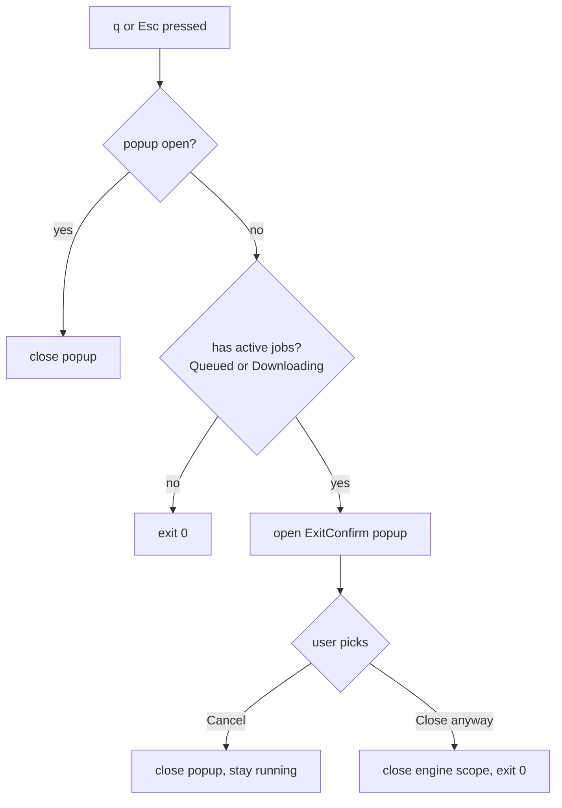

# feat: Ink-based TUI as a second DownloadEngine client

## Summary

Build a real interactive TUI on top of the existing `DownloadEngine` Effect service. UX comes from `docs/brainstorms/tui-explanation.md`: paste-to-enqueue, list of jobs with `Queued / Downloading / Downloaded / Failed` statuses, `Remove` on Queued items, `Retry` on retryable Failed items, quit confirmation when work is active. The TUI is the second concrete client of the engine — first being today's one-shot CLI in `run.ts` — and exists to validate the contract under an interactive shape before any HTTP adapter or Tauri webview lands.

This is **not** the brainstorm's "fake/simulated downloads" prototype: every job runs through the real engine → `ScribdDownloader`. Slideshare/Everand from the brainstorm are out — the project is scribd-only, and the engine's classifier already routes non-scribd URLs to `Failed("Unsupported domain", retryable: false)`.

---

## Problem Frame

The engine contract was just zipped (`docs/plans/2026-06-09-003-refactor-extract-download-engine-plan.md`) but only one client exercises it. A one-shot CLI doesn't pressure-test the interactive surface: it enqueues once, polls until quiet, exits. Things like `remove` mid-queue, `retry` after partial failure, multi-paste-while-running, and clean cancellation on quit are described in the engine but never run.

The TUI is the smallest realistic second client that:
- exercises every method on the engine (`enqueue`, `remove`, `retry`, `snapshot`, `events`)
- proves the events stream is consumable from a non-Effect host (React render loop)
- gives the author a daily-use surface that's nicer than `bun start <url>` for batches

It's also the lowest-cost rung on the longer ladder toward Tauri — when a webview UI eventually lands, the engine-to-UI plumbing patterns established here transfer directly. The HTTP adapter just replaces the in-process bridge.

---

## Requirements

Carried from `docs/brainstorms/tui-explanation.md` (with scribd-only narrowing and real-engine replacement applied):

- **R1.** Separate entrypoint `tui.ts` launched via `bun run tui`. The existing `bun start <url-or-file>` stays unchanged.
- **R2.** TUI takes the same CLI flags as `run.ts`: `--output (-o)`, `--filename`, `--rendertime`. Defaults from `DEFAULT_CONFIG`. No interactive folder picker.
- **R3.** Render: a header showing the current output folder; a queue area listing one item per Job (two lines: title + status on row 1, URL + optional action on row 2); a status bar with `Press Ctrl/Cmd+V to download links • q to quit • Tab to navigate`.
- **R4.** Empty queue → main area stays empty (no "No downloads yet" placeholder).
- **R5.** Item statuses: `Queued`, `Downloading`, `Downloaded`, `Failed` (with reason on row 2).
- **R6.** Paste handling: terminal raw paste (Ctrl/Cmd+V → bulk input through Ink's `useInput`) is handed verbatim to `engine.enqueue`. If no URLs found in the pasted text → status bar shows `No links found in clipboard` briefly (~2s), then reverts.
- **R7.** Duplicate handling lives in the engine — Job uniqueness by URL is **NOT** added here. (See Deferred to Follow-Up Work below — the brainstorm's duplicate rules are a future engine-level concern, not a TUI one.)
- **R8.** `Remove` button is visible only on `Queued` items. Activating → `engine.remove(jobId)`.
- **R9.** `Retry` button is visible only on `Failed` items whose `failure.retryable === true`. Activating → `engine.retry(jobId)`. (Unsupported-domain Failed jobs have `retryable: false` and show no Retry button.)
- **R10.** Tab cycles focus across actionable controls: existing `Remove` buttons (top-down) → existing `Retry` buttons (top-down) → wraps. Enter activates the focused control.
- **R11.** Quit on `q` or `Esc`: if any job has status `Queued` or `Downloading`, show an exit-confirm popup with `[Cancel] [Close anyway]`. Otherwise exit immediately. Esc inside the popup closes the popup (does not exit).
- **R12.** `Close anyway` cancels the engine (interrupts the worker fiber via scope shutdown) and exits 0.
- **R13.** Session-only state: queue is never persisted. Closing the app clears everything. Output folder persistence is **not** in scope (`--output` flag covers it at launch).

---

## Key Technical Decisions

### KTD1. Ink as the TUI library

Ink renders React components to a terminal via Yoga layout. The repo already uses Effect's declarative model (Layers, Streams); Ink's declarative React model is a natural fit. The render loop is well-isolated from the engine's fiber loop — Ink owns the terminal, Effect owns the work.

Alternative considered: hand-rolled stdout with `cli-progress` extensions. Rejected — focus/Tab navigation, popups, and dynamic redraw all become artisanal. Ink solves them out of the box.

### KTD2. Engine → React bridge via subscription hook

A `useEngineState()` hook in the root `App` component subscribes to `engine.events` and reads `engine.snapshot` into React state. Subscription runs inside a `useEffect` that spawns a managed Effect fiber via `BunRuntime.runFork` (or equivalent), pushes each event into a `setState` callback that re-derives the snapshot, and tears down the fiber on cleanup.

The engine itself runs in its own Effect runtime — created at TUI start, scope tied to TUI lifetime. When the user picks `Close anyway` or the root component unmounts, the scope closes and the worker fiber + Puppeteer browser shut down cleanly through the same `Layer.scoped` machinery that already works for `run.ts`.

### KTD3. CLI options shared with `run.ts`

The TUI uses the same `@effect/cli` `Options` definitions as the CLI: `--output`, `--filename`, `--rendertime`. Defaults from `DEFAULT_CONFIG`. Extract these option declarations from `run.ts` into a small shared module to keep parity guaranteed by structure, not by copy-paste.

### KTD4. Raw stdin paste, no clipboard library

Ink's `useInput` receives Ctrl/Cmd+V from the terminal as a bulk-write of the clipboard contents into stdin. The handler hands the raw string to `engine.enqueue(text)` — the engine already tolerantly extracts URLs from arbitrary text. No new dependency, no OS-specific clipboard code path.

Tradeoff: if the user's terminal blocks bracketed paste (rare in modern terminals: iTerm2, kitty, Alacritty, modern macOS Terminal.app — all support it), paste arrives as discrete keystrokes and won't be detected as bulk input. Acceptable for v1; a clipboard-read fallback can be added later if it bites.

### KTD5. No "Simulate paste" textarea

The brainstorm's prototype suggested a manual paste input for testing. Skipped — raw stdin paste works on the author's terminal, and tests use `ink-testing-library`'s programmatic `stdin.write` to inject text directly.

### KTD6. Folder change-popup dropped from v1

Brainstorm spec includes `[Change]` button on header + popup with text input + folder persistence. Dropped:
- `--output` flag at launch covers the same need without UI surface.
- Folder persistence would re-introduce a config file (XDG-style under `~/.config/scribd-dl/`), which contradicts the recent decision to drop `config.ini` in favor of flags.
- Engine's output dir is read once from `ConfigLoader` Layer at construction. Mid-session change would require restructuring `ScribdDownloader` to re-read config per job, or rebuilding the engine Layer on the fly — neither earns its keep for solo use.

`Change` button is not rendered at all in v1; the header shows the current folder for visibility only.

### KTD7. Tests use `ink-testing-library`

`ink-testing-library` provides `render(tree)` → `{ lastFrame, stdin, rerender, unmount }`. Tests write to `stdin` to simulate keyboard and paste, assert on `lastFrame()` text. No real terminal. Mock `DownloadEngine` via the same `Layer.succeed(DownloadEngine, mockSvc)` pattern already used in `test/DownloadEngine.test.ts` and `test/runCli.test.ts`.

### KTD8. tsconfig and `.tsx` integration

The project's `tsconfig.json` currently includes only `.ts`. To support Ink components: add `"jsx": "react-jsx"` to `compilerOptions`, extend `include` to cover `**/*.tsx`, and rely on `react-jsx` runtime so component files don't need explicit `import React`. Verify `verbatimModuleSyntax: true` stays compatible — `type` imports for React types may be required, the implementer confirms.

---

## High-Level Technical Design

### Component tree

```
App                                         // root, owns engine bridge, focus model, popup state
├── Header                                  // folder path (read-only, from config)
├── Queue                                   // map snapshot.jobs → QueueItem[]
│   └── QueueItem                           // 2-line render; emits onRemove/onRetry
├── StatusBar                               // hint text OR transient "No links found"
└── ExitConfirm (conditional)               // shown when q/Esc with active jobs
```

### Data flow

```mermaid
flowchart LR
  K[keyboard / paste via useInput] --> A[App handlers]
  A -->|enqueue / remove / retry| E[DownloadEngine]
  E -->|events Stream| B[useEngineState bridge]
  B -->|setState&#40;snapshot&#41;| R[React render]
  R --> Q[Queue + QueueItem rendering]
  A -->|focus index, popup flag| R
```



### Focus model

Focus index is an integer maintained in `App` state. Each render computes the ordered list of actionable controls from the current snapshot:

```
actionable = [
  ...jobs.filter(j => j.status === 'Queued').map(j => ({type:'remove', id:j.id})),
  ...jobs.filter(j => j.status === 'Failed' && j.failure?.retryable).map(j => ({type:'retry', id:j.id})),
]
```

Tab → `(focusIndex + 1) % actionable.length`. Enter → invoke `engine.remove` or `engine.retry` for `actionable[focusIndex]`. If snapshot mutation removes the focused control, `focusIndex` is clamped to `actionable.length - 1` on next render.

### Exit flow



`Close anyway` works by unmounting Ink and letting the engine's `Layer.scoped` cleanup run — the worker fiber is interrupted, the Puppeteer browser closes, the process exits naturally when all fibers settle.

---

## Output Structure

```
tui.ts                          # new entrypoint, mirrors run.ts shape
src/
  tui/                          # new directory, all Ink components here
    App.tsx                     # root
    Header.tsx
    Queue.tsx
    QueueItem.tsx
    StatusBar.tsx
    ExitConfirm.tsx
    useEngineState.ts           # subscription hook
  cli/
    options.ts                  # NEW — extracted output/filename/rendertime Options
test/
  tui/
    App.test.tsx
    QueueItem.test.tsx
    useEngineState.test.ts
```

`run.ts` imports option definitions from `src/cli/options.ts` rather than declaring them inline.

---

## Implementation Units

### U1. Add Ink dependencies, tsconfig jsx, tui entrypoint scaffold

**Goal:** Add the React + Ink + ink-testing-library deps, teach tsconfig about `.tsx`, ship a `tui.ts` that renders a one-line "scribd-dl TUI" placeholder via Ink. Wire `bun run tui` script. No engine wiring yet.

**Requirements:** R1

**Dependencies:** none

**Files:**
- `package.json` — add `ink`, `react`, devDeps `@types/react`, `ink-testing-library`; add `"tui": "bun tui.ts"` script
- `tsconfig.json` — add `"jsx": "react-jsx"`, extend `include` for `*.tsx`
- `tui.ts` (new) — entrypoint, renders a placeholder `App` component
- `src/tui/App.tsx` (new) — placeholder `<Text>scribd-dl TUI (skeleton)</Text>`

**Approach:**
- Use the latest stable Ink major and matching React peer. Pin via caret. `react` is a runtime dep (not just type) — Ink imports it at runtime.
- `ink-testing-library` goes to devDependencies.
- tsconfig change: add `"jsx": "react-jsx"` so `.tsx` files don't need explicit React import. Add `"src/**/*.tsx"`, `"test/**/*.tsx"` to `include` (keep `.ts` paths too).
- `tui.ts` guards `BunRuntime`-style entry with `import.meta.main` (mirror `run.ts`) — but since this entry is Ink-only, no `BunRuntime.runMain` needed. Just `render(<App />)` from `ink`.
- `bun run tui` should bring up the placeholder, `Ctrl+C` should cleanly exit.

**Patterns to follow:** `run.ts:122` `import.meta.main` guard; `package.json` script shape; `tsconfig.json` strict + `verbatimModuleSyntax` discipline.

**Test scenarios:** `Test expectation: none -- scaffolding unit, no behavior yet. App will gain behavior in U3/U4 with full tests.`

**Verification:** `bun install` succeeds with new deps; `bun run tui` prints the placeholder line and exits on Ctrl+C; `bun test` still 56/56 green; `bun run lint` clean.

---

### U2. Extract shared CLI options, wire engine layer + useEngineState bridge

**Goal:** Pull `--output / --filename / --rendertime` Option declarations out of `run.ts` into `src/cli/options.ts`. In `tui.ts`, parse the same flags via `@effect/cli`, build the same Layer stack as `run.ts`, and expose `DownloadEngine` to the React tree via a `useEngineState` hook backed by `engine.events` subscription and `engine.snapshot`.

**Requirements:** R2, R3 (header reads from config), R4 (empty snapshot → empty render)

**Dependencies:** U1

**Files:**
- `src/cli/options.ts` (new) — exports `outputOpt`, `filenameOpt`, `rendertimeOpt`
- `run.ts` — re-imports those instead of declaring inline (no behavior change)
- `tui.ts` — parses flags via `@effect/cli` `Command.make`, builds Layer, runs Ink `render` from inside the Effect handler so engine scope wraps the UI lifetime
- `src/tui/useEngineState.ts` (new) — `useEngineState(engine): { snapshot: EngineSnapshot, configFolder: string }`
- `src/tui/App.tsx` — now reads from `useEngineState` and renders folder + jobs.length count (full render comes in U3)
- `test/tui/useEngineState.test.ts` (new)

**Approach:**
- `src/cli/options.ts` is a small module; keep `DEFAULT_CONFIG`-derived descriptions intact (same strings users see in `--help`).
- TUI launch sequence inside the Command handler:
  1. Build `ConfigData` from option values (same shape as `run.ts`).
  2. Build the full Layer stack (`makeConfigLoader`, `DirectoryIoLive`, `PdfGeneratorLive`, `PuppeteerSgLive`, `ScribdDownloaderLive`, `DownloadEngineLive`).
  3. Inside a `scoped` Effect, acquire `DownloadEngine` and `ConfigLoader`, then call `render(<App engine={engine} folder={config.directory.output} />)` from Ink.
  4. `await` Ink's `waitUntilExit()` so the Effect doesn't return until the UI closes — keeping the scope alive.
- `useEngineState(engine)`:
  - `useState<EngineSnapshot>({ jobs: [] })`
  - `useEffect`: run `Effect.runFork` on a program that does `snapshot → setSnapshot` then subscribes via `Stream.runForEach` to `engine.events`, calling `setSnapshot(await Effect.runPromise(engine.snapshot))` on each event. Return cleanup that interrupts the forked fiber.
  - The "snapshot-then-subscribe in same scope" ordering from the engine brainstorm prevents the race: subscribe via `Stream.fromPubSub` first, then read snapshot, then drain stream into setState.
- `App` for this unit: renders `<Header folder={folder} />` (still placeholder) + `<Text>{snapshot.jobs.length} jobs</Text>`. No QueueItem yet.

**Patterns to follow:** Layer composition in `run.ts:100-106` (`buildLayer`); engine subscription pattern from `test/DownloadEngine.test.ts` (events.stream usage); `Layer.scoped` cleanup demonstrated by `PuppeteerSgLive` and the engine worker.

**Test scenarios:** (`test/tui/useEngineState.test.ts`, mock engine via `Layer.succeed`)
- Initial render reads `snapshot` and displays job count zero when engine is empty.
- After `engine.enqueue(...)` (called via the mock to push state), the hook re-renders and `lastFrame()` reflects the new job count.
- Unmount tears down the subscription fiber: a subsequent `engine.enqueue` does not trigger a setState call (verified by spying on setState or by checking no warnings about updates after unmount).
- Snapshot-then-subscribe ordering: an event that fires between snapshot read and subscribe is not lost (assertion via injecting an event during the bridge handshake — exact mechanism resolved in implementation).

**Verification:** `bun run tui` shows folder path from `--output` flag and "0 jobs"; passing `bun run tui -o ~/Downloads/scribd` reflects the override; `bun test` green including new `useEngineState` tests; quitting via Ctrl+C cleanly closes Puppeteer (no zombie process — verify by `ps aux | grep chrome` post-exit).

---

### U3. Queue rendering: Header, Queue, QueueItem, StatusBar (read-only)

**Goal:** Render the snapshot as the brainstorm describes — header with folder, queue list with two-line items, status bar with hint text. Status-color per state. No interactivity yet.

**Requirements:** R3, R4, R5

**Dependencies:** U2

**Files:**
- `src/tui/Header.tsx` (new)
- `src/tui/Queue.tsx` (new)
- `src/tui/QueueItem.tsx` (new)
- `src/tui/StatusBar.tsx` (new)
- `src/tui/App.tsx` — composes Header + Queue + StatusBar
- `test/tui/QueueItem.test.tsx` (new)

**Approach:**
- `Header.tsx`: `<Box>` with `Download folder: <folder>`. No `[Change]` button (KTD6).
- `Queue.tsx`: maps `snapshot.jobs` to `<QueueItem job={j} />` keyed by `j.id`. Empty snapshot → renders nothing (R4).
- `QueueItem.tsx`: two rows per item.
  - Row 1: `<Text>{displayTitle}</Text>` flex-grow, then `<Text color={statusColor}>{status}</Text>` right-aligned.
  - Row 2: `<Text dimColor>{url}</Text>`, then (for Failed) `<Text>Reason: {failure.reason}</Text>` on a third row, then optional action placeholder `[ ]` (becomes real button in U4).
  - Status colors: `Queued` → default, `Downloading` → yellow, `Downloaded` → green, `Failed` → red.
- `StatusBar.tsx`: `<Text dimColor>Press Ctrl/Cmd+V to download links • q to quit • Tab to navigate</Text>`. Transient-message support deferred to U4.

**Patterns to follow:** Ink Box/Text composition (no external pattern in this repo — match official Ink examples and stay simple).

**Test scenarios:** (`test/tui/QueueItem.test.tsx` with `ink-testing-library`)
- Renders a `Queued` job: row 1 contains title + `Queued`; row 2 contains URL.
- Renders a `Downloading` job: status shows in yellow (color attribute set on the status `<Text>`).
- Renders a `Downloaded` job: status shows in green.
- Renders a Failed retryable job: status red, third row contains `Reason: PageLoadFailed: ...`.
- Renders a Failed unsupported job: row 3 contains `Reason: Unsupported domain`.
- `Queue` with empty snapshot renders nothing (no placeholder text).
- `Queue` with 3 jobs renders 3 `QueueItem` blocks in snapshot insertion order.

**Verification:** Visual smoke check by running `bun run tui` and pasting a known-good scribd URL — should see it appear in queue and progress to Downloaded (worker already runs via U2's bridge). All component tests green.

---

### U4. Input handling: paste, focus/Tab, Remove/Retry, exit confirm

**Goal:** Wire keyboard. Paste-to-enqueue, "No links found" transient status, Tab focus across `Remove`/`Retry` buttons (rendered now), Enter activation, q/Esc exit with confirm popup when active jobs exist.

**Requirements:** R6, R8, R9, R10, R11, R12

**Dependencies:** U3

**Files:**
- `src/tui/App.tsx` — adds `useInput` handler, focus state, popup state, transient status state
- `src/tui/QueueItem.tsx` — renders `[Remove]` / `[Retry]` button text with focused highlight
- `src/tui/StatusBar.tsx` — accepts optional `transientMessage` prop
- `src/tui/ExitConfirm.tsx` (new) — popup component
- `test/tui/App.test.tsx` (new)

**Approach:**
- `App` owns three new pieces of state: `focusIndex: number`, `transientMessage: string | null`, `popupOpen: boolean`.
- `useInput(handler)` from Ink:
  - If pasted text length > 5 chars and contains a newline OR contains `http`, treat as paste and call `engine.enqueue(input)`. Inspect the returned `Job[]`: if empty, set `transientMessage = "No links found in clipboard"`, schedule a 2s timeout to clear it (use `useEffect` with `setTimeout` + cleanup).
  - **Detection rationale:** Ink delivers paste as a single `input` string. A length threshold + content sniff is a pragmatic heuristic; refining is a deferred concern (see Open Questions).
  - On `\t` (Tab): cycle `focusIndex`.
  - On `\r` (Enter): if `popupOpen` → activate focused popup button (Cancel/Close anyway). Else → look up `actionable[focusIndex]`, call `engine.remove(id)` or `engine.retry(id)`. Errors from these methods (e.g., `NotRemovable` because the job already started) are swallowed; the next snapshot update reflects reality.
  - On `q` or `Esc`:
    - If `popupOpen` and key is `Esc` → close popup.
    - Else if any job has status `Queued` or `Downloading` → `setPopupOpen(true)`.
    - Else → `process.exit(0)` (or cleaner: trigger Ink unmount which closes the scope, exits naturally).
- `actionable` list derived inline from `snapshot.jobs` per render (see HLD). Memoize via `useMemo` keyed on `snapshot`.
- `QueueItem` accepts `actionLabel?: "Remove" | "Retry"` and `focused?: boolean` props. When focused, render in inverse (`<Text inverse>[Remove]</Text>`).
- `ExitConfirm.tsx`: a centered `<Box borderStyle="round">` with a warning text and two buttons `[Cancel] [Close anyway]`. Own focus index 0/1, defaults to `Cancel`. Tab inside popup cycles between the two; Enter activates.
- `Close anyway`: unmount Ink via the `useApp().exit()` API — Ink's exit triggers Effect scope cleanup → engine fiber interrupt → Puppeteer close. No `process.exit(0)` needed.

**Patterns to follow:** Ink `useInput` + `useApp` standard idioms (no internal repo pattern — first use).

**Test scenarios:** (`test/tui/App.test.tsx` with `ink-testing-library`; mock `DownloadEngine`)

Paste:
- Writing a scribd URL via `stdin.write("https://www.scribd.com/document/1/a")` triggers `engine.enqueue` with that text; after re-render queue shows one Queued item.
- Writing pasted blob with multiple URLs triggers `engine.enqueue` with full blob; queue shows one item per extracted URL.
- Writing junk text without URLs triggers `engine.enqueue`, returns empty `Job[]`; status bar shows `No links found in clipboard`; after ~2s status bar reverts to normal hint.
- Writing an unsupported URL → queue shows one item Failed("Unsupported domain"), no Retry button rendered for it.

Focus / actions:
- With two Queued items, pressing Tab cycles focus: first Remove highlighted → second Remove highlighted → wraps.
- Mixed snapshot (1 Queued + 1 retryable Failed) → Tab order is Remove(Queued) → Retry(Failed) → wraps.
- Enter on focused Remove → `engine.remove(focusedId)` called; snapshot mutation removes item; focus clamps to remaining controls.
- Enter on focused Retry → `engine.retry(focusedId)` called.
- Retry button NOT rendered for Failed jobs with `retryable: false` (unsupported); Tab does not visit them.

Exit:
- `q` pressed with snapshot containing zero active jobs → `useApp().exit()` invoked.
- `q` pressed with snapshot containing one Downloading job → popup opens.
- Inside popup, focus defaults to Cancel; Enter → popup closes, UI continues.
- Inside popup, Tab → Close anyway focused; Enter → `useApp().exit()` invoked.
- Esc inside popup → closes popup, UI continues, does NOT exit even if no active jobs.
- Esc outside popup behaves identically to `q`.

**Verification:** Manual smoke against a real scribd URL: paste, see Queued → Downloading → Downloaded transition; Tab navigates correctly; Remove on still-Queued second item works; Retry on a deliberately-failed URL (offline mode) re-runs it. Quit during active download shows the popup. All App tests green.

---

## Scope Boundaries

### In scope (v1)

- Read-only header showing output folder.
- Queue list rendered from `engine.snapshot`, live-updated via `engine.events`.
- Paste-to-enqueue, Tab/Enter for Remove/Retry, q/Esc exit with confirm popup.
- Shared `--output / --filename / --rendertime` flags with the existing CLI.
- Component + interaction tests via `ink-testing-library`.

### Deferred to Follow-Up Work

- **Folder change at runtime** — needs an engine-level API change (dynamic `output` resolution per-job) or layer rebuild. `--output` flag is enough today.
- **Folder persistence between runs** — would re-introduce a config file. Skip unless flag UX becomes painful.
- **Duplicate-URL handling** — brainstorm spec describes "ignore if already Queued/Downloading/Downloaded, but allow re-paste of removed items". This is a property of the engine's `enqueue`, not the TUI. Push as a follow-up engine refinement; today every paste creates new Jobs even if URL is duplicate.
- **JobProgress event surface** — engine doesn't emit per-job byte/page progress; TUI shows discrete state only. Progress will land when first user surface (CLI long batches or TUI) clearly wants it.
- **Display title from real Scribd metadata** — `displayTitle` is derived from URL at enqueue time. Real document title (already extracted by `ScribdDownloader`) is currently only used for the output filename. Wiring it back through events to update the TUI label is a follow-up.

### Outside this work's identity

- **Browser / Tauri webview UI** — separate track (`docs/brainstorms/2026-06-09-tauri-app-requirements.md`).
- **HTTP/WS adapter** — comes when the first out-of-process UI lands. Not needed for Ink (in-process).
- **Bun executable + Chromium auto-installer** — independent track (`docs/plans/2026-06-09-002-feat-bun-executable-with-chromium-installer-plan.md`). The TUI will run inside that executable when both ship, but neither blocks the other.
- **Simulated/fake downloads** — the brainstorm prototype's idea. Real engine only.
- **Slideshare / Everand support** — project is scribd-only; engine classifier handles non-scribd as Failed unsupported.

---

## Risks & Mitigations

- **Engine events arrive faster than React render.** A burst of `JobStarted/JobCompleted` for short-running jobs could trigger many `setState` calls. Mitigation: have the bridge debounce — re-read `snapshot` and `setState` at most once per ~50ms via a leading-edge timer. v1 may not need this; measure first.
- **`ink-testing-library` and `useApp().exit()` interaction.** The exit hook might not be observable in tests the same way it is at runtime. Mitigation: in `App` accept an injected `onExit` callback prop that defaults to `useApp().exit`; tests pass a mock callback.
- **Bracketed-paste detection edge cases.** Some terminals deliver paste as discrete keystrokes (`useInput` called per char). Heuristic-based detection (length + content) may misfire on a fast typist. Mitigation: keep heuristic generous (lower the threshold or just always call enqueue on any input that looks like it could contain a URL), and accept that worst-case the user types a partial URL and it goes nowhere because regex doesn't match.
- **tsconfig `verbatimModuleSyntax` + React JSX.** React 19+ with `jsx: react-jsx` runtime should not need explicit React imports, but `verbatimModuleSyntax` enforces strict type-only import marking. Mitigation: confirm with a one-component compile during U1 implementation; if it bites, add `"jsxImportSource": "react"` or relax `verbatimModuleSyntax` for `.tsx` only.
- **Cleanup order on exit.** If Ink unmounts before Effect scope closes, the engine fiber may briefly outlive the UI. Worst case: a job completes after the TUI window is gone. Mitigation: launch sequence in `tui.ts` `await`s `waitUntilExit()` inside the Effect scope — Effect scope outlives Ink, not the other way around. Cleanup goes: Ink unmounts → `waitUntilExit()` resolves → Effect scope closes → engine fiber + Puppeteer shut down.

---

## Open Questions (defer to implementation)

- Exact paste-detection heuristic in `useInput` — threshold, content sniff details, whether to always-enqueue and let the engine's URL extraction be the filter. Resolve when implementing U4.
- Whether the transient "No links found" status should use a 2s timer (`setTimeout` + `setState`) or driven by paste history with an explicit "next paste" trigger. Default to 2s timer.
- Ink version pin — Ink major version at implementation time. Confirm React peer compatibility; React 19 should be supported by current Ink.
- Whether to wrap `<App>` in a React error boundary. Probably yes for production, deferred for v1.
- Whether `displayTitle` should ever update post-scrape (engine doesn't currently emit title-changed events). Out of scope per Deferred above, but flag it in implementation if low-cost to wire.

---

## Sources & Research

- **Brainstorm (primary input):** `docs/brainstorms/tui-explanation.md` — UX spec.
- **Engine contract (consumer-side):** `docs/plans/2026-06-09-003-refactor-extract-download-engine-plan.md` + `src/service/DownloadEngine.ts` — methods, error shapes, event types.
- **Current CLI shape:** `run.ts` — Layer composition and CLI option declarations to share via `src/cli/options.ts`.
- **Test patterns:** `test/DownloadEngine.test.ts`, `test/runCli.test.ts` — `Layer.succeed(Service, mock)` pattern, `#given/#when/#then` BDD comments, `bun:test` idioms.
- **Project conventions:** `CLAUDE.md` — Effect/Layer DI, no singletons, extensionless TS imports.
- **External (not researched in this plan):** Ink official docs at `github.com/vadimdemedes/ink` for `useInput` / `useApp` / Box / Text API; `ink-testing-library` README for `stdin.write` and `lastFrame`. The implementer pulls current docs at U1/U4 time.
