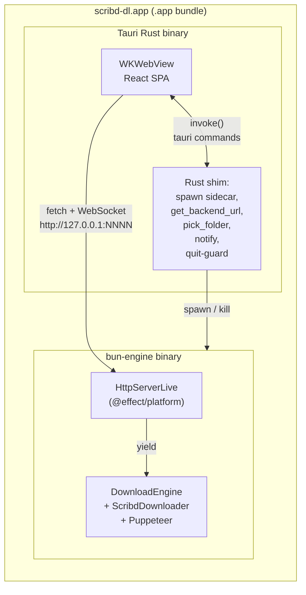
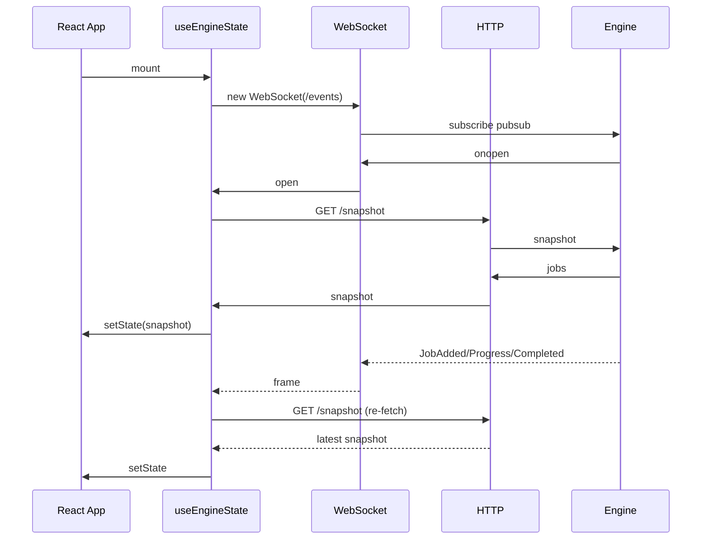
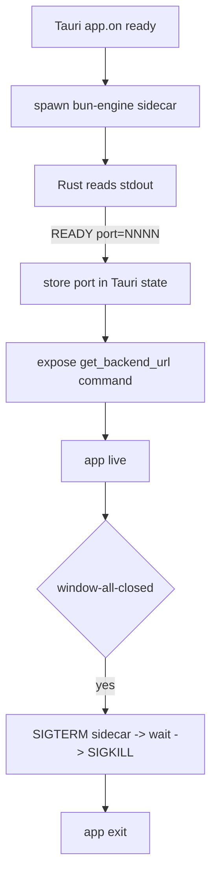

# feat: macOS desktop app — Tauri webview + Bun engine sidecar

## Summary

Build `scribd-dl.app` as the third client of `DownloadEngine` after `run.ts` (CLI) and `tui.ts` (Ink). Engine runs as a Bun HTTP/WS sidecar inside the Tauri 2.x bundle; React SPA in the WKWebView consumes REST commands + WS events. UX paritets Ink-TUI (paste-to-enqueue, queue with statuses, remove/retry, exit-guard) plus native folder picker with persistence, macOS system notifications, and per-job page progress.

Two notable refinements vs. origin brainstorm: per-job progress is in v1 (engine already emits `JobProgress` — `src/service/DownloadEngine.ts:47, 242` — so cost is near-zero), and the HTTP server uses `@effect/platform`'s `HttpServer` instead of raw `Bun.serve` (Layer-native, matches existing codebase style — `PuppeteerSgLive`, `DownloadEngineLive`).

---

## Problem Frame

Two engine clients exist today: `run.ts` (single-shot CLI) and `tui.ts` (Ink-TUI). Ink-TUI delivers the desired interactive UX, but requires a terminal — Spotlight-launch isn't possible. The brainstorm closed the topology question: Bun-engine becomes an HTTP/WS service, Tauri is only a webview-host + native bridge. This plan executes that decision end-to-end: engine HTTP/WS surface, browser-first React SPA, Tauri wrapper, native bits (folder picker, notifications, quit-guard), packaging.

Existing engine API (`src/service/DownloadEngine.ts:50-58`) covers everything the desktop needs without engine changes: `enqueue`, `remove`, `retry`, `snapshot`, `events`, `outputFolder`, `setOutputFolder`. Events stream includes `JobProgress` and `JobTitleUpdated` — both already wired by `src/service/ScribdDownloader.ts` callbacks.

---

## Requirements

Carried from origin (`docs/brainstorms/2026-06-09-desktop-app-tauri-bun-requirements.md`), grouped by source:

**UX-паритет с Ink-TUI** (origin "In scope (v1)" block 1):
- **R1.** Окно показывает очередь задач. Each row renders displayTitle, status, action (Remove on Queued / Retry on Failed retryable).
- **R2.** Статусы: `Queued`, `Downloading`, `Downloaded`, `Failed` (с причиной).
- **R3.** `Cmd+V` в окне → текст буфера передаётся в `POST /enqueue` → engine классифицирует и распределяет.
- **R4.** Если в буфере не найдено валидных URL → транзиентная плашка `No links found in clipboard` ~2с.
- **R5.** `Remove` — только на `Queued`. `Retry` — только на `Failed` с `retryable=true`. Unsupported-domain Failed — без Retry.
- **R6.** Quit-guard: при попытке закрыть окно с активными `Queued`/`Downloading` задачами — native confirm dialog. `Close anyway` → kill sidecar → exit.
- **R7.** Session-only state: при закрытии очередь чистится (это уже свойство engine — оно живёт в bun-процессе, который убивается).

**Поверх Ink-TUI** (origin "In scope (v1)" block 2):
- **R8.** Native folder picker в шапке окна. Кнопка `Change folder` → системный диалог. Выбор персистится между запусками через Tauri app data store.
- **R9.** macOS system notifications на `Downloaded` и `Failed` когда `document.visibilityState === 'hidden'`. Click по нотификации фокусирует окно.

**Сверх брифа (KTD1):**
- **R10.** Per-job progress отображается на `Downloading` строках (`12 / 87` + прогресс-бар). Engine эмитит `JobProgress` events со стадией `scrape`/`render` — UI рисует прогресс отдельно для каждой стадии.

**Distribution** (origin "In scope (v1)" block 3):
- **R11.** DMG-бандл `scribd-dl.dmg`, без code-signing/notarization в v1. Gatekeeper-предупреждение при первом запуске приемлемо.

---

## Key Technical Decisions

### KTD1. `@effect/platform` HttpServer вместо `Bun.serve`

`@effect/platform` + `@effect/platform-bun` уже в зависимостях. `HttpServer` Layer интегрируется в существующий стек так же, как `DownloadEngineLive` или `PuppeteerSgLive` — это даёт нам:
- Effect-нативные обработчики (`Effect.Effect<Response, …, …>`), которые могут yield'ить в `DownloadEngine` напрямую без `Effect.runPromise` шим-слоя.
- WebSocket поддержка через `@effect/platform/Socket` идиоматично сопрягается с `Stream.fromPubSub(pubsub)`.
- Единый стиль конфигурации Layer стека (`run.ts:83-89` `buildLayer`).

`Bun.serve` был бы проще на первой странице, но добавил бы границу «здесь Effect, здесь Promise» поперёк горячей точки кода. Откладываем эту границу за пределы планируемого периметра.

### KTD2. Per-job progress включён в v1

Engine эмитит `JobProgress` events (`src/service/DownloadEngine.ts:47, 242`) бесплатно. Брифа считала иначе. UI считывает `job.progress` из snapshot (`done`, `total`, `stage`) и рендерит shadcn `<Progress>` + текст `12 / 87`. Стадия `scrape` (получение страниц) и `render` (сборка PDF) показываются по-разному в подписи прогресса.

### KTD3. Один план — один Tauri-проект под подкаталогом `app/`

Tauri 2.x стандарт: `app/` — Vite SPA, `src-tauri/` — Rust shim + `tauri.conf.json`. Корень репо остаётся за Bun + engine + CLI/TUI. Это не создаёт двух репозиториев и не требует workspace-настройки: package.json остаётся один (корневой), Vite-проект использует свой `app/package.json` с минимальными deps (react, vite, tailwind, shadcn). См. Output Structure ниже.

### KTD4. Port discovery: stdout `READY port=NNNN` + Tauri command

Bun-engine биндится на random free port (`Bun.serve({ port: 0 })`), пишет одну строку `READY port=NNNN` в stdout, продолжает работать. Rust shim:
1. spawn sidecar через Tauri sidecar API,
2. читает stdout построчно до `^READY port=(\d+)$`,
3. сохраняет port в Tauri-state,
4. экспонирует Tauri command `get_backend_url()` → `http://127.0.0.1:NNNN`.

React на mount вызывает `invoke('get_backend_url')` (через `@tauri-apps/api/core`). В dev-режиме (когда запущено через `vite dev` без Tauri) `invoke` отсутствует → fallback на `http://127.0.0.1:4747` (явный `--port 4747` в `bun run engine`).

### KTD5. Snapshot-then-subscribe ordering на клиенте

PubSub в engine буферизует события подписавшимся клиентам только после открытия подписки (`Stream.fromPubSub(pubsub)` создаёт fresh subscription). Чтобы не пропустить события между REST-snapshot и WS-open, клиент:
1. Открывает WS `/events` → ждёт `onopen`.
2. После `onopen` шлёт `GET /snapshot` → setState.
3. На каждый WS-frame: либо merge in-place (если frame содержит достаточно данных — `JobAdded`, `JobProgress`), либо re-fetch `/snapshot` (для безопасности на первой итерации).

В первой итерации делаем re-fetch на каждое событие — это просто, для UI с ~10 задач незаметно. Оптимизировать (merge без re-fetch) можно потом.

### KTD6. Folder change через engine API, не через рестарт sidecar

Брифа предполагала рестарт sidecar при смене папки. Это не нужно: `DownloadEngine.setOutputFolder` (`src/service/DownloadEngine.ts:277-284`) уже атомарно обновляет `Ref`, который читается воркером перед каждой задачей (`src/service/DownloadEngine.ts:257`). Это значит:
- Change folder во время `Downloading` — текущая задача доскачивается в старую папку (folder ref был прочитан до `scribd.execute`), следующие задачи идут в новую.
- Никакого confirm dialog или disabled кнопки не нужно. Поведение совпадает с тем что описано в брифе F5.
- Persistence (Tauri app data store) и engine state синхронизируются через `POST /folder` от Tauri shim → engine `setOutputFolder`.

### KTD7. CORS открыт для localhost в dev, same-origin в Tauri

Production-бандл: webview origin = `tauri://localhost`, engine разрешает только этот origin через `Access-Control-Allow-Origin: tauri://localhost`. Dev: webview = Chrome на `http://localhost:5173`, engine разрешает `http://localhost:5173` (regex match на префикс `http://localhost:`).

### KTD8. shadcn-style components без shadcn CLI в зависимостях

shadcn CLI генерирует компоненты в проект как исходники — не runtime dep. План использует только нужные компоненты: `Button`, `Card`, `Progress`, `Dialog` (для exit confirm если решим из webview, не через Tauri native), плюс utility-классы Tailwind. Зависимости в `app/package.json`: `tailwindcss`, `@radix-ui/react-*` (точечно под используемые компоненты), `class-variance-authority`, `clsx`, `tailwind-merge`. Без полного shadcn registry — ставим вручную копированием стандартных файлов из shadcn docs.

---

## High-Level Technical Design

### Топология процессов



### REST + WebSocket контракт

| Endpoint                       | Method | Body / Frame                                  | Engine call            |
| ------------------------------ | ------ | --------------------------------------------- | ---------------------- |
| `/snapshot`                    | GET    | →: `{jobs: Job[]}`                            | `engine.snapshot`      |
| `/enqueue`                     | POST   | `{text: string}` →: `{jobs: Job[]}`           | `engine.enqueue(text)` |
| `/jobs/:id`                    | DELETE | →: `204` / `404` / `409`                      | `engine.remove(id)`    |
| `/jobs/:id/retry`              | POST   | →: `204` / `404` / `409`                      | `engine.retry(id)`     |
| `/folder`                      | GET    | →: `{path: string}`                           | `engine.outputFolder`  |
| `/folder`                      | POST   | `{path: string}` →: `204`                     | `engine.setOutputFolder(path)` |
| `/events`                      | WS     | frames: serialized `JobEvent` (one per push)  | subscribe to `engine.events` |

Errors: `JobNotFound` → 404 `{error: "JobNotFound"}`, `NotRemovable`/`NotRetryable` → 409 `{error, status}`.

### React state flow



### Lifecycle bun-сайдкара



---

## Output Structure

```text
app/                                    # Vite + React SPA (NEW)
  package.json                          # react, vite, tailwind, radix, classnames
  vite.config.ts
  tailwind.config.ts
  postcss.config.js
  index.html
  src/
    main.tsx                            # ReactDOM mount
    App.tsx                             # composition root
    components/
      Header.tsx
      Queue.tsx
      QueueItem.tsx
      StatusBar.tsx
      ExitConfirm.tsx                   # only if we render from webview, см. KTD/U12
      ui/
        button.tsx                      # shadcn-style components (copied, not generated)
        card.tsx
        progress.tsx
        dialog.tsx
    hooks/
      useEngineState.ts                 # WS+fetch bridge (mirror of src/tui/useEngineState.ts shape)
      usePasteHandler.ts
      useNotifications.ts
    lib/
      api.ts                            # fetch wrappers
      backendUrl.ts                     # invoke get_backend_url with fallback
      utils.ts                          # cn() helper
  test/
    useEngineState.test.tsx
    QueueItem.test.tsx
    App.test.tsx

src-tauri/                              # Tauri Rust shim (NEW)
  Cargo.toml
  tauri.conf.json
  build.rs
  src/
    main.rs                             # spawn sidecar, parse READY, commands
    sidecar.rs                          # sidecar lifecycle + stdout parsing
    commands.rs                         # get_backend_url, pick_folder, notify
  icons/

src/server/                             # NEW under existing src/
  HttpServerLive.ts                     # @effect/platform HttpServer Layer
  routes.ts                             # REST handlers
  events.ts                             # WS handler

engine.ts                               # NEW entrypoint at repo root
                                        # mirrors run.ts shape, builds Layer + HttpServerLive

test/server/
  HttpServer.test.ts                    # REST + WS tests using bun:test
```

`app/` and `src-tauri/` are siblings under repo root, following the Tauri 2.x convention. The existing `src/` continues to host Bun-side engine code; new `src/server/` adds the HTTP layer.

---

## Implementation Units

### U1. `engine.ts` + `HttpServerLive` (REST routes only)

**Goal:** новый entrypoint `engine.ts` строит тот же Layer stack что `run.ts`, плюс `HttpServerLive` поверх `@effect/platform-bun`'s `BunHttpServer`. Реализует все REST endpoints из таблицы (без WS). Печатает `READY port=NNNN` в stdout при старте.

**Requirements:** R3, R5, R8 (folder GET/POST), R10 (snapshot exposes progress)

**Dependencies:** none

**Files:**
- `engine.ts` (NEW, repo root)
- `src/server/HttpServerLive.ts` (NEW)
- `src/server/routes.ts` (NEW)
- `src/cli/options.ts` — extend with `portOpt` (optional, default 0 = random)
- `package.json` — add `engine` script: `"engine": "bun engine.ts"`
- `test/server/HttpServer.test.ts` (NEW)

**Approach:**
- `engine.ts` структура копирует `run.ts:91-107` `Command.make` + `BunRuntime.runMain`. Опции: `--output`, `--filename`, `--rendertime` (импортированы из `src/cli/options`) + новый `--port` (default 0).
- `HttpServerLive` — `Layer.scoped` оборачивает `BunHttpServer.layer({ port })`. После старта читает фактический порт из server-state и через `Effect.sync(console.log)` выводит `READY port=NNNN`. Использует `@effect/platform/HttpServer.HttpApp` для роутинга.
- Роуты в `src/server/routes.ts` определяются как `HttpRouter.Route` (или эквивалент текущей версии `@effect/platform`). Каждый handler yield'ит в `DownloadEngine` напрямую.
- JSON-сериализация Job: добавить utility `serializeJob(job)` который копирует структуру 1:1 (Job уже сериализуем — всё primitive + nested objects). На ts-стороне `EngineSnapshot` уже совместим с JSON.
- Error mapping: `JobNotFound` → `Effect.catchTag(...)` → `HttpServerResponse.json({error: "JobNotFound"}, {status: 404})`. То же для `NotRemovable`/`NotRetryable` → 409.
- CORS: `Access-Control-Allow-Origin: tauri://localhost, http://localhost:5173` (через HTTP middleware Layer).

**Patterns to follow:**
- Layer composition: `run.ts:83-89` (`buildLayer`).
- Effect error handling: `src/service/DownloadEngine.ts:182-198` (typed errors → service).
- `@effect/platform` HttpServer usage: search examples in `@effect/platform-bun` package docs at install time (Open Question 1).

**Test scenarios:** (`test/server/HttpServer.test.ts`, `bun:test` + `fetch`)
- `GET /snapshot` пустой engine → `{jobs: []}`.
- `POST /enqueue {text: "https://www.scribd.com/document/1/x"}` → 200 + `{jobs: [{status: "Queued", domain: "scribd", ...}]}`.
- `POST /enqueue {text: "не URL"}` → 200 + `{jobs: []}`.
- `POST /enqueue {text: "https://example.com/x"}` → 200 + `{jobs: [{status: "Failed", domain: "unsupported", failure: {retryable: false, ...}}]}`.
- `DELETE /jobs/:id` на Queued → 204, последующий `GET /snapshot` без этой задачи.
- `DELETE /jobs/:id` на Downloading → 409 `{error: "NotRemovable"}`.
- `DELETE /jobs/nonexistent` → 404 `{error: "JobNotFound"}`.
- `POST /jobs/:id/retry` на retryable Failed → 204, задача снова `Queued`.
- `POST /jobs/:id/retry` на unsupported Failed (`retryable: false`) → 409.
- `GET /folder` → `{path: <config.directory.output>}`.
- `POST /folder {path: "/tmp/new"}` → 204, последующий `GET /folder` → `{path: "/tmp/new"}`.
- `READY port=NNNN` пишется в stdout при старте.
- Default port 0 даёт работающий случайный порт (нечто > 1024).
- CORS preflight `OPTIONS` отвечает `Access-Control-Allow-Origin` для `tauri://localhost`.

**Verification:** `bun run engine --port 4747` поднимается. `curl localhost:4747/snapshot` возвращает `{jobs: []}`. `curl -X POST localhost:4747/enqueue -d '{"text":"https://www.scribd.com/document/.../X"}' -H 'Content-Type: application/json'` возвращает заполненный `jobs`. `bun test` зелёный. `bun run lint` и `bun run format:check` чистые.

---

### U2. WebSocket `/events` route

**Goal:** добавить WS endpoint `/events` к `HttpServerLive`. Каждый клиент при подключении создаёт подписку на `engine.events` Stream и шлёт каждое event как JSON-frame.

**Requirements:** R10 (events stream pushes progress), плюс инфраструктура для R1, R2, R5, R6, R8 (live updates).

**Dependencies:** U1

**Files:**
- `src/server/events.ts` (NEW)
- `src/server/HttpServerLive.ts` — расширяет router добавлением WS route
- `test/server/HttpServer.test.ts` — расширяется WS scenarios

**Approach:**
- `@effect/platform`/`@effect/platform-bun` имеет primitives для WebSocket upgrade. Конкретный API определяется при имплементации (Open Question 1) — но шаблон такой:
  - Route `/events` → upgrade.
  - На `onopen` стартует `Effect.scoped` который `Stream.runForEach(engine.events, sendFrame)`.
  - На `onclose` scope закрывается → подписка снимается.
- Сериализация frame: `JSON.stringify(event)` — все `JobEvent` варианты примитивны.
- Snapshot-then-subscribe гарантия со стороны engine: `Stream.fromPubSub` создаёт fresh subscription в момент `Stream.runForEach`. То есть события эмитнутые ДО подключения не приходят — клиент берёт их через `/snapshot`. Это OK при условии что клиент делает `/snapshot` ПОСЛЕ открытия WS (KTD5).

**Patterns to follow:**
- `useEngineState` in `src/tui/useEngineState.ts:8-19` — паттерн подписки на `engine.events`.
- `DownloadEngineLive` PubSub usage: `src/service/DownloadEngine.ts:131, 220`.

**Test scenarios:** (`test/server/HttpServer.test.ts` extension, bun's `WebSocket` client)
- Подключиться к `ws://localhost:NNNN/events` → `onopen` срабатывает.
- После open → `POST /enqueue` со scribd URL → в WS приходит frame `{_tag: "JobAdded", job: {...}}`.
- Запустить scrape (real или мок) → приходит `JobStarted`, потом `JobProgress` фреймы, потом `JobCompleted`.
- `JobTitleUpdated` приходит когда `ScribdDownloader` репортит TitleResolved.
- `JobFailed` приходит для retryable + non-retryable.
- `DELETE /jobs/:id` → `JobRemoved` frame.
- `POST /jobs/:id/retry` → `JobRequeued` frame.
- `POST /folder` → `OutputFolderChanged` frame.
- Закрытие WS → engine subscription снимается (verify через memory/scope, либо implicitly — нет ошибок в логах).
- Два одновременных WS клиента — оба получают свои копии всех frame'ов.

**Verification:** `websocat ws://localhost:4747/events` в одной вкладке, `curl POST /enqueue` в другой → в websocat виден поток frame'ов. `bun test` зелёный.

---

### U3. Vite + React + Tailwind + shadcn-style components scaffold

**Goal:** инициализировать `app/` Vite-проект: React 19, TypeScript, Tailwind v4 (или v3 — зависит от текущей стабильной), shadcn-style примитивы (`button`, `card`, `progress`, `dialog`) скопированы как локальные source-файлы. SPA отображает один placeholder `App.tsx` `<h1>scribd-dl</h1>`. Vitest сетап + один smoke test.

**Requirements:** none directly — это инфраструктурный юнит.

**Dependencies:** none (independent of U1/U2 in terms of code, но run-together после U2 для end-to-end smoke).

**Files:**
- `app/package.json` (NEW)
- `app/vite.config.ts` (NEW)
- `app/tsconfig.json` (NEW)
- `app/tailwind.config.ts` (NEW)
- `app/postcss.config.js` (NEW)
- `app/index.html` (NEW)
- `app/src/main.tsx` (NEW)
- `app/src/App.tsx` (NEW, placeholder)
- `app/src/components/ui/button.tsx` (NEW)
- `app/src/components/ui/card.tsx` (NEW)
- `app/src/components/ui/progress.tsx` (NEW)
- `app/src/components/ui/dialog.tsx` (NEW)
- `app/src/lib/utils.ts` (NEW) — `cn()` helper
- `app/src/index.css` (NEW) — Tailwind directives
- `app/test/smoke.test.tsx` (NEW)
- `package.json` (корневой) — добавить scripts `"app:dev": "cd app && bun run dev"`, `"app:build": "cd app && bun run build"`, `"app:test": "cd app && bun run test"`.

**Approach:**
- `app/` живёт под корнем как изолированный Vite-проект со своим `package.json` (минимум deps: react, react-dom, vite, @vitejs/plugin-react, typescript, tailwindcss, postcss, autoprefixer, @radix-ui/react-dialog, class-variance-authority, clsx, tailwind-merge, vitest, @testing-library/react, @testing-library/jest-dom, jsdom).
- shadcn-style компоненты копируются вручную из стандартных шаблонов shadcn docs (`button`, `card`, `progress`, `dialog`) — это исходники под MIT, не runtime dep на shadcn CLI.
- Tailwind конфиг включает `app/index.html` и `app/src/**/*.{ts,tsx}` в `content`.
- Vitest конфигурируется в `vite.config.ts` (через `defineConfig` + `test`). jsdom environment.

**Patterns to follow:** Tauri 2.x official `create-tauri-app` template для Vite + React + TS — берём structure оттуда. Project lint/format следует корневому стилю.

**Test scenarios:**
- Smoke test: `<App />` рендерит "scribd-dl" текст (`app/test/smoke.test.tsx`).
- `bun run app:dev` поднимает Vite на `localhost:5173`, в Chrome видно placeholder.
- `bun run app:build` собирает `app/dist/`.
- `bun run app:test` запускает Vitest, зелёный.

**Verification:** манáльный — открыть Chrome на `localhost:5173`, видеть placeholder. `bun test` (корневой) не сломан. `bun run lint` чистый (oxlint умеет `.tsx` через корневой конфиг).

---

### U4. `useEngineState` хук: WS subscribe + snapshot fetch

**Goal:** портировать паттерн `src/tui/useEngineState.ts` на HTTP/WS транспорт. Хук возвращает `EngineSnapshot`, переподписывается на mount, корректно закрывает WS на unmount.

**Requirements:** infrastructure for R1-R10 live state.

**Dependencies:** U2 (требует работающий WS server для интеграционного теста), U3.

**Files:**
- `app/src/hooks/useEngineState.ts` (NEW)
- `app/src/lib/api.ts` (NEW) — `fetchSnapshot()`, `enqueueText()`, `removeJob()`, `retryJob()`, `setFolder()`, `getFolder()`
- `app/src/lib/backendUrl.ts` (NEW) — `getBackendUrl()` invoke wrapper с fallback
- `app/test/useEngineState.test.tsx` (NEW)

**Approach:**
- Реализация (псевдокод для рецензии, не для копирования):

  ```text
  useEngineState() returns EngineSnapshot
    state: snapshot
    useEffect:
      const url = await getBackendUrl()           // tauri invoke OR localhost fallback
      const ws = new WebSocket(`${ws-url}/events`)
      let alive = true
      ws.onopen = async () => {
        const snap = await fetchSnapshot(url)
        if (alive) setSnapshot(snap)
      }
      ws.onmessage = async () => {
        const snap = await fetchSnapshot(url)
        if (alive) setSnapshot(snap)
      }
      ws.onclose = () => { /* show disconnected banner via separate state */ }
      return () => { alive = false; ws.close() }
  ```

- Re-fetch на каждый message — простая первая итерация (KTD5). Merge без re-fetch — open question, не блокер.
- `getBackendUrl()`:
  ```text
  if (window.__TAURI_INTERNALS__) return await invoke('get_backend_url')
  return 'http://127.0.0.1:4747'                    // dev fallback
  ```
- Disconnect-banner — отдельный state `isConnected` пробрасывается из хука. В `App.tsx` рендерится плашка "Backend disconnected" + кнопка ручного reload. (Auto-respawn — Deferred.)
- Frame: directional pseudocode for design review. Implementer follows the shape but writes idiomatic React.

**Patterns to follow:**
- `src/tui/useEngineState.ts:5-22` — структура хука (subscribe + cleanup).
- React-docs guidance: «derived values предпочитать над useEffect + setState» — здесь setState оправдан т.к. источник внешний и async (см. global instructions [react-useeffect] skill).

**Test scenarios:** (`app/test/useEngineState.test.tsx`, mock WebSocket + fetch)
- Initial mount → ws opens → snapshot fetched → state = snapshot.
- WS frame received → re-fetch → state updates.
- Unmount во время open WS → ws.close() вызывается, дальнейшие frame'ы НЕ триггерят setState (verify через React act warnings или spy).
- `getBackendUrl` берёт значение из Tauri invoke когда `window.__TAURI_INTERNALS__` определён.
- `getBackendUrl` использует fallback `http://127.0.0.1:4747` когда Tauri отсутствует (browser dev mode).
- WS close (server gone) → `isConnected = false` → плашка показывается.
- Реконнект после нажатия "reload" button → новый WS, новый snapshot.

**Verification:** запустить `bun run engine --port 4747` + `bun run app:dev`, открыть Chrome на `localhost:5173` → в DevTools Network видно WS upgrade, в Application/State видно snapshot. `bun run app:test` зелёный.

---

### U5. Read-only render: Header, Queue, QueueItem, StatusBar

**Goal:** скомпоновать read-only UI. Header показывает folder text (из `GET /folder`, кнопка Change пока stub). Queue рендерит карточки задач. QueueItem показывает displayTitle, URL, status pill, и для Downloading — progress bar + page counter. StatusBar — текст подсказки.

**Requirements:** R1, R2, R10.

**Dependencies:** U3, U4.

**Files:**
- `app/src/components/Header.tsx` (NEW)
- `app/src/components/Queue.tsx` (NEW)
- `app/src/components/QueueItem.tsx` (NEW)
- `app/src/components/StatusBar.tsx` (NEW)
- `app/src/App.tsx` — обновляется: композирует Header + Queue + StatusBar, использует useEngineState
- `app/test/QueueItem.test.tsx` (NEW)
- `app/test/App.test.tsx` (NEW)

**Approach:**
- `Header`: shadcn `Card` или просто `<div>` с двумя колонками. Слева — `Download folder: /path`. Справа — `<Button variant="outline">Change folder</Button>` (disabled до U10).
- `Queue`: маппит `snapshot.jobs` в `<QueueItem>`. Пустая queue → не рендерим ничего (паритет с Ink-TUI R4).
- `QueueItem`: Card. Title row + URL row + Status row. Status pill — Tailwind утилитки + цвет по статусу (yellow для Downloading, green для Downloaded, red для Failed, neutral для Queued).
- Для `Downloading` с `job.progress`: shadcn `<Progress value={percent}>` + текст `{done} / {total} ({stage})`.
- Для `Failed`: `<p className="text-sm text-red-600">Reason: {failure.reason}</p>`.
- `StatusBar`: dimmed text "Press ⌘V to add links". Accept optional `transientMessage` prop (использует U6).

**Patterns to follow:** Tailwind + shadcn idiomatic patterns. Цвета подобрать совместимо с тёмной темой (если будем добавлять — Deferred).

**Test scenarios:** (`app/test/QueueItem.test.tsx`, @testing-library/react)
- `Queued` job → title + URL + "Queued" badge видны. Action column пустой (до U7).
- `Downloading` job без progress → "Downloading" badge видна, прогресс-бар не показан.
- `Downloading` job с `progress: {done: 12, total: 87, stage: "scrape"}` → progress bar 13.8%, текст "12 / 87 (scrape)".
- `Downloaded` job → green badge.
- `Failed` retryable → red badge + Reason row.
- `Failed` unsupported (`retryable: false`) → red badge + "Unsupported domain" reason.
- `Queue` с 0 jobs не рендерит карточек.
- `Queue` с 3 jobs рендерит 3 карточки в порядке snapshot.

**Verification:** запустить engine + dev → `curl POST /enqueue` со scribd URL → в Chrome видно карточку, статус движется, прогресс растёт. `app:test` зелёный.

---

### U6. Paste handler + транзиентная плашка

**Goal:** глобальный `paste` event handler → `POST /enqueue`. Если backend вернул `jobs: []` → 2-секундная плашка "No links found in clipboard" в StatusBar.

**Requirements:** R3, R4.

**Dependencies:** U5.

**Files:**
- `app/src/hooks/usePasteHandler.ts` (NEW)
- `app/src/App.tsx` — wire usePasteHandler + state для transientMessage
- `app/src/components/StatusBar.tsx` — `transientMessage` prop
- `app/test/App.test.tsx` — расширяется paste scenarios

**Approach:**
- `usePasteHandler({ onText })`:
  ```text
  useEffect:
    handler = (e: ClipboardEvent) => {
      const text = e.clipboardData?.getData('text') ?? ''
      if (text.trim()) onText(text)
    }
    window.addEventListener('paste', handler)
    return () => window.removeEventListener('paste', handler)
  ```
- В `App.tsx`: `onText` → `await enqueueText(backendUrl, text)` → если `response.jobs.length === 0` → `setTransientMessage('No links found in clipboard')`, setTimeout 2000 ms → clear.
- Refetch snapshot не нужен здесь — WS frame `JobAdded` придёт и хук сам refetch'нет.

**Patterns to follow:** Ink-TUI plan U4 paste detection R6. Здесь проще — браузерный `paste` event имеет clipboardData нативно.

**Test scenarios:** (`app/test/App.test.tsx`, jsdom, `fireEvent.paste`)
- Paste scribd URL → mock fetch видит `POST /enqueue` с правильным body.
- Mock backend возвращает `{jobs: [{status: "Queued", ...}]}` → плашка НЕ показывается.
- Paste junk text → mock backend возвращает `{jobs: []}` → плашка показывается.
- Через 2 секунды (advance fake timers) → плашка пропадает.
- Paste blob с 3 URL → один `POST /enqueue` с полным blob (engine extract'ит сам).
- Paste empty string → handler ничего не делает, `POST /enqueue` не вызывается.

**Verification:** запустить engine + dev → Cmd+V scribd URL в Chrome → карточка появляется. Cmd+V случайного текста → плашка показывается на 2с. `app:test` зелёный.

---

### U7. Remove + Retry actions

**Goal:** на `Queued` карточке кнопка `×` → `DELETE /jobs/:id`. На `Failed` retryable — кнопка `Retry` → `POST /jobs/:id/retry`. На `Failed` unsupported — Retry не рендерится.

**Requirements:** R5.

**Dependencies:** U5.

**Files:**
- `app/src/components/QueueItem.tsx` — расширяется action button
- `app/src/lib/api.ts` — `removeJob`, `retryJob` уже есть из U4
- `app/test/QueueItem.test.tsx` — расширяется action scenarios

**Approach:**
- В `QueueItem` props добавить `onRemove(id)` и `onRetry(id)` callbacks.
- Render rules:
  - `status === 'Queued'` → shadcn `<Button variant="ghost" size="icon" onClick={() => onRemove(job.id)}>×</Button>`.
  - `status === 'Failed' && failure?.retryable === true` → `<Button variant="outline" onClick={() => onRetry(job.id)}>Retry</Button>`.
  - Иначе → ничего.
- Errors от backend (409 NotRemovable если задача успела стартануть в гонке) — swallow tихо, следующий WS frame обновит snapshot. Можно опционально показать toast — Deferred.

**Patterns to follow:** ink-tui plan U4 R8/R9.

**Test scenarios:** (`app/test/QueueItem.test.tsx`)
- Queued + click `×` → mock fetch видит `DELETE /jobs/:id`.
- Failed retryable + click Retry → mock fetch видит `POST /jobs/:id/retry`.
- Failed unsupported (`retryable: false`) → Retry кнопка не присутствует в DOM (`queryByText('Retry')` returns null).
- Downloading → ни одна action кнопка не рендерится.
- Downloaded → ни одна action кнопка не рендерится.
- Backend returns 409 → нет UI исключения, console.warn опционально.

**Verification:** манáльный smoke — paste 2 URL, ремувнуть второй, посмотреть что только первый скачался. `app:test` зелёный.

---

### U8. Disconnect banner + manual reconnect

**Goal:** когда WS закрылся неожиданно (бэкенд упал, engine рестартанулся), показать плашку "Backend disconnected" + кнопку "Reconnect". Click → пересоздать WS подключение.

**Requirements:** R7 (session resilience), origin Outstanding "WS reconnect / backend crash recovery".

**Dependencies:** U4.

**Files:**
- `app/src/hooks/useEngineState.ts` — добавляется `isConnected` + `reconnect` returns
- `app/src/App.tsx` — рендерит баннер если `!isConnected`

**Approach:**
- В `useEngineState` `ws.onclose` → `setIsConnected(false)`. `ws.onopen` → `setIsConnected(true)`.
- `reconnect()` — отдельная function returnaемая из хука: закрывает текущий WS если есть, открывает новый.
- В `App.tsx`: `if (!isConnected) return <DisconnectBanner onReconnect={reconnect} />` сверху Queue.

**Test scenarios:** (`app/test/useEngineState.test.tsx` extension)
- WS open → `isConnected === true`.
- WS close (server gone) → `isConnected === false`.
- `reconnect()` → mock WS открывается заново → `isConnected === true`.

**Verification:** запустить engine + dev → убить engine (Ctrl+C) → в Chrome видно баннер. Поднять engine → нажать Reconnect → баннер пропадает.

---

### U9. Tauri scaffold: spawn sidecar + parse READY + get_backend_url

**Goal:** инициализировать `src-tauri/` через `bun tauri init` (Tauri 2.x). `tauri.conf.json` объявляет bun-engine sidecar binary. Rust shim: spawn'ит sidecar, парсит `READY port=NNNN`, экспонирует Tauri command `get_backend_url()`.

**Requirements:** R6 (window lifecycle), R7, infrastructure for R8/R9.

**Dependencies:** U1, U3.

**Files:**
- `src-tauri/Cargo.toml` (NEW)
- `src-tauri/tauri.conf.json` (NEW)
- `src-tauri/build.rs` (NEW)
- `src-tauri/src/main.rs` (NEW)
- `src-tauri/src/sidecar.rs` (NEW)
- `src-tauri/src/commands.rs` (NEW)
- `src-tauri/icons/` (NEW, placeholder)
- `app/src/lib/backendUrl.ts` — уточняется реальная invoke сигнатура
- `package.json` (корневой) — добавить scripts `"tauri:dev": "bun tauri dev"`, `"tauri:build": "bun tauri build"`
- `.gitignore` — exclude `src-tauri/target/`

**Approach:**
- `bun tauri init` создаёт стандартный шаблон. Адаптируем под наш layout (`frontendDist = "../app/dist"`, `beforeDevCommand = "bun run app:dev"`, `devUrl = "http://localhost:5173"`, `beforeBuildCommand = "bun run app:build"`).
- Sidecar секция в `tauri.conf.json`:
  ```text
  "externalBin": ["binaries/bun-engine"]
  ```
  Бинарь `binaries/bun-engine-{target-triple}` (e.g., `aarch64-apple-darwin`) собирается отдельной командой (U13).
- `sidecar.rs`:
  - На `app::Builder::setup` → spawn sidecar через `tauri::api::process::Command::new_sidecar("bun-engine")`.
  - `.spawn()` возвращает `(rx, child)`. Слушать `rx` events; на `CommandEvent::Stdout(line)` искать regex `^READY port=(\d+)$`, при матче сохранить port в `tauri::State<Mutex<Option<u16>>>` (или одноразовый `OnceLock<u16>`).
  - `child` сохранить в state для kill при close.
- `commands.rs`:
  - `#[tauri::command] fn get_backend_url(state: tauri::State<...>) -> Result<String, String>` — возвращает `http://127.0.0.1:NNNN` или ошибку если порт ещё не получен.
- `main.rs` регистрирует commands в `tauri::Builder::default().invoke_handler(generate_handler![get_backend_url])`.
- Frontend `backendUrl.ts` правится: `await invoke<string>('get_backend_url')` (заменяет placeholder из U4).

**Patterns to follow:** Tauri 2.x official sidecar docs (https://v2.tauri.app/develop/sidecar/). Open Question 2: exact API names в актуальной Tauri 2.x могут отличаться от того что я описал — проверяется в имплементации (внешний research через ce-framework-docs-researcher при имплементации, если нужно).

**Test scenarios:** не unit-тестируется (Rust glue + side effects). Полагаемся на manual smoke:
- `bun run tauri:dev` поднимает окно. В окне виден SPA из U5 (placeholder header + пустая queue).
- В Chrome devtools (Tauri open-devtools) видно successful `invoke('get_backend_url')` → URL содержит порт.
- `curl <port>/snapshot` из терминала отвечает.
- Закрытие окна → bun-process убит (`ps aux | grep bun-engine`).

**Verification:** ручной smoke выше. `bun run lint` и существующие тесты остаются зелёными (Rust code не покрыт нашим test setup).

---

### U10. Native folder picker + persistence

**Goal:** Tauri commands `pick_folder`, `read_persisted_folder`, `write_persisted_folder`. Header кнопка `Change folder` живая: invoke pick → invoke write → `POST /folder` (engine setOutputFolder). На app startup: invoke read → `POST /folder`. Persisted значение синхронизируется с engine state.

**Requirements:** R8.

**Dependencies:** U5, U9.

**Files:**
- `src-tauri/Cargo.toml` — add `tauri-plugin-dialog`, `tauri-plugin-store`
- `src-tauri/src/main.rs` — `Builder::default().plugin(tauri_plugin_dialog::init()).plugin(tauri_plugin_store::Builder::default().build())`
- `src-tauri/src/commands.rs` — extend `pick_folder`, `read_persisted_folder`, `write_persisted_folder`
- `app/src/hooks/useFolder.ts` (NEW)
- `app/src/components/Header.tsx` — Change button становится live
- `app/test/useFolder.test.ts` (NEW)

**Approach:**
- `pick_folder`: использует `tauri-plugin-dialog`'s `FileDialogBuilder::pick_folder()`. Возвращает `Option<PathBuf>` (None если cancelled). JS-side: `Promise<string | null>`.
- `read_persisted_folder` / `write_persisted_folder`: `tauri-plugin-store` сохраняет в `~/Library/Application Support/scribd-dl/settings.json`. Ключ `"folder"`. Default — `~/Downloads`.
- `useFolder()` hook:
  - On mount: `invoke('read_persisted_folder')` → если есть → `setFolder(path)` + `POST /folder`.
  - `onChangeClick()`: `invoke('pick_folder')` → если path → `invoke('write_persisted_folder', {path})` + `POST /folder`.
  - State `folder` syncs из WS `OutputFolderChanged` event (через useEngineState — engine эмитит при `setOutputFolder`).
- Edge case: Folder change во время Downloading — НИЧЕГО не нужно (KTD6). Текущая задача дойдёт в старую папку, следующие — в новую.

**Patterns to follow:** Tauri 2.x plugin-dialog + plugin-store docs (https://v2.tauri.app/plugin/dialog/, https://v2.tauri.app/plugin/store/). Open Question 3 — точный API.

**Test scenarios:** (`app/test/useFolder.test.ts`, mock Tauri invoke)
- Mock `read_persisted_folder` → `'/Users/me/Custom'` → mount triggers `POST /folder` с этим path.
- Mock `read_persisted_folder` → `null` → fallback на дефолт (`~/Downloads`) — но фактически дефолт уже в engine config; здесь просто skipim `POST`.
- `onChangeClick` → mock `pick_folder` → `/new/path` → `write_persisted_folder` invoked + `POST /folder` invoked.
- `onChangeClick` → mock `pick_folder` → `null` (cancelled) → нет `write`, нет `POST`.

**Verification:** ручной smoke в tauri:dev — Change → системный диалог → выбор → следующая задача идёт в новую папку. Закрыть/открыть app → folder тот же.

---

### U11. macOS system notifications

**Goal:** при `JobCompleted` / `JobFailed` events и `document.visibilityState === 'hidden'` → invoke Tauri command `notify(title, body)`. Click на notification → Tauri фокусирует окно.

**Requirements:** R9.

**Dependencies:** U4, U9.

**Files:**
- `src-tauri/Cargo.toml` — add `tauri-plugin-notification`
- `src-tauri/src/main.rs` — register plugin
- `src-tauri/src/commands.rs` — `notify` command + window-focus handler on notification action
- `app/src/hooks/useNotifications.ts` (NEW)
- `app/src/App.tsx` — wire useNotifications
- `app/test/useNotifications.test.ts` (NEW)

**Approach:**
- `tauri-plugin-notification`'s native API на macOS использует `NSUserNotificationCenter`/`UNUserNotificationCenter`.
- Permission: первый запуск нотификации требует grant. plugin-notification handles request internally при первом `show`.
- `useNotifications(events: JobEvent[])`: смотрит на снапшот — но нам нужны именно events, не snapshot. Лучше — пробрасывать events stream напрямую (`useEngineState` дополняется возвратом `lastEvent`).
  - Альтернатива: в `useEngineState` хранить ref на predNumb выполнения каждого статуса; на каждое snapshot update сравнивать предыдущий и текущий — для каждого job, у которого статус изменился на `Downloaded` / `Failed`, отправить notification (если hidden).
  - Тестабельно проще через диффинг snapshot'ов — выбираем этот путь.
- `document.visibilityState === 'hidden'` сменяется при минимизации окна (Cmd+H, click out of focus). Tauri webview корректно его репортит на macOS.
- Click handler: `tauri-plugin-notification` принимает callback. В нем — `app.get_window("main").set_focus()`.

**Patterns to follow:** Tauri 2.x plugin-notification docs. Open Question 3.

**Test scenarios:** (`app/test/useNotifications.test.ts`, mock Tauri invoke + mock `document.visibilityState`)
- Snapshot transitions `Downloading → Downloaded` + `document.hidden === true` → `notify` invoked с title `"Downloaded"`, body containing displayTitle.
- Same transition + `document.hidden === false` → `notify` НЕ invoked.
- Snapshot transitions `Downloading → Failed (retryable)` + hidden → `notify` invoked с body containing failure.reason.
- Snapshot transitions `Queued → Downloading` → НЕТ нотификации (это не terminal статус).
- Удаление задачи (был в snapshot, теперь нет) → НЕТ нотификации.
- Стартовый mount со снапшотом, где уже есть Downloaded задачи → НЕТ ретроактивных нотификаций.

**Verification:** ручной smoke в tauri:dev — paste URL, Cmd+H → дождаться завершения → видна macOS notification. Click → окно возвращается в фокус.

---

### U12. Quit guard

**Goal:** при попытке закрыть окно с активными `Queued`/`Downloading` задачами — native confirm dialog `Cancel` / `Close anyway`. Cancel → окно остаётся. Close anyway → kill sidecar → exit.

**Requirements:** R6.

**Dependencies:** U9.

**Files:**
- `src-tauri/src/main.rs` — `tauri::WindowEvent::CloseRequested` handler
- `src-tauri/Cargo.toml` — `reqwest = { version = "...", features = ["json"] }` для запроса в engine
- `src-tauri/src/commands.rs` (или новый `quit.rs`) — quit-guard logic

**Approach:**
- В `Builder::on_window_event`: при `CloseRequested { api, .. }`:
  1. `api.prevent_close()` — блокируем default close.
  2. Через `tokio::spawn` (Tauri's runtime): `reqwest::get(format!("{backend_url}/snapshot"))` → парсим `jobs`, считаем активные (`status in ["Queued", "Downloading"]`).
  3. Если активных нет → `app_handle.exit(0)` (clean), Rust убъёт sidecar через child Drop.
  4. Если есть → `tauri-plugin-dialog::DialogBuilder::message("...")` с `Yes/No` → `MessageDialogButtons::OkCancelCustom("Close anyway", "Cancel")`.
  5. `Ok` (Close anyway) → kill child sidecar explicit (SIGTERM, wait 2s, SIGKILL) → `app_handle.exit(0)`.
  6. `Cancel` → ничего (api.prevent_close уже сработал).
- Implementation должен внимательно обращаться с async в Rust+Tauri 2.x — точный паттерн уточняется в реализации.

**Patterns to follow:** Tauri 2.x `WindowEvent` docs. Аналог в Ink-TUI plan U4 R11/R12 (exit confirm logic).

**Test scenarios:** Rust + async + native dialog — не unit-тестируется. Manual smoke:
- Открыть окно, пустая queue → close → закрывается без диалога. Sidecar убит.
- Paste, во время Downloading → close → диалог появляется. Cancel → окно остаётся, скачивание продолжается, sidecar жив.
- Paste, во время Downloading → close → Close anyway → sidecar убит (`ps aux | grep bun-engine` пусто), окно закрыто.
- Queued tasks (без Downloading) → close → диалог появляется (т.к. Queued тоже считается активным).

**Verification:** ручной smoke. Документ tests scenarios — это manual checklist.

---

### U13. Packaging + smoke на чистой macOS

**Goal:** собрать production-бандл. `bun build --compile --target=bun-darwin-arm64 engine.ts -o src-tauri/binaries/bun-engine-aarch64-apple-darwin`. `bun run tauri:build` → `.app` + `.dmg`. Manual smoke на чистой macOS-машине.

**Requirements:** R11.

**Dependencies:** U1-U12.

**Files:**
- `scripts/build-sidecar.sh` (NEW) — обёртка для `bun build --compile` с правильным target и output naming
- `src-tauri/tauri.conf.json` — финализация bundle конфига (icons, identifier, version)
- `src-tauri/icons/` — реальные icons (placeholders → final)
- `package.json` (корневой) — script `"build:sidecar": "./scripts/build-sidecar.sh"`, `"build:app": "bun run build:sidecar && bun run tauri:build"`
- `README.md` — секция "Building the desktop app"

**Approach:**
- Bun compile target naming должен совпадать с Tauri's `externalBin` target-triple convention. Для arm64 macOS — `aarch64-apple-darwin`. Файл должен лежать как `src-tauri/binaries/bun-engine-aarch64-apple-darwin`.
- Bun compile bundles Chromium от Puppeteer? Нет — `bun build --compile` собирает JS+deps в один бинарь, но Chromium качается Puppeteer-ом в runtime. См. Open Question 4 — это влияет на размер DMG.
- `tauri.conf.json` `bundle.targets = ["dmg"]`. Identifier — `com.seigiard.scribd-dl` (или согласовать). Иконки — генерировать через `bun tauri icon path/to/source.png`.
- `README.md` обновляется: команды сборки + размер DMG + гайд по first-run Gatekeeper.
- Manual smoke на чистой macOS: установить DMG, drag в Applications, открыть из Launchpad (ожидать Gatekeeper-warning при первом запуске), пройти полный сценарий: paste → Downloaded → check файл на диске, Change folder, notification, quit-guard.

**Patterns to follow:** Tauri 2.x bundle docs. Open Question 4 про Chromium bundling.

**Test scenarios:** packaging — не unit-тестируется. Manual smoke checklist:
- `bun run build:app` завершается без ошибок.
- `src-tauri/target/release/bundle/dmg/scribd-dl_<version>_aarch64.dmg` существует.
- Размер DMG зафиксирован в README.
- Установить на чистой macOS → запуск → весь сценарий из U1-U12 работает.

**Verification:** ручной smoke на чистой машине.

---

## Scope Boundaries

### In scope (v1)

- Все 11 R-requirements выше.
- Browser-first dev workflow: F1 (`bun run engine` + `bun run app:dev` в Chrome) — рабочий standalone vehicle для UI-разработки.
- Tauri-обёртка: window, sidecar lifecycle, native folder picker, notifications, quit guard.
- DMG packaging без code signing.

### Deferred to Follow-Up Work

- **Auto-respawn sidecar** при крэше. v1 — manual Reconnect button (U8).
- **WS frame merge без re-fetch.** v1 — re-fetch snapshot на каждый event для простоты. Оптимизировать когда станет заметно.
- **Code signing / notarization.** Когда круг распространения вырастет. Отдельная фаза: Apple Developer setup + CI signing pipeline.
- **Tauri-based unification с Ink-TUI.** Можно потом извлечь общий `HttpEngineClient` который оба клиента используют поверх HTTP, и удалить in-process `useEngineState` версию из `src/tui/`. Сейчас — два независимых хука.
- **Dark theme.**
- **In-app retry для backend disconnect** (auto-respawn). v1 — manual.
- **Show toast при backend error (409 NotRemovable etc).** v1 — swallow, следующий snapshot правит.

### Outside this work's identity

- **Windows / Linux builds.** Код пишется cross-platform-ready (Tauri это умеет), но build только на macOS.
- **Drag-and-drop файлов.** Out по решению брифа.
- **Параллельные скачивания.** Engine concern.
- **История между сессиями.** Engine concern.
- **UI для filename/rendertime.** Out по решению брифа.
- **Global hotkey / tray app.**

---

## Risks & Dependencies

### Зависимости

- **Bun 1.3.14+** — runtime для engine, sidecar build.
- **`@effect/platform` / `@effect/platform-bun`** — уже в зависимостях (0.96.1 / 0.90.0). HttpServer API стабильный.
- **Tauri 2.x** — wrapper. Stable. Plugin-dialog, plugin-store, plugin-notification — отдельные крейты, добавляются в `Cargo.toml`.
- **React 19, Vite, Tailwind, Radix UI** — стандартный фронт-стек.
- **Puppeteer + Chromium** — без изменений. Engine продолжает использовать.

### Риски

- **Tauri 2.x sidecar API нюансы (Open Question 2).** Документация в актуальной версии может отличаться от того что я описал в U9. Mitigation: реализатор начинает с U9 с чтения официальных docs через `ce-framework-docs-researcher`. Если bun-compile output naming не матчит Tauri target-triple — переименовываем в build script.
- **Размер DMG (Open Question 4).** Если Chromium от Puppeteer bundled → может быть 200-300MB. Если auto-download → DMG маленький, но первый запуск долгий. Mitigation: смотрим по факту в U13, решаем.
- **`@effect/platform` WebSocket API (Open Question 1).** API может требовать определённой обёртки. Mitigation: U2 starts с проверки текущего API через ce-framework-docs-researcher если что.
- **Snapshot re-fetch на каждый WS event** может стать заметным при сотне задач. v1 — измеряем, не оптимизируем.
- **Permission grant для notifications** требуется при первом запуске. macOS показывает diaог permission — это норма.
- **`document.visibilityState`** на webkit может работать иначе чем в Chrome. Manual test покажет.

---

## Alternatives Considered

### Rust-rewrite engine на этом же этапе

Отвергнуто. Полный rewrite `ScribdDownloader` + Puppeteer на `chromiumoxide`/`headless_chrome` + `lopdf` — отдельный большой трек. Сейчас sidecar-подход даёт UX за меньшую часть стоимости. Размер DMG может стать сигналом для рассмотрения позже (см. U13 size signal).

### Electron вместо Tauri

Отвергнуто. Electron bundle ~150MB сам по себе (Chromium внутри) — overhead для приложения этого размера непропорционален. Tauri использует system WebKit → wrapper-часть бандла малая.

### `Bun.serve` вместо `@effect/platform` HttpServer

Рассмотрено (см. KTD1). Отвергнуто в пользу Layer-нативного подхода. `Bun.serve` остаётся опцией если `@effect/platform`'s HttpServer/WebSocket окажется неудобным — но это маловероятно.

### Native Mac app (Swift + WKWebView) без Tauri

Отвергнуто. Поднимет цену кросс-платформенной разработки (если потом нужно будет Windows), и нативный Swift код для одного "Spawn sidecar + window + Cmd+V" overkill. Tauri достаточно тонкий.

---

## Open Questions

Эти решаются в имплементации, не блокируют сейчас:

1. **`@effect/platform`'s HttpServer + WebSocket API surface.** Точные имена и shape модулей в текущей версии `@effect/platform` (0.96.1). При имплементации U1/U2 проверить через `ce-framework-docs-researcher` или прямое чтение `node_modules/@effect/platform/dist`.
2. **Tauri 2.x sidecar API exact API в текущей минорной версии.** `tauri::api::process::Command::new_sidecar` или новое имя, типы `CommandEvent`, async pattern для setup hook. Проверить при имплементации U9.
3. **Tauri plugin-store / plugin-dialog / plugin-notification API в текущих версиях.** Проверить при U10, U11.
4. **Chromium bundling strategy: bundle vs auto-download.** Решается в U13 на основе фактического размера DMG. Если bundle → +~150MB. Если auto-download → DMG ~50MB но первый запуск качает Chromium (несколько минут).
5. **macOS application identifier** (`com.seigiard.scribd-dl` или другой). Решается перед U13.
6. **CORS regex для dev — точное выражение.** При U1 имплементации.
7. **WS reconnect: auto vs manual.** v1 manual (U8). Если будет заметно мешать → добавляем auto в follow-up.

---

## Sources & Research

- **Origin brainstorm:** `docs/brainstorms/2026-06-09-desktop-app-tauri-bun-requirements.md`.
- **Engine contract:** `src/service/DownloadEngine.ts` — API, events, layer.
- **TUI client pattern (mirror for HTTP version):** `docs/plans/2026-06-09-004-feat-ink-tui-client-plan.md`, `src/tui/useEngineState.ts`.
- **CLI client pattern:** `run.ts` — Layer composition (`buildLayer`).
- **Engine progress + folder change spec:** `docs/plans/2026-06-09-005-feat-engine-progress-and-folder-change-plan.md` — confirms `JobProgress` + `setOutputFolder` are wired.
- **Tauri 2.x sidecar:** https://v2.tauri.app/develop/sidecar/
- **Tauri 2.x window events:** https://v2.tauri.app/develop/calling-rust/#listening-to-events-on-the-rust-side
- **shadcn/ui components:** https://ui.shadcn.com/docs/components/ (source-копируем, не runtime dep).
- **Bun compile:** https://bun.sh/docs/bundler/executables
