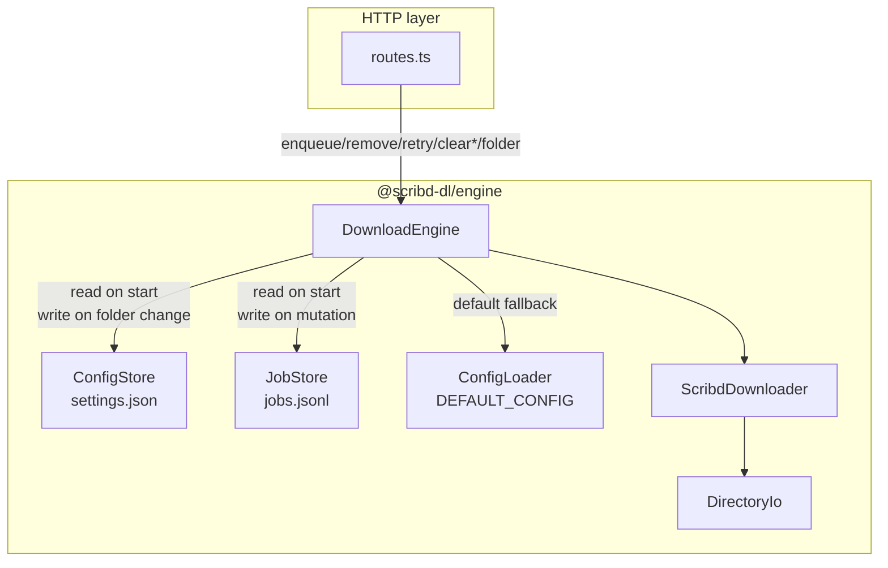
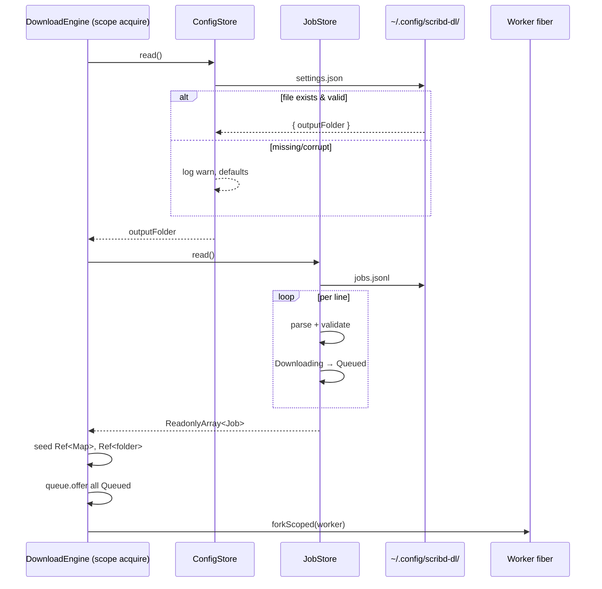
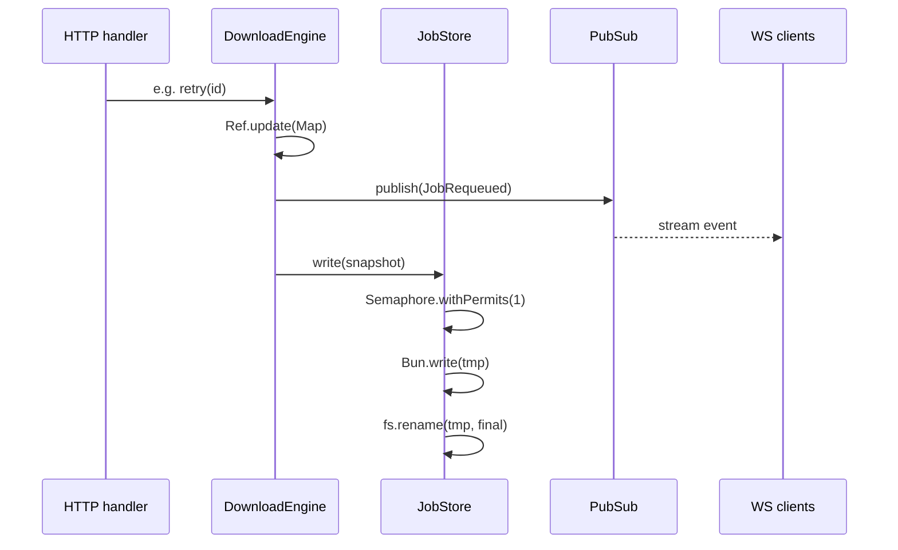

# Persistent config and job state via `~/.config/scribd-dl/`

## Summary

Engine получает персистентное состояние через два файла в `~/.config/scribd-dl/`: `settings.json` хранит `outputFolder`, `jobs.jsonl` — state-snapshot очереди (одна строка на job). На старте engine читает оба файла, нормализует все `Downloading` в `Queued` и продолжает работу с того места, где остановился. CLI-режим `bun start <url>` удаляется целиком — единственный entry point теперь engine sidecar, остальные процессы (TUI, SPA, будущий Tauri-desktop) — клиенты поверх его HTTP/WS. Добавляются явные HTTP-операции `DELETE /jobs/completed` и `DELETE /jobs/failed`; `DELETE /jobs/:id` расширяется на любой не-`Downloading` статус.

---

## Problem Frame

Сейчас состояние engine живёт только в памяти (`packages/engine/src/service/DownloadEngine.ts`): `Ref<Map<JobId, Job>>` для очереди и `Ref<string>` для `outputFolder`. При рестарте процесса теряется и очередь, и мутированный пользователем `outputFolder` (он публикуется по WS как `OutputFolderChanged`, но никуда не пишется). Все три клиента — TUI, SPA, будущий desktop — стартуют с пустым snapshot независимо от прошлой сессии.

Параллельно `--output`/`--filename`/`--rendertime` — CLI-флаги, не сочетаются с UI, который сам хочет менять папку, и не переживают рестарт. CLI-режим `bun start <url>` (`packages/engine/run.ts`) дополнительно создаёт второй entry point, который при наличии файлового state-файла начал бы конкурировать с engine за запись.

Перенос состояния в файлы решает оба класса проблем: сессия переживает рестарт, UI-изменения папки видны при следующем запуске, конфиг-флаги становятся не нужны, и единый писатель в `~/.config/scribd-dl/` снимает класс гонок «два процесса пишут в один файл».

---

## Requirements

Все требования карриются из origin doc (`docs/brainstorms/2026-06-10-persistence-config-and-jobs-requirements.md`). Маппинг R-ID плана → R-ID origin:

- **R1.** Файловое расположение `~/.config/scribd-dl/{settings.json, jobs.jsonl}`, создание на запись, fallback на дефолты при отсутствии/повреждении (см. origin R1).
- **R2.** `settings.json` хранит только `outputFolder: string` (абсолютный, expanded), атомарная перезапись на изменение, engine — единственный писатель (см. origin R2).
- **R3.** `jobs.jsonl` хранит state-snapshot (одна строка = один `Job`), атомарная перезапись на смену статуса/title, прогресс-тики не пишутся (см. origin R3).
- **R4.** На старте engine `Downloading` нормализуется в `Queued` без подтверждения; `Queued` остаётся, `Downloaded`/`Failed` сохраняются (см. origin R4).
- **R5.** CLI-режим `bun start <url>` удаляется целиком. Флаги `--output`/`--filename`/`--rendertime` исчезают; `filename` и `rendertime` фиксируются константами в коде (см. origin R5).
- **R6.** Новые endpoints `DELETE /jobs/completed`, `DELETE /jobs/failed`, возвращают `200 { removed: number }`; `DELETE /jobs/:id` разрешает любой статус кроме `Downloading` (см. origin R6).
- **R7.** `GET /snapshot` и WS-протокол не меняются; wire-типы в `packages/shared/src/jobs.ts` без изменений; новый `ClearResponse` в `packages/shared/src/http.ts` (см. origin R7).

---

## Key Technical Decisions

### KTD1. Два новых сервиса `ConfigStore` и `JobStore` поверх существующего `ConfigLoader`

`ConfigLoader` остаётся как источник статических дефолтов (`DEFAULT_CONFIG` в `packages/engine/src/utils/io/ConfigLoader.ts`): `filename: "title"`, `rendertime: 100`, `output: "output"`. Поверх него добавляются два новых `Context.Tag`/`Layer.scoped` сервиса:

- `ConfigStore` — читает/пишет `~/.config/scribd-dl/settings.json`, экспонирует `read: Effect<Settings>` и `write: (s: Settings) => Effect<void>`.
- `JobStore` — читает/пишет `~/.config/scribd-dl/jobs.jsonl`, экспонирует `read: Effect<ReadonlyArray<Job>>` (с нормализацией Downloading→Queued) и `write: (jobs: ReadonlyArray<Job>) => Effect<void>`.

Альтернатива «вынести всё в один `PersistenceLayer`» отвергнута: два файла имеют разный жизненный цикл (settings меняется редко, jobs — часто), разные форматы (JSON vs JSONL), разные ошибки повреждения; разделение упрощает тесты и keeps the read/write surface focused.

### KTD2. Атомарная запись через `Bun.write(tmp) + fs.rename(tmp, final)`

Оба store-сервиса пишут во временный файл рядом (`settings.json.tmp`, `jobs.jsonl.tmp`) и атомарно переименовывают. На macOS/Linux `rename` атомарен в рамках одной файловой системы, что гарантирует: после kill -9 в файле всегда либо старая, либо новая полная версия — никогда полу-записанный мусор.

### KTD3. Сериализация записи в `JobStore` через `Semaphore` (permits=1)

HTTP-обработчики (enqueue, remove, retry, clear) и worker-фибра меняют `Map<JobId, Job>` параллельно через `Ref.update`. Без сериализации записи две одновременных мутации могли бы привести к race: `Ref.get → write file` от A и B чередуются, последний writer затирает чужой snapshot. Решение: `Semaphore.make(1)` внутри `JobStore`, оборачивающий `write` — `Ref.get` происходит внутри критической секции, гарантируя что записанный snapshot отражает состояние после ВСЕХ предыдущих коммитов.

`ConfigStore` не требует semaphore (settings меняется только через `setOutputFolder`, который и так serializes через свой `Ref.update`).

### KTD4. Persist триггерится в `DownloadEngine` на каждой смене статуса и title

Точки записи в `JobStore`:
- `enqueue` — после добавления каждого job (или один раз батчем после всех)
- `remove` / `retry` — после изменения Map
- worker'ы при переходе `Queued → Downloading → Downloaded | Failed`
- `JobTitleUpdated` (когда `TitleResolver` обновляет `displayTitle`)

Прогресс-события (`ScrapeProgress`, `RenderProgress`) **не** триггерят запись — они идут только в `PubSub` и наружу по WS, файл от них не страдает.

`ConfigStore.write` триггерится из `setOutputFolder` после `Ref.set(folderRef, ...)`.

### KTD5. Нормализация Downloading→Queued происходит в `JobStore.read`, не в `DownloadEngine`

`JobStore.read` возвращает уже нормализованный массив. Это держит engine-логику чистой («что прочитали — то и есть текущее состояние») и упрощает тестирование: правило живёт в одном месте с явным test case.

### KTD6. Расширение `engine.remove` и snапшот ошибок

Текущий `NotRemovable` фейлится на любой не-`Queued`. Правила меняются: `NotRemovable` остаётся только для `Downloading`. Это семантическое расширение API; добавляется новый ошибочный сценарий `NotRemovable { status: "Downloading" }` (тот же тип, другое значение поля). HTTP-обработчик мапит его в 409 как и сейчас.

Новые engine API: `clearCompleted: Effect<number, never, never>` и `clearFailed: Effect<number, never, never>` — возвращают количество удалённых job'ов. Внутри: фильтр Map по статусу, удаление, публикация `JobRemoved` для каждого, persist один раз.

### KTD7. CLI-флаги исчезают; engine.ts оставляет только `--port`

`packages/engine/run.ts` удаляется. `packages/engine/engine.ts` упрощается: убираются `outputOpt`, `filenameOpt`, `rendertimeOpt`. Остаётся только `portOpt`. `ConfigData` строится из `DEFAULT_CONFIG` без CLI-инъекций (выбор `outputFolder` теперь делает `ConfigStore` на читая `settings.json` поверх дефолта).

`src/cli/options.ts` либо удаляется (если кроме `portOpt` ничего не остаётся), либо сжимается до одного экспорта `portOpt`. Зависит от: остаётся ли `Command.make` шейп вообще или engine.ts переписывается на голый `BunRuntime.runMain` с argv-парсингом порта вручную. Решение: оставить `Command.make` с одним `port` — минимальное изменение, сохраняет `--help` для пользователя.

---

## High-Level Technical Design

### Слой сервисов (после изменений)



### Жизненный цикл при старте



### Поток одной мутации



---

## Output Structure

```text
packages/engine/
  engine.ts                          # MODIFIED: remove output/filename/rendertime opts
  src/
    cli/
      options.ts                     # MODIFIED: keep only portOpt
    errors/
      DomainErrors.ts                # MODIFIED: new PersistenceFailed (optional, see U2)
    service/
      ConfigStore.ts                 # NEW
      JobStore.ts                    # NEW
      DownloadEngine.ts              # MODIFIED: integrate stores, start-up read, persist on mutation
      ScribdDownloader.ts            # unchanged
    server/
      routes.ts                      # MODIFIED: DELETE /jobs/completed, DELETE /jobs/failed, broaden /jobs/:id
      HttpServerLive.ts              # unchanged
    utils/
      io/
        ConfigLoader.ts              # unchanged (stays as defaults source)
  test/
    ConfigStore.test.ts              # NEW
    JobStore.test.ts                 # NEW
    DownloadEngine.test.ts           # MODIFIED: add persistence + restart scenarios
    server/HttpServer.test.ts        # MODIFIED: clear endpoints + broadened remove
    runCli.test.ts                   # DELETED
  run.ts                             # DELETED

packages/shared/
  src/
    http.ts                          # MODIFIED: add ClearResponse

package.json                         # MODIFIED: remove `start` script (or repoint to engine)
README.md                            # MODIFIED: drop CLI usage, add ~/.config note
CLAUDE.md                            # MODIFIED: drop CLI section, document persistence
```

---

## Implementation Units

### U1. Удалить CLI-режим `bun start <url>`

**Goal:** Убрать второй entry point до того, как новые store-сервисы трогают engine. Делается первым, чтобы изоляция была чистой: дальше план работает только с одной точкой запуска (engine sidecar).

**Requirements:** R5.

**Dependencies:** none.

**Files:**
- DELETE `packages/engine/run.ts`
- DELETE `packages/engine/test/runCli.test.ts`
- MODIFY `packages/engine/engine.ts` — убрать `outputOpt`, `filenameOpt`, `rendertimeOpt` из `Command.make`, ConfigData строить только из `DEFAULT_CONFIG`
- MODIFY `packages/engine/src/cli/options.ts` — оставить только `portOpt` (удалить `outputOpt`, `filenameOpt`, `rendertimeOpt`)
- MODIFY `package.json` (root) — удалить скрипт `start` (`bun packages/engine/run.ts`); скрипты `lint`/`format`/`format:check` — убрать ссылку на `packages/engine/run.ts`
- MODIFY `packages/engine/package.json` — удалить скрипт `start`
- MODIFY `README.md` — убрать секции о CLI usage, `--output`/`--filename`/`--rendertime`
- MODIFY `CLAUDE.md` — обновить секции «Runtime and commands» и «Architecture» (убрать упоминание `run.ts`, `runCli`, `--output`, `--filename`, `--rendertime`)

**Approach:**
- `engine.ts` после изменений: `Command.make("scribd-dl-engine", { port: portOpt }, ({ port }) => { const config = DEFAULT_CONFIG; ... })`. Никакой пользовательской настройки в CLI больше нет.
- `extractUrls` в `DownloadEngine.enqueue` остаётся — он нужен HTTP-эндпоинту `/enqueue` для парсинга многострочного ввода от UI.
- Проверить что в `packages/engine/tui.ts` нет import'ов из `run.ts` (TUI работает поверх engine через HTTP, не должен).

**Test scenarios:**
- Никаких новых тестов; удалённый `runCli.test.ts` уходит вместе с CLI.
- Smoke: `bun run engine` стартует без ошибок и печатает `READY port=4747`.
- Smoke: `bun run tui` подключается к локальному engine как и раньше.
- `bun run lint` и `bun run format:check` проходят без ссылок на удалённые файлы.

**Verification:** репо без `packages/engine/run.ts`, `bun run start` (если кто-то попробует) выдаёт `npm`-стандартный «script not found»; `bun run engine` работает; все существующие тесты engine'а зелёные.

---

### U2. Добавить сервис `ConfigStore`

**Goal:** Изолированный сервис, отвечающий за чтение/запись `settings.json`. На этом шаге сервис существует но ещё не интегрирован в engine — это будет в U4.

**Requirements:** R1, R2.

**Dependencies:** U1 (чистая базовая линия без CLI).

**Files:**
- CREATE `packages/engine/src/service/ConfigStore.ts`
- CREATE `packages/engine/test/ConfigStore.test.ts`
- MODIFY `packages/engine/src/errors/DomainErrors.ts` — добавить `PersistenceFailed` (общая ошибка для I/O в store-сервисах; поля `path: string`, `op: "read" | "write"`, `cause: unknown`). Следует существующему паттерну `Data.TaggedError`.

**Approach:**
- Public interface:
  ```text
  interface Settings { readonly outputFolder: string }
  interface ConfigStoreService {
    readonly read: Effect<Settings, never, never>
    readonly write: (s: Settings) => Effect<void, PersistenceFailed, never>
  }
  class ConfigStore extends Context.Tag("ConfigStore")<...>() {}
  ConfigStoreLive: Layer<ConfigStore, never, ConfigLoader>
  ```
- `read` стратегия:
  - Путь файла: `path.join(os.homedir(), ".config", "scribd-dl", "settings.json")`.
  - Если файла нет → вернуть `{ outputFolder: defaultFromConfigLoader }`. Без warn.
  - Если есть, но JSON parse failed → `console.warn` + дефолты. **Не** возвращать ошибку (read должен быть `never` в error channel).
  - Если есть, но валидный JSON без поля `outputFolder` (или поле не string) → warn + дефолты.
  - Иначе вернуть `{ outputFolder: expandHome(parsed.outputFolder) }`.
- `write` стратегия:
  - Убедиться что директория существует через `DirectoryIo.create` или прямой `fs.mkdir(recursive: true)`.
  - Сериализовать в JSON с 2-space indent.
  - Записать во `settings.json.tmp` через `Bun.write`.
  - `fs.rename(tmp, final)`.
  - Любая I/O ошибка → `PersistenceFailed`.
- `expandHome` — вынести в `packages/engine/src/utils/io/path.ts` (новый общий хелпер) или переиспользовать существующий внутренний из `DownloadEngine.ts`. Решение в U4 при интеграции.

**Patterns to follow:**
- `packages/engine/src/utils/io/DirectoryIo.ts` — `Effect.tryPromise` с tagged-error `catch`.
- `packages/engine/src/utils/io/ConfigLoader.ts` — Context.Tag + Layer.succeed/scoped pattern.

**Test scenarios:**
- **Happy: read existing valid settings.** Test-time tmp dir, write `{"outputFolder":"/tmp/foo"}` → `read` returns `{ outputFolder: "/tmp/foo" }`.
- **Missing file → defaults.** Tmp dir без файла → `read` returns `{ outputFolder: <default from ConfigLoader> }`, no error thrown.
- **Corrupt JSON → defaults + warn.** Записать невалидный текст → `read` returns defaults, warn вызван (можно стабить console.warn).
- **Missing outputFolder field → defaults + warn.** Записать `{}` → defaults.
- **Non-string outputFolder → defaults + warn.** Записать `{"outputFolder": 42}` → defaults.
- **Write creates directory.** Удалить `~/.config/scribd-dl/` (тест в tmp), `write({ outputFolder: "/x" })` создаёт директорию и файл.
- **Write atomic via tmp+rename.** После `write` проверить что `settings.json.tmp` НЕ существует.
- **Write round-trip.** `write` → `read` → тот же `outputFolder`.
- **Home expansion on read.** Записать `{"outputFolder":"~/foo"}` → `read` возвращает `<HOME>/foo`.

Tests подменяют корневой путь `~/.config/scribd-dl/` через переменную окружения или DI-параметр (см. ниже). Конкретный механизм: `ConfigStoreLive` принимает `baseDir` извне (через Layer-параметр или env `SCRIBD_DL_CONFIG_DIR`); по умолчанию `path.join(os.homedir(), ".config", "scribd-dl")`. Тесты передают tmp dir.

**Verification:** `bun --filter @scribd-dl/engine test test/ConfigStore.test.ts` зелёный; lint/format чистые.

---

### U3. Добавить сервис `JobStore`

**Goal:** Изолированный сервис чтения/записи `jobs.jsonl` с нормализацией Downloading→Queued при чтении. Как и U2, ещё не интегрирован — это U4.

**Requirements:** R1, R3, R4 (часть про нормализацию на read).

**Dependencies:** U2 (для общего `PersistenceFailed` и согласованного паттерна `baseDir`).

**Files:**
- CREATE `packages/engine/src/service/JobStore.ts`
- CREATE `packages/engine/test/JobStore.test.ts`

**Approach:**
- Public interface:
  ```text
  interface JobStoreService {
    readonly read: Effect<ReadonlyArray<Job>, never, never>
    readonly write: (jobs: ReadonlyArray<Job>) => Effect<void, PersistenceFailed, never>
  }
  class JobStore extends Context.Tag("JobStore")<...>() {}
  JobStoreLive: Layer<JobStore, never, never>
  ```
- `read` стратегия:
  - Путь: `<baseDir>/jobs.jsonl`.
  - Файла нет → return `[]`.
  - Читать построчно (`Bun.file(path).text()` → split на `\n` → filter `line.trim() !== ""`).
  - Для каждой строки: `JSON.parse` внутри try; невалидная — warn `Skipping malformed line N` + skip.
  - Валидация формы: проверить наличие `id`, `url`, `domain`, `status`, `displayTitle` (минимум). Несоответствие — warn + skip.
  - Нормализация: если `status === "Downloading"` → пересоздать `Job` со `status: "Queued"`, дропнуть `progress` (старый прогресс невалиден).
  - Вернуть массив в исходном порядке файла.
- `write` стратегия:
  - Сериализация: каждое `JSON.stringify(job)` + `\n`, конкатенация в один буфер.
  - `Semaphore` (permits=1) обёртка ВНУТРИ сервиса. `write` берёт permit перед I/O, отпускает в `ensuring`.
  - Атомарный tmp+rename.
  - `mkdir -p baseDir` перед записью.
- `Semaphore` создаётся в Layer.scoped блоке через `Effect.makeSemaphore(1)`.

**Patterns to follow:**
- `DirectoryIo.ts` — tagged-error tryPromise.
- `DownloadEngine.ts` строки 87-89 — `Ref.make` + `PubSub.unbounded` инициализация внутри `Layer.scoped(Effect.gen)`. Аналогично здесь для Semaphore.
- `extractUrls` в `DownloadEngine.ts` — паттерн «line-by-line с пропуском пустых и комментариев». Здесь свой парсинг JSONL.

**Test scenarios:**
- **Happy: read existing 3 jobs.** Записать три валидные строки разных статусов → `read` возвращает массив длины 3, порядок сохранён.
- **Missing file → empty.** `read` возвращает `[]`, без warn.
- **Empty file → empty.** Файл существует, размер 0 → `[]`.
- **Trailing newline OK.** Файл с `{"...}\n\n` → одна строка, пустые скипаются.
- **Malformed line skipped.** `valid\nINVALID JSON\nvalid` → массив длины 2, warn с номером строки.
- **Missing required field skipped.** `{"id":"x"}` (нет url/status) → skip + warn.
- **Downloading normalized to Queued.** Записать job со `status:"Downloading"` + `progress:{...}` → `read` возвращает Queued БЕЗ поля `progress`.
- **Queued/Downloaded/Failed unchanged.** Все три статуса остаются, поля сохраняются включая `failure` и `displayTitle`.
- **Write round-trip.** `write([j1,j2])` → `read()` равно `[j1,j2]` (или эквивалент после нормализации).
- **Write creates baseDir.** Удалить baseDir → `write` создаёт.
- **Write atomic via tmp+rename.** После `write` `.tmp` не существует.
- **Concurrent writes serialized.** Параллельные два `write` через `Effect.all([w1, w2])` — оба завершаются без ошибки; финальный файл соответствует одному из двух snapshot'ов (last-permit-wins).
- **Write of empty array writes empty file.** `write([])` → файл существует, размер 0.

**Verification:** `bun --filter @scribd-dl/engine test test/JobStore.test.ts` зелёный.

---

### U4. Интегрировать `ConfigStore` и `JobStore` в `DownloadEngine`

**Goal:** На старте engine читает оба store, восстанавливает Map и folderRef, заполняет worker-queue restored Queued'ами. На каждой смене статуса/title/folder триггерит соответствующий persist.

**Requirements:** R1, R2, R3, R4, R7.

**Dependencies:** U2, U3.

**Files:**
- MODIFY `packages/engine/src/service/DownloadEngine.ts`
- MODIFY `packages/engine/test/DownloadEngine.test.ts`
- MODIFY `packages/engine/engine.ts` — добавить `ConfigStoreLive`, `JobStoreLive` в InfraLayer, прокинуть в `DownloadEngineLive`
- MODIFY `packages/engine/test/server/HttpServer.test.ts` — добавить mock-store layers где нужны

**Approach:**
- `DownloadEngineLive` сигнатура расширяется: `Layer<DownloadEngine, never, ScribdDownloader | ConfigLoader | ConfigStore | JobStore>`.
- Внутри `Layer.scoped`:
  1. `const restored = yield* JobStore.read` — массив с нормализованными статусами.
  2. `const settings = yield* ConfigStore.read`.
  3. `const stateRef = yield* Ref.make(new Map(restored.map(j => [j.id, j])))`.
  4. `const folderRef = yield* Ref.make(settings.outputFolder)`.
  5. Worker queue: `for (const j of restored) if (j.status === "Queued") yield* Queue.offer(queue, j.id)`.
  6. Дальше всё как сейчас (PubSub, worker fork).
- Helper `persistJobs: Effect<void, never, never>` внутри scope:
  - `const map = yield* Ref.get(stateRef)`
  - `yield* JobStore.write(Array.from(map.values())).pipe(Effect.catchAll(e => Effect.sync(() => console.error("persist failed", e))))`
  - Ошибки persist'а **не валятся наверх** — engine продолжает работать; пишется только warning. Альтернатива (фейлить операцию) дала бы UX «нажал retry — получил 500 потому что диск», что хуже.
- Все мутации Map (enqueue, remove, retry, worker transitions, title update) теперь делаются через локальный хелпер:
  ```text
  const commit = (mut: (m: Map) => Map, event: JobEvent) => Effect.gen(...) {
    yield* Ref.update(stateRef, mut)
    yield* publish(event)
    yield* persistJobs
  }
  ```
  Прогресс-события — НЕ через commit, идут отдельно через `publish` без `persistJobs`.
- `setOutputFolder`:
  ```text
  yield* Ref.set(folderRef, expanded)
  yield* publish(OutputFolderChanged)
  yield* ConfigStore.write({ outputFolder: expanded }).pipe(catchAll log)
  ```
- `expandHome` хелпер — оставить в `DownloadEngine.ts` или вынести в `src/utils/io/path.ts` (новый файл). Решение: вынести, чтобы `ConfigStore` тоже мог использовать. Один экспорт `expandHome(path: string): string`.
- `restoreOnStart` нюансы:
  - При восстановлении пустого state → ничего особенного, обычный пустой engine.
  - При восстановлении state со 100% Downloaded/Failed jobs (всё завершено) → queue пустая, worker idle. ОК.

**Technical design (директивно):**

Контракт нового хелпера commit и таблица event → persist:

| Event | persist jobs? | persist settings? |
|---|---|---|
| JobAdded | yes | no |
| JobStarted (Queued→Downloading) | yes | no |
| JobCompleted | yes | no |
| JobFailed | yes | no |
| JobRemoved | yes | no |
| JobRequeued | yes | no |
| JobTitleUpdated | yes | no |
| JobProgress | **no** | no |
| OutputFolderChanged | no | yes |

**Patterns to follow:**
- Текущий `setJob`/`publish`/`updateJob` паттерн в `DownloadEngine.ts:94-100, 181-188`.
- Layer-композиция в `engine.ts:27-32`.

**Test scenarios:**
- **Cold start: empty stores.** Mock `JobStore.read = []`, `ConfigStore.read = { outputFolder: "/default" }` → `snapshot.jobs` пустой, `outputFolder` = "/default".
- **Cold start with persisted jobs.** Mock `JobStore.read` возвращает 3 job'а разных статусов (Queued, Downloaded, Failed) → snapshot их содержит, queue получает offer только для Queued.
- **Cold start with Downloading normalized.** Mock возвращает job `Downloading` (через нормализацию в read он уже Queued) → попадает в worker-queue.
- **Cold start reads outputFolder.** Mock `ConfigStore.read = { outputFolder: "/tmp/x" }` → `engine.outputFolder` = "/tmp/x".
- **Enqueue persists.** Spy на `JobStore.write` → после `enqueue("https://...")` зафиксирован вызов с массивом, содержащим новый job.
- **Remove persists.** После `remove(id)` `JobStore.write` вызван без удалённого job'а.
- **Retry persists.** После `retry(id)` write вызван с job'ом, у которого status: Queued.
- **Worker transition persists.** Mock `ScribdDownloader.execute` — после succeeded execute job становится Downloaded и `JobStore.write` вызван минимум дважды (Queued→Downloading, Downloading→Downloaded).
- **Title update persists.** Симулировать `TitleResolved` event через executor — `JobStore.write` вызван с обновлённым `displayTitle`.
- **Progress does NOT persist.** Симулировать `ScrapeProgress`/`RenderProgress` event — `JobStore.write` НЕ вызывается (только `publish`).
- **setOutputFolder persists.** Spy на `ConfigStore.write` → после `setOutputFolder("/new")` вызов с `{ outputFolder: "/new" }`.
- **Persist failure does not crash engine.** Mock `JobStore.write` фейлит → engine продолжает работать, последующие операции успешны.
- **Concurrent enqueue + remove.** Через `Effect.all([enqueue(...), remove(...)])` оба завершаются, финальное состояние консистентно (не теряется ни одна мутация).

**Execution note:** Расширять `DownloadEngine.test.ts` инкрементально — переносить существующие тесты на новый Layer-стек с `Layer.succeed(ConfigStore, mockStore)`. Не переписывать с нуля.

**Patterns to follow:**
- `DownloadEngine.test.ts` уже использует `Layer.succeed` mocks для `ScribdDownloader` — те же приёмы для `ConfigStore`/`JobStore`.

**Verification:** `bun --filter @scribd-dl/engine test test/DownloadEngine.test.ts` зелёный; smoke `bun run engine` стартует с пустым `~/.config/scribd-dl/` (создаёт каталог при первой записи); ручной тест: kill engine на полпути Downloading → restart → job снова Downloading.

---

### U5. Новые HTTP endpoints + расширение `DELETE /jobs/:id`

**Goal:** Экспонировать clear-операции наружу и снять ограничение `DELETE /jobs/:id` для `Downloaded`/`Failed`.

**Requirements:** R6, R7.

**Dependencies:** U4 (engine API должно иметь `clearCompleted`/`clearFailed` и расширенный `remove`).

**Files:**
- MODIFY `packages/engine/src/service/DownloadEngine.ts` — добавить `clearCompleted`/`clearFailed` в сервис-интерфейс; расширить `remove`
- MODIFY `packages/engine/src/server/routes.ts` — добавить два DELETE-роута
- MODIFY `packages/shared/src/http.ts` — добавить `ClearResponse`
- MODIFY `packages/engine/test/DownloadEngine.test.ts` — тесты clearCompleted/clearFailed/remove (расширенный)
- MODIFY `packages/engine/test/server/HttpServer.test.ts` — integration тесты новых роутов

**Approach:**
- `DownloadEngineService`:
  - Добавить `clearCompleted: Effect<number, never, never>` (возвращает количество удалённых).
  - Добавить `clearFailed: Effect<number, never, never>`.
  - Внутри: `Ref.modify` собирает удаляемые IDs, делает batch publish `JobRemoved` для каждого, один `persistJobs` в конце.
  - `remove(id)`: проверка статуса — если `Downloading` → `NotRemovable`; иначе удалить, publish `JobRemoved`, persist.
- `routes.ts`:
  - `HttpRouter.del("/jobs/completed", ...)` → `engine.clearCompleted.pipe(map(removed => HttpServerResponse.json({ removed })))`
  - `HttpRouter.del("/jobs/failed", ...)` → аналогично
  - `removeRoute` обработка ошибок: catchTag `NotRemovable` отдаёт 409 как и сейчас, но текст уточняется (`status: "Downloading"`).
- `packages/shared/src/http.ts`:
  ```text
  interface ClearResponse { readonly removed: number }
  ```
  Экспортируется из `index.ts` через существующий `export *`.

**Test scenarios:**

*Engine-level (DownloadEngine.test.ts):*
- **clearCompleted removes only Downloaded.** Залить mix: 2 Queued, 1 Downloaded, 1 Failed → `clearCompleted` возвращает 1, snapshot теряет Downloaded.
- **clearCompleted on empty completed returns 0.** Нет Downloaded → возвращает 0, никаких событий не публикуется.
- **clearFailed removes only Failed.** Аналогично.
- **clearCompleted publishes JobRemoved per item.** Subscribe к events, ожидать N событий `JobRemoved` после `clearCompleted`.
- **clearCompleted persists once.** Spy на `JobStore.write` → вызван 1 раз (не по разу на job).
- **remove of Downloaded succeeds.** `remove(downloadedId)` → snapshot не содержит job, событие JobRemoved.
- **remove of Failed succeeds.** Аналогично.
- **remove of Downloading fails NotRemovable.** Залить Downloading → `remove(id)` фейлит с `NotRemovable { status: "Downloading" }`.
- **remove of Queued still succeeds.** Regression — старый сценарий продолжает работать.

*HTTP-level (server/HttpServer.test.ts):*
- **DELETE /jobs/completed → 200 { removed: N }.** С заранее залитой очередью.
- **DELETE /jobs/failed → 200 { removed: N }.**
- **DELETE /jobs/:id (Downloaded) → 204.** Covers R6.4.
- **DELETE /jobs/:id (Downloading) → 409 NotRemovable.**
- **DELETE /jobs/unknown-id → 404 JobNotFound.** Regression.

**Patterns to follow:**
- `removeRoute`/`retryRoute` в `routes.ts` — `Effect.catchTag` для маппинга domain errors в HTTP коды.
- Возврат JSON-body 200: `HttpServerResponse.json({ removed })` — параллель существующему `folderGetRoute`.

**Verification:** все тесты зелёные; manual: при подключённом WS-клиенте `DELETE /jobs/completed` стримит ожидаемые `JobRemoved` события; HTTP responses соответствуют `ClearResponse`.

---

## Scope Boundaries

### In scope
- Persistence слой через `settings.json` + `jobs.jsonl`.
- Удаление CLI-режима и его флагов.
- Новые HTTP endpoints для clear-операций.
- Расширение `DELETE /jobs/:id` на `Downloaded` и `Failed`.
- Минимально достаточные доки (README/CLAUDE.md).

### Deferred to Follow-Up Work
- UI-кнопки «Clear completed» / «Clear failed» в SPA (`apps/web`) и TUI (`packages/engine/src/tui/`). Бэкенд готов; UI-работа — отдельный PR.
- Обновление CLAUDE.md секций про testing patterns / wire contract с учётом новых сервисов — в этом плане трогаем только секции про CLI и architecture, остальное — следующий проход.

### Outside scope (origin: `Scope Boundaries`)
- Отмена in-flight `Downloading` job (cancel). Нужен механизм interrupt в worker-фибре + UX-решения; отдельная фича.
- Версионирование схемы файлов (`version` field, миграции). Добавляем при первой реальной миграции.
- File-based DB (SQLite/lowdb/level). См. KD2 в origin.
- Конфигурация порта engine через файл. Остаётся CLI-аргументом.
- Поддержка нескольких параллельных engine-процессов. Один engine на машину; `EADDRINUSE` на 4747 — естественная защита.
- Внешнее редактирование `settings.json`/`jobs.jsonl` пока engine запущен.
- Логирование событий для аудита (отдельный event-log файл).

---

## Risks & Dependencies

### Risks

**R1. Race на параллельные мутации Map.** Митигируется `Semaphore(1)` в `JobStore.write` (KTD3) — критическая секция включает `Ref.get` + I/O. Под нагрузкой (если она когда-нибудь придёт) Semaphore может стать боттлнеком; в self-use сценарии — non-issue.

**R2. Размер `jobs.jsonl` со временем.** Если пользователь никогда не чистит — файл растёт. Реалистично — тысячи строк через год self-use. JSON.parse одной строки ~микросекунды; чтение `jobs.jsonl` на старте — миллисекунды до десятков тысяч записей. Не блокер. Если станет — добавить auto-archive старых записей (но это уже отдельная фича).

**R3. Атомарность `rename`.** Гарантируется только если tmp и final на одной файловой системе. В `~/.config/scribd-dl/` это всегда так. Не риск если кто-то не маунтит `~/.config/scribd-dl/` через симлинк на другой том — выходит за scope.

**R4. Persist failure скрывает себя.** KTD4 говорит ошибка persist'а только логируется. Если диск умер и `JobStore.write` всегда фейлит — engine продолжает работать в памяти, но рестарт потеряет всё. Это accepted: альтернатива «фейлить операцию» хуже UX. Mitigation: warning в stderr виден в обычном использовании.

**R5. Удаление `runCli.test.ts` и `run.ts` — нет ли других мест с зависимостью.** Митигируется в U1 grep'ом по `runCli`, `run.ts`, `runCli`. Tests engine'а не должны импортить `run.ts` (там только `runCli` тесты).

**R6. Сменa контракта `NotRemovable`.** Сейчас выкидывается на любой не-Queued. После — только на Downloading. UI-клиенты ожидающие 409 для Downloaded больше его не получат; они получат 204. SPA/TUI сейчас не предъявляют `remove` к Downloaded/Failed; смотрим в `apps/web/src/` и `packages/engine/src/tui/` — если есть такая логика, может потребоваться UI fix (в рамках Deferred UI работы, не блокер для бэкенда).

### Dependencies

- Bun runtime 1.3+ (`Bun.write` API). Уже зафиксировано в `packages/engine/package.json`.
- `effect` ≥3.21 (`Effect.makeSemaphore`). Уже есть.
- `@effect/cli` — остаётся для engine.ts (один опшен `--port`). Можно удалить целиком если переписать парсинг argv вручную — отдельный refactor, не в этом скоупе.

---

## Outstanding Questions

Нет открытых вопросов. Все решения зафиксированы в брейншторме и KTD выше.

---

## Verification Plan

1. **Unit-уровень:** все новые/изменённые тесты (`ConfigStore.test.ts`, `JobStore.test.ts`, расширенный `DownloadEngine.test.ts`, расширенный `server/HttpServer.test.ts`) зелёные через `bun run test`.
2. **Lint/format:** `bun run lint` и `bun run format:check` чистые.
3. **Manual smoke (рестарт):**
   - Удалить `~/.config/scribd-dl/`.
   - `bun run engine`.
   - Через SPA/TUI: добавить 2 URL, сменить outputFolder.
   - Дождаться когда один скачается, второй в Downloading.
   - kill -9 engine.
   - `bun run engine` снова.
   - Подключиться UI → видим: outputFolder тот же, скачанный остался Downloaded, второй снова Queued (auto-restarted).
4. **Manual smoke (clear):**
   - Накопить mix статусов.
   - SPA: HTTP `DELETE /jobs/completed` (через curl или devtools) → snapshot теряет Downloaded, UI получает `JobRemoved` события.
   - То же для `DELETE /jobs/failed`.
5. **Manual smoke (remove broadened):**
   - HTTP `DELETE /jobs/<downloaded-id>` → 204; snapshot теряет job.
   - HTTP `DELETE /jobs/<downloading-id>` → 409.
6. **Manual smoke (CLI gone):**
   - `bun run start` → script not found.
   - `bun run engine --help` → видит только `--port`.

---

## Sources & Research

- Origin requirements: `docs/brainstorms/2026-06-10-persistence-config-and-jobs-requirements.md`
- Текущая engine архитектура: `packages/engine/src/service/DownloadEngine.ts`
- HTTP роуты: `packages/engine/src/server/routes.ts`, `packages/engine/src/server/HttpServerLive.ts`
- CLI флаги: `packages/engine/src/cli/options.ts`, `packages/engine/engine.ts`, `packages/engine/run.ts`
- Wire contract: `packages/shared/src/jobs.ts`, `packages/shared/src/http.ts`
- Конфиг/ошибки: `packages/engine/src/utils/io/ConfigLoader.ts`, `packages/engine/src/utils/io/DirectoryIo.ts`, `packages/engine/src/errors/DomainErrors.ts`
- Конвенции проекта: корневой `CLAUDE.md` (Architecture, Conventions)
