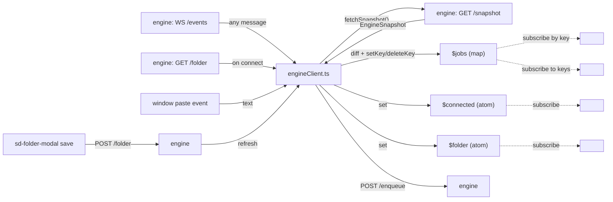

# refactor: Migrate SPA from React to nanotags + terminal.css

## Summary

`apps/web` переписывается с React/Tailwind/Radix на nanotags (custom elements) + nanostores + terminal.css. Vite + TypeScript + vitest сохраняются. Поведение клиента остаётся прежним (paste → enqueue, queue со статусами и прогрессом, remove/retry, disconnect banner) плюс добавляется работающий folder picker. `packages/engine` и `packages/shared` не меняются.

---

## Problem Frame

Текущий `apps/web` — SPA на React 19 с Tailwind 4 и Radix UI (~800 строк исходников, 4 компонента + 4 UI-примитива). UI простой (один экран, очередь, модалка), вес стека несоразмерен задаче, а кнопка `Change folder` отрисована, но не подключена (`onChangeFolder` не передан в `Header`).

Решение зафиксировано в [origin](../brainstorms/2026-06-10-spa-nanotags-terminalcss-requirements.md): nanotags для рендера, nanostores для состояния, terminal.css для визуального тона. Один HTTP/WS-клиент движка, никаких бандл-тяжёлых зависимостей.

---

## Requirements

Все идентификаторы — origin Decisions/Outstanding.

- **R1** — UI рендерится через custom elements (nanotags `define()`), без React/JSX. См. origin D-1.
- **R2** — Состояние клиента хранится в nanostores (`atom` + `map`). Job-level мутации точечно перерисовывают `<sd-queue-item>` через `map.setKey`. См. origin D-2.
- **R3** — Визуально SPA использует terminal.css как тон; веб-идиомы взаимодействия (клики, фокус по умолчанию, нет `q to quit`, нет принудительной Tab-фокусировки) сохраняются. См. origin D-3.
- **R4** — Folder picker реализуется как модалка с инпутом, `Enter` = save, `Esc` = cancel, валидация на пустую строку. Источник правды — движок (`GET /folder`, `POST /folder`), `localStorage` не используется. См. origin D-4.
- **R5** — Прогресс рендерится текстом `done / total (stage)`, без прогресс-бара. См. origin D-6.
- **R6** — Поведение поведения paste/remove/retry/disconnect-banner/transient-status сохраняется как в текущем SPA. См. origin "User-facing behavior".
- **R7** — Тесты `apps/web/test/*` переписываются под DOM (`@testing-library/dom`) с сохранением исходных сценариев. См. origin D-5.
- **R8** — `packages/engine` и `packages/shared` остаются без изменений; брейнсторм-вопрос O-1 (`POST /folder`) закрыт — эндпоинт уже существует.
- **R9** — `apps/web/package.json` не содержит `react`, `react-dom`, `@radix-ui/*`, `class-variance-authority`, `clsx`, `tailwind-merge`, `tailwindcss`, `@tailwindcss/vite`, `@vitejs/plugin-react`, `@testing-library/react`, `@types/react*`. Из success criteria origin.
- **R10** — `bun run lint`, `bun run format:check`, `bun --filter @scribd-dl/web test` зелёные. Из success criteria origin.

---

## Key Technical Decisions

### KTD-1. WS-апдейты: refresh-on-event + client-side diff перед `setKey`

Текущий `useEngineState` на любое WS-сообщение делает `GET /snapshot` и заменяет `snapshot` целиком. План сохраняет эту модель: после `fetchSnapshot` итерируемся по jobs, сравниваем shallow-равенство с предыдущим значением по ключу `job.id` и вызываем `$jobs.setKey(id, job)` только для изменившихся; удалённые ключи — `$jobs.setKey(id, undefined)` (или эквивалент API nanostores `map`). Это даёт точечный ререндер `<sd-queue-item>` без перехода на JobEvent-парсинг.

**Альтернатива** — парсить `JobEvent` из WS-сообщения и точечно апдейтить map, экономя HTTP-roundtrip. Отложено: это меняет контракт клиент-движок (сейчас WS работает как "что-то изменилось, перечитай"), требует переноса логики merge-event-into-snapshot из движка в клиент. Не оправдано в рамках миграции UI.

### KTD-2. terminal.css подключается из npm

`terminal.css` ставится как dev-зависимость, импортируется в `apps/web/src/styles.css` через `@import "terminal.css"` (плюс точечные оверрайды). Версия фиксируется в `bun.lock`, оффлайн dev работает.

**Альтернатива** — `<link>` на CDN в `index.html`. Отвергнуто: разбивает оффлайн-разработку, не контролируется bun.lock.

### KTD-3. Один store-модуль с несколькими атомами

`apps/web/src/store.ts` экспортирует `$snapshot` (`atom<EngineSnapshot | null>`), `$jobs` (`map<Record<JobId, Job>>`), `$folder` (`atom<string | null>`), `$connected` (`atom<boolean>`), `$transient` (`atom<string | null>`), `$modal` (`atom<'none' | 'folder'>`). Каждый custom element подписывается через `ctx.effect` на нужный срез. `$jobs` обновляется через сравнение в `engineClient.ts`, не через производное от `$snapshot` — это даёт точечный ререндер списка.

### KTD-4. nanotags `define()` per-component, монтаж через `index.html`-каркас

Каждый компонент — отдельный custom element, регистрируется `define("sd-xxx")` в собственном файле; `main.ts` импортирует их side-effect-импортами. Каркас тегов лежит в `index.html` (не создаётся из JS), nanotags гидрирует существующую DOM-разметку. Это идиоматично для nanotags и упрощает SSR-подобный fallback (HTML отрисует "пустой" каркас до загрузки JS).

### KTD-5. `engineClient.ts` — функции, не хуки

Логика WS + REST переезжает из `apps/web/src/hooks/useEngineState.ts` и `apps/web/src/hooks/usePasteHandler.ts` в `apps/web/src/engineClient.ts`. Это обычные функции: `startEngineClient()` инициализирует WS, ставит обработчики и пишет в сторы; `attachPasteHandler()` навешивает `paste`-listener на `window`. Никаких React-хуков. `transientTimerRef` логика (2 сек таймаут на сообщение) переезжает в `showTransient(msg: string)` — обычный модульный таймер.

### KTD-6. `lib/api.ts` и `lib/backendUrl.ts` переносятся 1:1

Никаких изменений в `lib/api.ts` (все 6 функций — `fetchSnapshot`, `enqueueText`, `removeJob`, `retryJob`, `fetchFolder`, `setFolder` — уже не зависят от React) и `lib/backendUrl.ts`. `lib/utils.ts` (4 строки, обёртка `clsx` + `tailwind-merge`) удаляется вместе с зависимостями.

### KTD-7. Vite-конфиг чистится

`vite.config.ts` теряет `@vitejs/plugin-react` и `@tailwindcss/vite`. Alias `@/*` сохраняется (стандартный Vite resolve). `tsconfig.json` теряет `"jsx"` и `react`-связанные опции; добавляется ничего — Bun + Vite справляются.

---

## Output Structure

После миграции `apps/web/src/` выглядит так:

```text
apps/web/
  index.html                     # каркас custom elements + import "./src/main.ts"
  vite.config.ts                 # без react/tailwind плагинов
  package.json                   # nanotags, nanostores, terminal.css; без react/radix/tailwind
  tsconfig.json                  # без jsx
  src/
    main.ts                      # импорт define()-модулей, startEngineClient(), attachPasteHandler()
    store.ts                     # $snapshot, $jobs, $folder, $connected, $transient, $modal
    engineClient.ts              # WS + REST → сторы
    styles.css                   # @import "terminal.css" + точечные оверрайды
    components/
      sd-app.ts
      sd-header.ts
      sd-disconnect-banner.ts
      sd-queue.ts
      sd-queue-item.ts
      sd-statusbar.ts
      sd-folder-modal.ts
    lib/
      api.ts                     # без изменений
      backendUrl.ts              # без изменений
  test/
    setup.ts                     # vitest jsdom setup
    paste.test.ts                # paste-event → POST /enqueue
    queue-item.test.ts           # рендер статусов/кнопок (на DOM)
    store.test.ts                # WS-патч → store updates
    disconnect.test.ts           # disconnect-banner toggling
    smoke.test.ts                # mount + базовый рендер
```

Папок `components/ui/` и `hooks/` больше нет.

---

## High-Level Technical Design

### Поток данных



### Жизненный цикл `<sd-queue>` ↔ `<sd-queue-item>`

`<sd-queue>` подписан на список ключей `$jobs`. На каждое изменение:
- Новые `job.id` → создаёт `<sd-queue-item job-id="...">` и аппендит.
- Удалённые ключи → снимает соответствующий `<sd-queue-item>`.
- Существующие ключи не трогает — `<sd-queue-item>` сам подписан на `$jobs` по своему ключу и перерисует только свой блок.

Это и есть выигрыш от map: progress-тики (которые сейчас приходят как WS-сообщения и триггерят полный refresh) не дёргают порядок DOM в очереди, не сбрасывают фокус на кнопках Remove/Retry соседних items.

### Folder-модалка

```mermaid
stateDiagram-v2
  [*] --> Closed
  Closed --> Open: $modal.set("folder")
  Open --> Validating: Enter / click Save
  Validating --> Open: trim() === "" (показать error)
  Validating --> Posting: непустой path
  Posting --> Closed: 204 OK → $folder обновлён через fetchFolder
  Posting --> Open: !res.ok → показать error
  Open --> Closed: Esc / click Cancel / click overlay
```



---

## Implementation Units

### U1. Deps swap: убрать React/Tailwind/Radix, добавить nanotags/nanostores/terminal.css

**Goal:** Чистый старт — `apps/web/package.json` приведён к целевому состоянию, `bun install` зелёный, `bun.lock` обновлён.

**Requirements:** R1, R9.

**Dependencies:** none.

**Files:**
- `apps/web/package.json` (modify)
- `bun.lock` (auto-update)

**Approach:**
- Удалить: `react`, `react-dom`, `@radix-ui/react-dialog`, `@radix-ui/react-progress`, `@radix-ui/react-slot`, `class-variance-authority`, `clsx`, `tailwind-merge`, `tailwindcss`, `@tailwindcss/vite`, `@vitejs/plugin-react`, `@testing-library/react`, `@types/react`, `@types/react-dom`.
- Добавить: `nanotags`, `nanostores`, `terminal.css`, `@testing-library/dom`.
- `@testing-library/jest-dom`, `jsdom`, `vitest`, `typescript`, `vite` — оставить.
- `@scribd-dl/shared` — оставить.

**Patterns to follow:** существующая структура workspace (`"@scribd-dl/shared": "workspace:*"`).

**Test scenarios:**
- Test expectation: none — пакет-манифест.

**Verification:** `bun install` без ошибок; `package.json` не содержит запрещённых R9 ключей.

---

### U2. Vite + TS конфиг: убрать react/tailwind, оставить alias

**Goal:** `vite.config.ts` и `apps/web/tsconfig.json` чистые от React/Tailwind. Dev-сервер стартует.

**Requirements:** R1, R3.

**Dependencies:** U1.

**Files:**
- `apps/web/vite.config.ts` (modify)
- `apps/web/tsconfig.json` (modify)

**Approach:**
- В `vite.config.ts` снять `@vitejs/plugin-react` и `@tailwindcss/vite`. Сохранить путь-alias `@/*` через `resolve.alias` (стандартный Vite, без плагинов).
- В `tsconfig.json` убрать `"jsx"`, `"jsxImportSource"`, `"types": ["@types/react", ...]` если присутствуют. `moduleResolution: "bundler"`, `noEmit: true` сохраняются (см. CLAUDE.md).
- В `apps/web/test/setup.ts` снять `@testing-library/jest-dom`-импорт под React и заменить на vanilla-вариант (jest-dom поддерживает обе экосистемы — импорт `@testing-library/jest-dom/vitest` остаётся).

**Patterns to follow:** конфиги остальных workspace'ов.

**Test scenarios:**
- Test expectation: none — конфиг.

**Verification:** `bun run app:dev` поднимает Vite без ошибок (даже на пустой странице — следующий unit добавит HTML).

---

### U3. `index.html` + `styles.css`: каркас и базовый стиль

**Goal:** Базовая HTML-структура с custom-element тегами, terminal.css импортирован, точечные оверрайды.

**Requirements:** R1, R3.

**Dependencies:** U2.

**Files:**
- `apps/web/index.html` (modify) — пересоздаётся каркас
- `apps/web/src/styles.css` (create) — `@import "terminal.css"` + оверрайды
- `apps/web/src/index.css` (delete) — Tailwind-токены больше не нужны
- `apps/web/src/main.tsx` (delete, заменится `main.ts` в U4)

**Approach:**
- `index.html` содержит `<sd-app>` с дочерними `<sd-header>`, `<sd-disconnect-banner hidden>`, `<sd-queue>`, `<sd-statusbar>`, `<sd-folder-modal hidden>`. Каркас:

```html
<sd-app>
  <article class="terminal-card">
    <header>Scribd downloader</header>
    <sd-header></sd-header>
    <sd-disconnect-banner hidden></sd-disconnect-banner>
    <sd-queue></sd-queue>
    <sd-statusbar></sd-statusbar>
  </article>
  <sd-folder-modal hidden></sd-folder-modal>
</sd-app>
<script type="module" src="/src/main.ts"></script>
```

- `styles.css` импортирует terminal.css и добавляет оверрайды: `.queue-item` (отступы, бордер между айтемами), статус-цвета (`--primary-color` для Downloaded/Downloading, `--error-color` для Failed), blink-animation для `Downloading`, footer-разделитель пунктиром.
- `index.html` подключает `styles.css` через `<link rel="stylesheet" href="/src/styles.css">` или импорт из `main.ts` — на выбор; референс показывает inline `<style>` для @keyframes, но в нашем случае всё в styles.css.

**Patterns to follow:** terminal.css `.terminal-card`, `header`, `.btn`/`.btn-default`/`.btn-primary`/`.btn-error`, `.terminal-alert.terminal-alert-error`, `fieldset`/`form-group` как в референсном коде origin.

**Test scenarios:**
- Test expectation: none — статика; покрывается в U10 smoke-тестом.

**Verification:** `bun run app:dev` открывается, видна базовая карточка с заголовком, без JS-ошибок в консоли (custom-elements ещё не определены — браузер их рендерит пустыми, это ок).

---

### U4. `store.ts`: nanostores схема

**Goal:** Единственный источник правды состояния клиента, типизированно.

**Requirements:** R2, R6.

**Dependencies:** U1.

**Files:**
- `apps/web/src/store.ts` (create)
- `apps/web/src/main.ts` (create, минимальная заглушка-точка-входа)

**Approach:**
- Экспортирует:
  - `$jobs: MapStore<Record<JobId, Job>>` (`nanostores`).
  - `$folder: WritableAtom<string | null>`.
  - `$connected: WritableAtom<boolean>` (init `false`).
  - `$transient: WritableAtom<string | null>` (init `null`).
  - `$modal: WritableAtom<'none' | 'folder'>` (init `'none'`).
- Хелперы:
  - `applySnapshot(snap: EngineSnapshot)` — итерация по `snap.jobs`, shallow-сравнение с текущим значением `$jobs.get()[id]`, `setKey(id, job)` только если изменился; удаление ключей, которых нет в новом снэпшоте.
  - `showTransient(msg: string)` — set + clearTimeout/setTimeout на 2000 мс с module-local `let timer: number | null`.
- Все типы из `@scribd-dl/shared`. Никаких локальных дубликатов wire-контракта (см. CLAUDE.md).
- `main.ts` — пока пустой `import "./styles.css";` + `import "./store";` (заполнится в U9).

**Patterns to follow:** nanostores API (`atom`, `map`, `.set`, `.get`, `.setKey`, `.subscribe`).

**Test scenarios:**
В `test/store.test.ts` (создаётся в U10, но сценарии перечислены сразу для трассировки на этот unit):
- Empty snapshot — `applySnapshot({ jobs: [] })` оставляет `$jobs.get()` пустым.
- Add — снэпшот с одним job → `$jobs.get()[id]` равен этому job.
- Update — изменение `status` существующего job → `$jobs.get()[id]` обновлён, `setKey` вызван только для него (опционально проверяется через subscribe-spy).
- Remove — job исчез из снэпшота → ключ удалён из `$jobs`.
- `showTransient` — `set` → через 2000 мс auto-clear (использовать `vi.useFakeTimers`).

**Verification:** `bun --filter @scribd-dl/web test test/store.test.ts` зелёный после U10.

---

### U5. `engineClient.ts`: WS + REST → сторы

**Goal:** Логика подключения, paste, и server-mutating actions переносится из React-хуков в module-level функции.

**Requirements:** R6, KTD-1, KTD-5.

**Dependencies:** U4.

**Files:**
- `apps/web/src/engineClient.ts` (create)
- `apps/web/src/hooks/` (delete целиком на финальном чек-аут — после миграции в U9)

**Approach:**
- Экспортирует:
  - `startEngineClient(): Promise<void>` — `await getBackendUrl()`, создаёт WS на `${toWsUrl(url)}/events`, навешивает onopen/onmessage/onerror/onclose. onopen → `refresh()` + `loadFolder()`, onmessage → `refresh()`, onerror/onclose → `$connected.set(false)`. Хранит current WS в module-local var; экспортирует `reconnect()` (закрывает текущий WS и пересоздаёт; вызывается из `<sd-disconnect-banner>`).
  - `attachPasteHandler(): void` — `window.addEventListener("paste", ...)`. Игнор когда target — `INPUT`/`TEXTAREA`. Извлекает регексом `https?://\S+`. `await enqueueText(baseUrl, text)`: если `jobs.length === 0` → `showTransient("No links found in clipboard")`.
  - `loadFolder()`, `refresh()`, `saveFolder(path: string)`, `removeJobById(id)`, `retryJobById(id)` — тонкие обёртки над `lib/api.ts`, пишут в сторы по успеху.
- Никаких React-хуков, никакого `useRef`. Module-level `let ws: WebSocket | null`, `let baseUrl: string | null`.
- Ошибки REST не показываются как транзиенты — disconnect-banner покрывает (см. R6, текущий код).

**Patterns to follow:** существующий `useEngineState.ts` (логика WS), `usePasteHandler.ts` (paste extraction), `App.tsx` (handle paste).

**Test scenarios:**
В `test/paste.test.ts`:
- Paste с https-ссылкой → `POST /enqueue` вызывается с правильным body (мок `enqueueText`).
- Paste без ссылок → `showTransient` вызывается с `"No links found in clipboard"`.
- Paste внутри `<input>` — игнорируется.

В `test/disconnect.test.ts`:
- `$connected = false` при WS close → `<sd-disconnect-banner>` becomes visible (через `hidden`-атрибут).
- Клик `Reconnect` → пересоздаёт WS (мок).

**Verification:** оба теста зелёные.

---

### U6. `<sd-header>` и `<sd-folder-modal>`: folder line + change-folder flow

**Goal:** Реализация folder UI согласно R4. Кликабельная кнопка `Change`, рабочая модалка с валидацией.

**Requirements:** R3, R4.

**Dependencies:** U4, U5.

**Files:**
- `apps/web/src/components/sd-header.ts` (create)
- `apps/web/src/components/sd-folder-modal.ts` (create)

**Approach:**

`<sd-header>`:
- `define("sd-header")` с refs `display` (span под путь), `change` (button).
- Контент — внутренний `innerHTML` при `setup()` (или предсозданный в `index.html`-каркасе). terminal.css-разметка: flex-row с `Download folder: <span data-ref="display">` слева и `<button data-ref="change" class="btn btn-default">Change</button>` справа.
- `ctx.effect($folder, value => display.textContent = value ?? "—")`.
- `ctx.on(change, "click", () => $modal.set("folder"))`.

`<sd-folder-modal>`:
- `define("sd-folder-modal")` с refs `input`, `error`, `cancel`, `save`, `overlay`.
- При `setup()` рендерит контент модалки в `innerHTML` (overlay + `.terminal-card` + input + buttons). Изначально `hidden`.
- `ctx.effect($modal, mode => { this.hidden = mode !== "folder"; if (mode === "folder") { input.value = $folder.get() ?? ""; error.hidden = true; input.focus(); } })`.
- `ctx.on(input, "keydown", e => { if (e.key === "Enter") trySave(); if (e.key === "Escape") $modal.set("none"); })`.
- `ctx.on(save, "click", trySave)`. `ctx.on(cancel, "click", () => $modal.set("none"))`. `ctx.on(overlay, "click", e => { if (e.target === overlay) $modal.set("none"); })`.
- `trySave()`: `const val = input.value.trim(); if (!val) { error.textContent = "Path cannot be empty"; error.hidden = false; return; } try { await saveFolder(val); $modal.set("none"); } catch { error.textContent = "Failed to save"; error.hidden = false; }`.

**Patterns to follow:** референс origin (HTML-разметка модалки, кнопки `.btn-default`/`.btn-primary`, `terminal-alert terminal-alert-error`).

**Test scenarios:**
В `test/folder-modal.test.ts` (новый файл):
- Открытие — `$modal.set("folder")` → элемент перестаёт быть `hidden`, input предзаполнен текущим `$folder`.
- Пустой path — `Enter` с пустым input → error visible, `saveFolder` не вызван.
- Валидный path — `Enter` → `saveFolder` вызван с trim'нутой строкой, `$modal` сброшен в `"none"`.
- Cancel — клик по Cancel → `$modal` = `"none"`, `saveFolder` не вызван.
- Esc — `$modal` сброшен.
- Server error — `saveFolder` бросает → error visible, модалка остаётся открытой.

**Verification:** `test/folder-modal.test.ts` зелёный; ручная проверка через `bun run dev:spa` — кнопка `Change` открывает модалку, путь сохраняется, отображается обновлённым.

---

### U7. `<sd-queue>` и `<sd-queue-item>`: список и точечный ререндер

**Goal:** Очередь рендерится из `$jobs` map, изменение одного job не трогает соседей.

**Requirements:** R2, R5, R6.

**Dependencies:** U4.

**Files:**
- `apps/web/src/components/sd-queue.ts` (create)
- `apps/web/src/components/sd-queue-item.ts` (create)

**Approach:**

`<sd-queue>`:
- `define("sd-queue")` без refs (container — сам элемент).
- `ctx.effect($jobs, jobs => syncChildren(this, jobs))`:
  - Считывает текущие `<sd-queue-item>`-дети, индексирует по `job-id`-атрибуту.
  - Для каждого `id` в новом снэпшоте, которого нет в детях — создаёт `<sd-queue-item job-id="...">` и аппендит.
  - Для каждого ребёнка, чьего id нет в новом снэпшоте — удаляет.
  - Порядок: insertion order (как сейчас в SPA).
- Когда `Object.keys(jobs).length === 0` — рендерит plain-text placeholder (или просто оставляет пустоту, как в референсе).

`<sd-queue-item>`:
- `define("sd-queue-item").withProps(p => ({ jobId: p.string() }))`.
- При `setup()`:
  - Рендерит скелет (`innerHTML`): два ряда — title+status, url+actions; ниже опционально progress/reason.
  - `ctx.effect($jobs, jobs => render(jobs[ctx.props.$jobId.get()]))`. Если job нет — `this.remove()` (страховка от гонок).
  - `render(job)` обновляет textContent title/status/url, выставляет класс статуса (для цвета и blink), показывает/скрывает прогресс-строку (`done / total (stage)`), показывает/скрывает `Reason:` для Failed, показывает `Remove` для Queued и `Retry` для Failed+retryable.
  - `ctx.on(removeBtn, "click", () => removeJobById(job.id))`. Аналогично для retry.
- Статусы цветят через CSS-класс (`status-queued`, `status-downloading`, и т.д.) в `styles.css`.

**Patterns to follow:** референс origin (структура queue-item, blink-анимация на Downloading, цвета через CSS-переменные terminal.css).

**Test scenarios:**
В `test/queue-item.test.ts`:
- Queued — рендерит title, url, status `Queued`, кнопку `Remove`, не рендерит `Reason`, не рендерит progress.
- Downloading с progress — рендерит progress-строку `5 / 10 (stage)`.
- Downloaded — рендерит status `Downloaded`, не рендерит кнопок.
- Failed + retryable — рендерит status `Failed`, `Reason:` строку, кнопку `Retry`.
- Failed + non-retryable — рендерит status `Failed`, `Reason:`, без кнопки `Retry`.
- Клик `Remove` — вызывает `removeJobById(id)` (мок `engineClient`).
- Клик `Retry` — вызывает `retryJobById(id)`.

В `test/queue.test.ts` (новый файл):
- Empty `$jobs` — нет `<sd-queue-item>` детей.
- Add — `applySnapshot` с новым job → один `<sd-queue-item>` в очереди.
- Remove — снэпшот без id → элемент снят.
- Update — изменение status существующего job → существующий `<sd-queue-item>` остаётся (тот же DOM-узел, проверяется через reference equality), но `status` обновлён.

**Verification:** оба теста зелёные.

---

### U8. `<sd-disconnect-banner>` и `<sd-statusbar>`

**Goal:** Баннер дисконнекта и статус-строка реализованы поверх стора.

**Requirements:** R3, R6.

**Dependencies:** U4, U5.

**Files:**
- `apps/web/src/components/sd-disconnect-banner.ts` (create)
- `apps/web/src/components/sd-statusbar.ts` (create)

**Approach:**

`<sd-disconnect-banner>`:
- Рендерит `Disconnected from engine` + `<button data-ref="reconnect">Reconnect</button>` через terminal.css `terminal-alert terminal-alert-error`.
- `ctx.effect($connected, isConnected => { this.hidden = isConnected; })`.
- `ctx.on(reconnect, "click", () => reconnect())` (из `engineClient.ts`).

`<sd-statusbar>`:
- Рендерит текст. По умолчанию `Press Ctrl/Cmd+V to download links` (см. origin O-3 — фиксирую референсный текст). При `$transient !== null` — показывает транзиент.
- `ctx.effect($transient, msg => { textNode.textContent = msg ?? DEFAULT_HINT; })`.

**Patterns to follow:** terminal.css `terminal-alert`.

**Test scenarios:**
- Disconnect: `$connected = false` → элемент visible, `Reconnect` клик → `reconnect()` вызван (покрыто в U5 disconnect.test.ts).
- Statusbar default: `$transient = null` → видим default hint.
- Statusbar transient: `$transient = "No links found in clipboard"` → видим это сообщение.
- Statusbar обратно: `$transient = null` снова → default hint.

В `test/statusbar.test.ts` (новый файл) — три последних сценария.

**Verification:** `test/statusbar.test.ts` и `test/disconnect.test.ts` зелёные.

---

### U9. `<sd-app>` и `main.ts`: монтаж

**Goal:** Точка входа собирает всё вместе: импортирует custom elements, стартует engine client, навешивает paste handler.

**Requirements:** R6.

**Dependencies:** U3, U4, U5, U6, U7, U8.

**Files:**
- `apps/web/src/components/sd-app.ts` (create)
- `apps/web/src/main.ts` (modify — заполнить заглушку из U4)
- `apps/web/src/App.tsx` (delete)
- `apps/web/src/main.tsx` (delete — уже удалён в U3, проверка)
- `apps/web/src/components/DisconnectBanner.tsx`, `Header.tsx`, `Queue.tsx`, `QueueItem.tsx`, `StatusBar.tsx` (delete)
- `apps/web/src/components/ui/` (delete целиком)
- `apps/web/src/hooks/` (delete целиком)
- `apps/web/src/lib/utils.ts` (delete)

**Approach:**

`sd-app.ts` — простой `define("sd-app")` без логики, существует как семантический wrapper. (Можно вовсе не определять как custom element и оставить просто div, но per-KTD-4 каждый компонент = define(). Минимальный setup без подписок.)

`main.ts`:
```text
import "./styles.css";
import "./store";
import "./components/sd-app";
import "./components/sd-header";
import "./components/sd-disconnect-banner";
import "./components/sd-queue";
import "./components/sd-queue-item";
import "./components/sd-statusbar";
import "./components/sd-folder-modal";
import { startEngineClient, attachPasteHandler } from "./engineClient";

startEngineClient();
attachPasteHandler();
```

Удаление старых React-файлов — в этом юните, чтобы юниты U6-U8 могли работать на текущем дереве без конфликтов в кросс-импортах. Lint+typecheck должны быть зелёными после удаления (никаких dangling импортов `@/components/Header` и т.п.).

**Patterns to follow:** Vite ESM-импорты, CLAUDE.md "Extensionless ESM imports".

**Test scenarios:**
В `test/smoke.test.ts`:
- DOM маунтится без ошибок.
- `<sd-app>`, `<sd-queue>`, `<sd-statusbar>` присутствуют после загрузки.
- Default `$transient = null` → видим default-hint в statusbar.

**Verification:** `bun --filter @scribd-dl/web test` зелёный (все тесты); `bun run dev:spa` поднимает движок + Vite, paste ссылки работает, очередь обновляется, folder change работает.

---

### U10. Тесты: переписать paste/queue-item/store/disconnect/smoke на DOM

**Goal:** Все сценарии оригинального test/* воспроизведены на `@testing-library/dom` + vitest + jsdom.

**Requirements:** R7, R10.

**Dependencies:** U4-U9 (сценарии этих юнитов уже перечислены; этот юнит — финальная сборка и удаление React-тестов).

**Files:**
- `apps/web/test/paste.test.tsx` → `apps/web/test/paste.test.ts` (rewrite)
- `apps/web/test/QueueItem.test.tsx` → `apps/web/test/queue-item.test.ts` (rewrite)
- `apps/web/test/useEngineState.test.tsx` → `apps/web/test/store.test.ts` (rewrite, переименовано — KTD-5)
- `apps/web/test/disconnect.test.tsx` → `apps/web/test/disconnect.test.ts` (rewrite)
- `apps/web/test/smoke.test.tsx` → `apps/web/test/smoke.test.ts` (rewrite)
- `apps/web/test/folder-modal.test.ts` (new — см. U6)
- `apps/web/test/queue.test.ts` (new — см. U7)
- `apps/web/test/statusbar.test.ts` (new — см. U8)
- `apps/web/test/setup.ts` (verify — `@testing-library/jest-dom/vitest`)

**Approach:**
- Без React Testing Library. Use `@testing-library/dom` (`screen`, `getByText`, `getByRole`, etc.) + jsdom для монтажа.
- Монтаж: `document.body.innerHTML = "<sd-app>...</sd-app>"`, импорт `./src/main.ts` или per-test импорт нужных компонентов.
- Сторы изолируются между тестами: `$jobs.set({})`, `$connected.set(false)`, и т.д. в `beforeEach`. Опционально — экспортировать `resetStores()` из `store.ts` для тестов.
- WS моки через `vi.stubGlobal("WebSocket", FakeWebSocket)` или замена `getBackendUrl`/`fetchSnapshot` через `vi.mock("@/lib/api", ...)`.
- Все сценарии — те же inputs/outputs, что в текущих тестах, плюс новые перечисленные в U6/U7/U8.

**Execution note:** перепиши тесты по одному, не пакетом. Каждый файл — отдельный коммит после зелёного `bun --filter @scribd-dl/web test test/<file>`.

**Test scenarios:** см. U4-U8 — этот юнит реализует те уже перечисленные сценарии, плюс перенос покрытия из текущих React-тестов 1:1.

**Verification:** `bun --filter @scribd-dl/web test` — все файлы зелёные. Старые `.tsx`-тесты удалены.

---

### U11. Финальная чистка и smoke-run

**Goal:** Никаких висящих React/Tailwind остатков, lint+format чистые, dev-сервер работает.

**Requirements:** R9, R10.

**Dependencies:** U1-U10.

**Files:**
- `apps/web/postcss.config.*` (delete если есть)
- `apps/web/tailwind.config.*` (delete если есть)
- `apps/web/src/index.css` (verify deleted)
- `apps/web/.gitignore` (verify, если есть React-specific записи)

**Approach:**
- Поиск по `apps/web` на остатки: `rg "tailwind|@tailwindcss|tw-merge|cva|class-variance-authority|react|@radix"` — ожидается ноль вхождений в `src/` и `test/` (тестовые setup.ts может содержать `@testing-library/jest-dom`, это ок).
- `bun run lint` (oxlint) — fix остатки.
- `bun run format` (oxfmt) — reflow.
- `bun --filter @scribd-dl/engine test` — sanity, что engine не сломан (не должен — мы его не трогали).
- `bun run dev:spa` — открыть SPA, проверить: paste ссылку, queue появляется, folder change сохраняет, перезапуск engine — disconnect banner появляется, reconnect возвращает к работе.

**Test scenarios:**
- Test expectation: none — uplift и чистка.

**Verification:**
- `rg "@radix|tailwind|react-dom"` в `apps/web` → пусто.
- `bun run lint`, `bun run format:check` зелёные.
- `bun run test` зелёный (engine + web).
- Bundle: `bun run app:dev` → `vite build` (опционально) — сравнить размер с пред-миграционным, ожидаем падение на порядок.

---

## Scope Boundaries

### In-scope

- Полный рерайт `apps/web/src/` и `apps/web/test/` на nanotags + nanostores + terminal.css.
- Реализация работающего folder picker (UI части — backend уже готов).
- Перепис тестов на `@testing-library/dom`.

### Deferred to Follow-Up Work

- Переход с "WS-сообщение → full snapshot refresh" на "JobEvent-парсинг → точечный апдейт map". См. KTD-1 alternative. Отдельный PR.
- `clearCompleted` / `clearFailed` UI-кнопки (эндпоинты на движке есть, в текущем SPA нет, брейнсторм их не упоминал).
- Pixel-perfect parity с мокапом (заголовок "Tauri Downloader TUI" и т.п.) — origin Non-goal.

### Outside this product's identity

- TUI-парность (Tab-фокус-нав, `q to quit`, ASCII-рамки) — origin Non-goal.

---

## Risks & Dependencies

- **R-1.** `nanotags` — относительно молодая библиотека (psdcoder.dev). Риск: малое community, тонкие edge-cases (особенно вокруг lifecycle и cleanup). Митигация: код тонкий и легко переписывается на vanilla custom elements при необходимости — define-обёртка не блокирующая.
- **R-2.** `terminal.css` глобально стилизует базовые теги (form, button, input). Если в будущем добавятся компоненты вне terminal.css-карточки — стили могут протекать. Митигация: всё держим внутри `<sd-app>` `.terminal-card`-карточек; оверрайды локально в `styles.css`.
- **R-3.** Тестовая инфраструктура для custom elements в jsdom: не все hooks (`connectedCallback`) могут работать как в браузере. Митигация: использовать `customElements.whenDefined(...)` в тестах при необходимости; если jsdom-провал — fallback на ручной вызов `setup()`.
- **R-4.** Фокус на input в модалке после `hidden=false` — браузерный quirk, в jsdom может не работать. Тест на focus можно сделать опциональным.

---

## Open Questions

- **O-2 (carried from origin).** Заголовок `.terminal-card`'s `<header>` — какой текст? Текущий `Header.tsx` рисует "Download folder" как метку. Предложение по умолчанию: `Scribd downloader`. **Defer to implementation** (U3); финальный текст согласовать в PR.
- **O-3 (carried from origin).** Footer hint exact copy. Предложение по умолчанию: `Press Ctrl/Cmd+V to download links` (как в референсе). **Defer to implementation** (U8); финальный текст согласовать в PR.

---

## Sources & Research

- Origin: [docs/brainstorms/2026-06-10-spa-nanotags-terminalcss-requirements.md](../brainstorms/2026-06-10-spa-nanotags-terminalcss-requirements.md).
- nanotags API: https://nanotags.psdcoder.dev/ — `define()`, `ctx.props`, `ctx.refs`, `ctx.on`, `ctx.effect`. Реактивность через nanostores.
- terminal.css: https://terminalcss.xyz/ — `.terminal-card`, `header`, `.btn`/`.btn-default`/`.btn-primary`/`.btn-error`, `.terminal-alert`/`.terminal-alert-error`, `fieldset`/`form-group`.
- Engine HTTP routes уже включают `POST /folder` (`packages/engine/src/server/routes.ts:89-101`) — брейнсторм-вопрос O-1 закрыт без engine-изменений.
- `apps/web/src/lib/api.ts:37-40` — `setFolder` уже реализован.

---

## Success Criteria

- `apps/web/package.json` не содержит `react*`, `@radix-ui/*`, `tailwind*`, `clsx`, `cva`, `tailwind-merge`, `@vitejs/plugin-react`.
- `bun run app:dev` запускает SPA на terminal.css; paste ссылки добавляет в очередь; статусы и прогресс обновляются; remove/retry работают; folder change сохраняет через `POST /folder`; disconnect banner появляется при потере соединения и `Reconnect` восстанавливает.
- `bun --filter @scribd-dl/web test` зелёный.
- `bun run lint`, `bun run format:check` — без ошибок.
- `packages/engine` и `packages/shared` — без изменений (`git diff packages/` пустой по итогам PR).
- Bundle SPA значительно меньше пред-миграционного.
