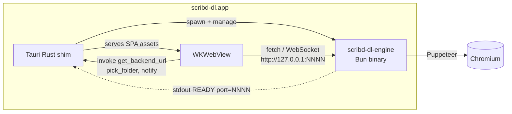
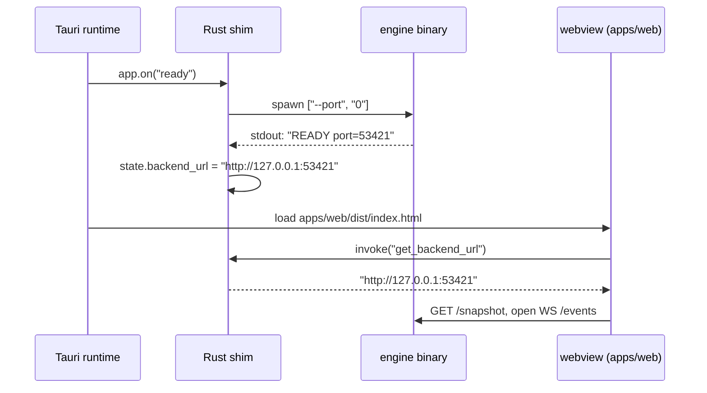
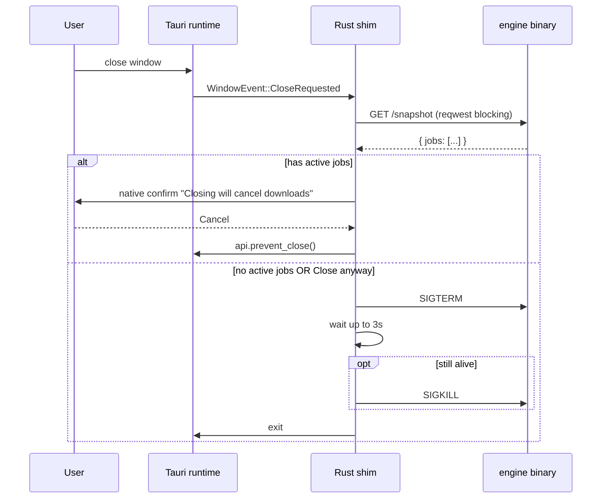

# feat: Tauri desktop app (apps/desktop) wrapping engine + web SPA

## Summary

Build a macOS desktop `.app` for scribd-dl by wrapping the existing `apps/web` SPA in a Tauri 2.x shell that spawns `packages/engine` as a self-contained Bun sidecar. The engine and the web SPA are already in place; this plan adds **only the desktop wrapper**: Tauri scaffold in `apps/desktop/`, Rust shim that owns the sidecar lifecycle and the `get_backend_url` handshake, native folder picker + notifications + quit guard, and packaging into a DMG.

Distribution is the existing narrow circle on macOS — Gatekeeper warning on first launch is acceptable. Code signing / notarization / Windows / Linux are out of scope.

---

## Problem Frame

Today scribd-dl ships three clients of the same `DownloadEngine`: CLI (`bun run engine`), Ink TUI (`bun run tui`), and web SPA (`bun run dev:spa` → browser). All three require a terminal. The goal is removing terminal-dependence: Spotlight → `scribd-dl.app` → `Cmd+V` → file on disk in two gestures.

UX parity with `apps/web` is the floor — no regressions vs the browser experience. The desktop adds three native-only affordances on top: a native folder picker, macOS notifications when the window isn't focused, and a quit guard against losing active downloads.

---

## Origin Reference

Sourced from `docs/brainstorms/2026-06-09-desktop-app-tauri-bun-requirements.md` (updated 2026-06-11). The brainstorm's F0 (engine HTTP/WS sidecar) and F1 (web SPA) are already shipped. This plan covers the brainstorm's F2 → F5 — Tauri scaffold + handshake, native bridge, quit guard, packaging.

Two repo facts found during planning research go beyond the brainstorm and shape this plan:

- `packages/engine/engine.ts` already accepts `--port` (default `0` = random free port) and prints `READY port=NNNN` on startup. No engine-side handshake work is needed.
- `apps/web/src/lib/backendUrl.ts` already contains a Tauri-aware branch (`window.__TAURI__.core.invoke("get_backend_url")` with `http://127.0.0.1:4747` dev fallback). The frontend backend-URL resolver is ready.

Consequence: `packages/engine` and `packages/shared` are not touched in any unit below.

---

## Requirements

Carried from the brainstorm; see origin for full rationale.

- **R1 — UX parity with `apps/web`.** Queue list, statuses (`Queued` / `Downloading` / `Downloaded` / `Failed`), paste handler, remove (Queued only), retry (Failed with `retryable=true`), disconnect banner — all reused via shared `apps/web` bundle.
- **R2 — Engine sidecar lifecycle.** Spawn on app-ready, kill cleanly on window-all-closed (SIGTERM → wait → SIGKILL). No zombie Chromium after exit.
- **R3 — Port discovery handshake.** Rust shim spawns engine binary with `--port 0`, parses stdout until `READY port=NNNN`, exposes the resolved URL via `get_backend_url` Tauri command. After `READY`, stdout/stderr go to `~/Library/Logs/scribd-dl/`.
- **R4 — Native folder picker.** Browse button visible in the folder modal only under `window.__TAURI__`. Click → native dialog → path written to `$draftFolder` → existing save flow (`POST /folder`). Text input remains editable by hand.
- **R5 — Native notifications.** On WS `JobCompleted` / `JobFailed` when window is not focused AND `window.__TAURI__` present → invoke `notify` command. Click on notification focuses window.
- **R6 — Quit guard.** Closing the window while there are `Queued` / `Downloading` jobs surfaces a native confirm dialog. `Close anyway` kills sidecar and exits; `Cancel` keeps window open.
- **R7 — Packaging.** One command (`bun --filter @scribd-dl/desktop tauri build`) produces a DMG. Engine sidecar binary is built automatically via `beforeBuildCommand`.
- **R8 — Persistence via engine, not Tauri.** Folder and queue persistence are owned by engine (`ConfigStore`, `JobStore` in `~/.config/scribd-dl/`). No Tauri-side store for these.

---

## Key Technical Decisions

**KTD1 — Web bundle is shared, not forked.** `apps/desktop` uses `apps/web` build artifacts directly (`frontendDist = "../web/dist"`). Tauri-specific behavior in `apps/web` is gated by `window.__TAURI__` checks. Browser builds remain identical with no-op fallthrough. Rationale: keeps one source of truth for SPA code; avoids drift between desktop and web.

**KTD2 — Sidecar binary built via `bun build --compile`.** `bun build --compile --target=bun-darwin-arm64 packages/engine/engine.ts --outfile apps/desktop/src-tauri/binaries/scribd-dl-engine-aarch64-apple-darwin` produces a self-contained binary (~50MB) named per Tauri's `externalBin` triplet convention. Wired into `tauri.conf.json.build.beforeBuildCommand` so `tauri build` is one command end-to-end. Alternatives: shipping Bun runtime separately (more moving parts) — rejected.

**KTD3 — Rust shim owns sidecar lifecycle and stdout parsing.** Rust spawns the binary via `tauri-plugin-shell` sidecar API, line-reads stdout until `READY port=NNNN`, stores resolved URL in app state behind a `Mutex<Option<String>>`, exposes it through `#[tauri::command] fn get_backend_url`. After handshake, stdout/stderr are piped to a logfile under `~/Library/Logs/scribd-dl/`. Rationale: matches the brainstorm's port-discovery design and lets the frontend stay handshake-agnostic.

**KTD4 — Quit guard fetches snapshot from Rust via reqwest.** On `WindowEvent::CloseRequested`, Rust does a synchronous `reqwest::blocking::get` against the cached backend URL, deserializes `EngineSnapshot`, checks for any job with `status in {Queued, Downloading}`. If found → native confirm dialog. Rationale: simpler than routing snapshot through webview; doesn't depend on webview liveness; uses the same JSON contract from `packages/shared`. Trade-off captured in Risks.

**KTD5 — Engine persistence stays authoritative.** No Tauri-side store for folder. Initial folder comes from `GET /snapshot.outputFolder` (engine reads from `ConfigStore`); user changes via folder modal → `POST /folder` → engine persists to `~/.config/scribd-dl/settings.json`. Rationale: eliminates a sync layer; same behavior across desktop / CLI / TUI.

---

## Scope Boundaries

### Deferred to Follow-Up Work

- Code signing / notarization (one-time Apple Developer setup; not blocking initial circle).
- Windows / Linux builds (code stays cross-platform-ready in Rust shim and frontend, but no build/test work).
- Auto-update.
- Per-job progress bar (requires engine-side `JobProgress` events; separate engine track).
- Display title before scrape completes (requires engine-side `JobTitleResolved` event; separate engine track).
- Auto-respawn of crashed sidecar (manual restart via disconnect banner is acceptable for v1).
- WS reconnect strategy beyond what `apps/web` already does.

### Outside this product's identity

- Drag-and-drop file inputs, global hotkey, tray icon, auto-watch clipboard, parallel downloads, history between sessions. (Per brainstorm — these would change the product shape.)

---

## High-Level Technical Design

### Process topology inside `.app`



### Startup sequence



### Shutdown sequence



---

## Output Structure

`apps/desktop/` is greenfield (currently just `README.md` + placeholder `package.json`). Expected layout after this plan:

```text
apps/desktop/
├── package.json                 # scripts: tauri dev, tauri build, build:engine-binary
├── README.md                    # updated to describe usage
├── src-tauri/
│   ├── Cargo.toml
│   ├── Cargo.lock
│   ├── build.rs
│   ├── tauri.conf.json          # frontendDist=../../web/dist, externalBin, plugins
│   ├── capabilities/
│   │   └── default.json         # dialog, notification, shell permissions
│   ├── icons/                   # standard Tauri icon set
│   ├── binaries/
│   │   └── scribd-dl-engine-aarch64-apple-darwin   # produced by beforeBuildCommand
│   └── src/
│       ├── main.rs              # tauri::Builder, plugins, window event handlers
│       ├── sidecar.rs           # spawn + READY parse + lifecycle
│       ├── commands.rs          # get_backend_url, pick_folder (delegated), notify (delegated)
│       └── quit_guard.rs        # CloseRequested handler + snapshot fetch
```

Not authoritative — implementer may adjust paths. Per-unit `**Files:**` lists are the source of truth.

---

## Implementation Units

### U1. Engine sidecar binary build script

**Goal.** Produce `scribd-dl-engine-aarch64-apple-darwin` from `packages/engine/engine.ts` via a single `bun run` command, ready for Tauri's `externalBin` packaging.

**Requirements.** R7.

**Dependencies.** None.

**Files.**
- `apps/desktop/package.json` (create — replace placeholder): add `scripts.build:engine-binary` invoking `bun build --compile --target=bun-darwin-arm64 ../../packages/engine/engine.ts --outfile src-tauri/binaries/scribd-dl-engine-aarch64-apple-darwin`.
- `apps/desktop/.gitignore` (create): ignore `src-tauri/target/`, `src-tauri/binaries/scribd-dl-engine-*`.
- `package.json` (root, optional): expose `desktop:build` / `desktop:dev` shortcuts via workspace filter.

**Approach.** `bun build --compile` already produces self-contained binaries for the active Bun version. Output filename must match Tauri's `<name>-<triplet>` convention so `bundle.externalBin = ["binaries/scribd-dl-engine"]` resolves correctly. For now only `aarch64-apple-darwin` is built — Intel Macs are deferred (see Scope Boundaries → cross-arch is implicit, document in README).

**Patterns to follow.** None in repo yet — this is the first compiled binary. Bun docs: `--compile --target` flag matrix.

**Test scenarios.**
- Running `bun --filter @scribd-dl/desktop run build:engine-binary` from a clean checkout produces a binary at `apps/desktop/src-tauri/binaries/scribd-dl-engine-aarch64-apple-darwin`.
- The produced binary, invoked with `--port 4747`, prints `READY port=4747` to stdout and serves `GET /snapshot` correctly (smoke test, manual).
- Re-running the script overwrites the previous binary without leaving stale files.

**Verification.** Binary file exists at expected path; `file <binary>` reports `Mach-O 64-bit executable arm64`; manual smoke against `curl http://127.0.0.1:4747/snapshot` returns a JSON `EngineSnapshot`.

---

### U2. Tauri scaffold in `apps/desktop/`

**Goal.** Initialize Tauri 2.x Rust crate inside `apps/desktop/src-tauri/`, wire it to load `apps/web/dist/`, register the engine sidecar in `externalBin`, and produce a runnable shell window (no behavior yet — empty `main.rs` past plugin registration).

**Requirements.** R1 (foundation for UX parity), R7 (packaging foundation).

**Dependencies.** U1 (sidecar binary must exist for `tauri build` to package it; `tauri dev` may run without the binary if `beforeBuildCommand` is gated to build only).

**Files.**
- `apps/desktop/src-tauri/Cargo.toml` (create): tauri 2.x, tauri-build, tauri-plugin-shell, tauri-plugin-dialog, tauri-plugin-notification, serde, serde_json, reqwest (blocking feature).
- `apps/desktop/src-tauri/build.rs` (create): standard `tauri_build::build()`.
- `apps/desktop/src-tauri/tauri.conf.json` (create): `productName = "scribd-dl"`, identifier, `build.beforeDevCommand = "bun --filter @scribd-dl/web dev"`, `build.devUrl = "http://localhost:5173"`, `build.beforeBuildCommand` runs `bun --filter @scribd-dl/web build && bun --filter @scribd-dl/desktop run build:engine-binary`, `build.frontendDist = "../../apps/web/dist"`, `bundle.externalBin = ["binaries/scribd-dl-engine"]`, `bundle.targets = ["dmg"]`, security CSP for prod (see KTD3 / brainstorm).
- `apps/desktop/src-tauri/src/main.rs` (create): minimal `tauri::Builder::default().plugin(...).run(...)` with stub `get_backend_url` returning `Err("not yet wired")`.
- `apps/desktop/src-tauri/capabilities/default.json` (create): grant `core:default`, `shell:allow-spawn`, `dialog:allow-open`, `notification:default` to `main` window.
- `apps/desktop/src-tauri/icons/` (create): standard icon set (use placeholder PNGs or Tauri default; final icons deferred).
- `apps/desktop/package.json` (modify): add `tauri` script delegating to `tauri` CLI.

**Approach.** Use `bun create tauri-app` output as a reference, but author config files manually so they sit inside the existing workspace structure rather than scaffolding a new project root. Plugin permissions are explicit in capabilities/ — no broad `*` grants. CSP `default-src 'self' tauri:; connect-src 'self' http://127.0.0.1:* ws://127.0.0.1:*` (dev relaxed via `devCsp`).

**Patterns to follow.** Tauri 2.x scaffolding from official docs (https://v2.tauri.app/start/). Workspace structure mirrors `apps/tui`, `apps/web`.

**Test scenarios.** Test expectation: none — pure scaffolding. Verification is behavioral via `tauri dev` smoke run.

**Verification.**
- `bun --filter @scribd-dl/desktop tauri dev` opens a window loading `apps/web` SPA from Vite (HMR works on `.ts` changes in `apps/web/src/`).
- `bun --filter @scribd-dl/desktop tauri build` produces a `.app` and `.dmg` under `apps/desktop/src-tauri/target/release/bundle/`.
- `bun run lint`, `bun run format:check` clean.

---

### U3. Rust shim: sidecar spawn + READY handshake + `get_backend_url`

**Goal.** Replace the stub `get_backend_url` from U2 with a working implementation: spawn the engine binary at app-ready, parse stdout until `READY port=NNNN`, store the URL in shared state, return it to the webview on demand. Clean shutdown on window-all-closed.

**Requirements.** R2, R3.

**Dependencies.** U2.

**Files.**
- `apps/desktop/src-tauri/src/sidecar.rs` (create): `SidecarState { backend_url: Mutex<Option<String>>, child: Mutex<Option<CommandChild>> }`, `spawn_sidecar(app: &AppHandle) -> Result<()>` that uses `app.shell().sidecar("scribd-dl-engine")?.args(["--port", "0"]).spawn()?` and reads `CommandEvent::Stdout` lines until the `READY port=` line, then promotes a state update.
- `apps/desktop/src-tauri/src/commands.rs` (create): `#[tauri::command] async fn get_backend_url(state: State<'_, SidecarState>) -> Result<String, String>` — waits up to N seconds on a `Notify` (or polls the Mutex) until the URL is populated, returns it or errors.
- `apps/desktop/src-tauri/src/main.rs` (modify): manage `SidecarState`, register `get_backend_url`, hook `setup` to call `spawn_sidecar`, hook `on_window_event` for `Destroyed` → kill sidecar.
- Log piping helper (small util in `sidecar.rs`): after `READY`, drain remaining stdout/stderr lines into `~/Library/Logs/scribd-dl/engine.log` (rotate or truncate per launch — keep simple: truncate).

**Approach.** `tauri-plugin-shell`'s sidecar API streams `CommandEvent` (Stdout, Stderr, Error, Terminated). Parse with a tight regex `^READY port=(\d+)$`. Hold the spawned `CommandChild` in state so shutdown can call `.kill()`. On window-all-closed, `kill()` sends SIGTERM; if still alive after a 3s wait, escalate to SIGKILL (use `nix` crate or rely on `kill()` semantics — Tauri's `CommandChild::kill` already sends SIGKILL on Unix, so SIGTERM-then-SIGKILL needs a manual `libc::kill(pid, SIGTERM)` first followed by a timed wait — confirm during implementation).

**Patterns to follow.** Tauri 2.x sidecar guide: https://v2.tauri.app/develop/sidecar/. Project's general async pattern is plain `tokio` (Tauri's runtime).

**Test scenarios.** (Rust unit tests in `src-tauri/src/sidecar.rs` under `#[cfg(test)] mod tests`.)
- `parse_ready_line("READY port=53421") == Some(53421)`.
- `parse_ready_line("hello world") == None`.
- `parse_ready_line("READY port=abc") == None`.
- `parse_ready_line("READY port=53421 extra") == None` (strict match prevents false positives from log noise).
- Integration smoke (manual, documented in `apps/desktop/README.md`): start `tauri dev`, open DevTools console in the webview, run `await window.__TAURI__.core.invoke("get_backend_url")` → returns `http://127.0.0.1:<some-port>`, `fetch(that + "/snapshot")` returns 200.

**Verification.**
- `cargo test --manifest-path apps/desktop/src-tauri/Cargo.toml` passes.
- `tauri dev` window: webview connects to engine, paste works, queue list populates from snapshot, WS events deliver.
- Closing the window leaves no `scribd-dl-engine` process (`pgrep -f scribd-dl-engine` empty after exit).
- `~/Library/Logs/scribd-dl/engine.log` accumulates stdout/stderr after the READY line.

---

### U4. Native folder picker (Browse button under Tauri)

**Goal.** Add a Browse button to `apps/web/src/views/folder-modal.ts` visible only when `window.__TAURI__` is present. Click invokes a Rust-side `pick_folder` command that delegates to `tauri-plugin-dialog`; the chosen path writes into `$draftFolder`, after which the existing Save flow runs unchanged.

**Requirements.** R4.

**Dependencies.** U3 (Tauri shell working; `invoke` available).

**Files.**
- `apps/desktop/src-tauri/src/commands.rs` (modify): add `#[tauri::command] async fn pick_folder(app: AppHandle) -> Result<Option<String>, String>` using `app.dialog().file().pick_folder(|path| ...)` (or the blocking variant) returning the selected path or `None` if user cancels.
- `apps/desktop/src-tauri/src/main.rs` (modify): register `pick_folder`.
- `apps/web/src/views/folder-modal.ts` (modify): import `isTauri` helper (or inline-check `window.__TAURI__`); add a `Browse…` button to the modal's button row, render-conditional on Tauri; click handler `invoke("pick_folder")` → on non-null result, `$draftFolder.set(result)`.
- `apps/web/src/lib/backendUrl.ts` (modify, minor): export an `isTauri()` helper or expose a typed `tauri` accessor so view code doesn't repeat the global check.
- `apps/web/tests/folderModal.test.ts` (modify or create alongside existing folder-modal coverage): Vitest unit covering Tauri-mode rendering with a stub `__TAURI__` and asserting the Browse button appears and writes to `$draftFolder`.

**Approach.** Browser builds remain identical — the Browse button simply doesn't render when `window.__TAURI__` is undefined. Save flow stays exactly as it is (`saveFolder(path)` → `POST /folder`). Engine handles persistence per KTD5. The native dialog's `defaultPath` should start at the currently configured `$folder.get()` when set.

**Patterns to follow.** Tauri 2.x dialog plugin: https://v2.tauri.app/plugin/dialog/. Existing folder-modal structure (`apps/web/src/views/folder-modal.ts`) — keep view function pure, no direct store reads inside template (see project CLAUDE.md "Web SPA architecture" conventions).

**Test scenarios.** (Vitest; mocks for `window.__TAURI__.core.invoke`.)
- Without `__TAURI__`: Browse button is not in the rendered template (snapshot or `querySelector("[data-action=browse]")` returns null).
- With `__TAURI__.core.invoke` mocked to resolve `"/Users/me/Downloads"`: clicking Browse calls `invoke("pick_folder")`, then `$draftFolder.get()` equals `/Users/me/Downloads`.
- With `__TAURI__.core.invoke` mocked to resolve `null` (user cancelled): clicking Browse leaves `$draftFolder` unchanged.
- With `__TAURI__.core.invoke` mocked to reject: clicking Browse leaves `$draftFolder` unchanged and does not throw (error caught silently — same posture as other folder-modal error paths).
- Save flow after Browse: with `$draftFolder` populated from Browse, Save triggers existing `trySave` which calls `saveFolder` once with that path (existing test coverage applies — confirm regression-free).
- Manual E2E inside `tauri dev`: Browse → system folder picker opens → choose folder → input field shows path → Save → engine `POST /folder` → relaunching app shows the same folder (persistence via ConfigStore).

**Verification.** `bun --filter @scribd-dl/web test` green. Manual E2E above succeeds. Linter clean.

---

### U5. Native notifications on background `Downloaded` / `Failed`

**Goal.** When a `JobCompleted` or `JobFailed` WS event arrives and the window is not focused AND `window.__TAURI__` is present, post a macOS notification. Click on notification focuses the window.

**Requirements.** R5.

**Dependencies.** U3.

**Files.**
- `apps/desktop/src-tauri/src/commands.rs` (modify): add `#[tauri::command] async fn notify(app: AppHandle, title: String, body: String) -> Result<(), String>` using `app.notification().builder().title(title).body(body).show()`. Register an `on_notification_click` (or set the app's activation policy) so the window resurfaces — Tauri's notification plugin's default click behavior may already focus the app; verify during implementation.
- `apps/desktop/src-tauri/src/main.rs` (modify): register `notify`. Configure window so `show()` brings to front (use `window.set_focus()` on click).
- `apps/web/src/engineClient.ts` (modify): in `handleWsEvent`, after the existing `refresh()` dispatch, when event is `JobCompleted` or `JobFailed` AND `document.visibilityState === "hidden"` AND `isTauri()` → look up the job in the post-refresh snapshot (or read the event payload directly when it carries enough), then `invoke("notify", { title, body })`.
- `apps/web/src/lib/api.ts` (no change expected; confirm during implementation that event payloads carry title/reason — if not, the snapshot is freshly applied so reading from `$jobs` is safe).

**Approach.** Notification payload:
- `JobCompleted` → title = `"Downloaded"`, body = `<displayTitle or URL>`.
- `JobFailed` → title = `"Download failed"`, body = `<displayTitle> — <failure.reason>`.

Visibility check uses `document.visibilityState` (already standard; works under WKWebView). Click → activation policy: rely on Tauri default; if it doesn't focus, add `app.get_webview_window("main")?.set_focus()` in a notification click handler.

Browser builds: `isTauri()` returns false → no-op, no notifications, no Notification API permission prompts.

**Patterns to follow.** Tauri 2.x notification plugin: https://v2.tauri.app/plugin/notification/. Existing event dispatch path in `apps/web/src/engineClient.ts`.

**Test scenarios.** (Vitest where possible; manual macOS verification for OS-level behavior.)
- `isTauri() === false`: a `JobCompleted` event does not call `invoke`.
- `isTauri() === true` AND `document.visibilityState === "visible"`: event does not call `invoke`.
- `isTauri() === true` AND `document.visibilityState === "hidden"` AND event is `JobCompleted`: `invoke("notify", { title: "Downloaded", body: <expected> })` called once with the correct payload.
- Same with `JobFailed`: body includes the failure reason.
- Manual E2E: paste URL, minimize window, wait → macOS notification appears at top-right. Click → window comes to front.
- Manual E2E: while focused → notification does NOT appear (queue updates inline).

**Verification.** Vitest green. Manual macOS scenarios above pass. Notifications honored by macOS notification center.

---

### U6. Quit guard

**Goal.** Closing the window while there are active (`Queued` / `Downloading`) jobs surfaces a native confirm dialog. `Close anyway` kills the sidecar and exits; `Cancel` prevents the close.

**Requirements.** R6.

**Dependencies.** U3 (need a working backend URL to query snapshot).

**Files.**
- `apps/desktop/src-tauri/src/quit_guard.rs` (create): `async fn has_active_jobs(backend_url: &str) -> Result<bool, reqwest::Error>` using `reqwest::Client::new().get(format!("{}/snapshot", backend_url)).send().await?.json::<Snapshot>()`. Local Rust mirror of the snapshot shape — only the fields needed (`jobs: Vec<{status: String}>`). Active = `status == "Queued"` or `status == "Downloading"`.
- `apps/desktop/src-tauri/src/main.rs` (modify): override `on_window_event` for `WindowEvent::CloseRequested { api, .. }`. Use Tauri's dialog plugin's `ask` (blocking-style for the user) — `app.dialog().message("Closing will cancel active downloads.").title("Cancel downloads?").buttons(MessageDialogButtons::OkCancel).show(callback)`. Inside: if snapshot fetch fails → log and allow close (fail-open); if no active jobs → allow close; otherwise show dialog, prevent close until user confirms, kill sidecar on confirm.
- `apps/desktop/src-tauri/Cargo.toml` (modify if needed): ensure `reqwest` is in deps (likely already from U3 logging plumbing — verify and add `blocking` or async client as appropriate).

**Approach.** Quit guard runs on the **Rust** side because the webview may be unresponsive during shutdown. The snapshot fetch is fast (engine serves locally) and short-circuits when the backend URL hasn't been populated (treat as "no active jobs"). The dialog is non-blocking in Tauri 2.x — use the callback-based `show()` and call `api.prevent_close()` outside the callback to keep the window alive while the user reads the dialog.

State machine:
1. User closes window → `CloseRequested` fires.
2. Rust calls `prevent_close()` immediately and dispatches a snapshot fetch task.
3. If fetch fails or returns no active jobs → Rust calls `window.close()` (which fires CloseRequested again; use a `quit_confirmed` flag in state to short-circuit the second pass).
4. If active jobs found → show confirm dialog. User picks Cancel → leave `quit_confirmed` false, do nothing. User picks Close anyway → set `quit_confirmed = true`, call `window.close()`.

**Patterns to follow.** Tauri 2.x dialog plugin async patterns. `apps/desktop/src-tauri/src/sidecar.rs` for shared state access.

**Test scenarios.** (Rust unit tests for pure logic; manual E2E for window event integration.)
- `has_active_jobs` with snapshot `{ jobs: [] }` → `false`.
- `has_active_jobs` with `{ jobs: [{ status: "Downloaded" }] }` → `false`.
- `has_active_jobs` with `{ jobs: [{ status: "Queued" }] }` → `true`.
- `has_active_jobs` with `{ jobs: [{ status: "Downloading" }] }` → `true`.
- `has_active_jobs` with `{ jobs: [{ status: "Failed" }] }` → `false`.
- `has_active_jobs` with `{ jobs: [{ status: "Downloaded" }, { status: "Queued" }] }` → `true` (any-active).
- `has_active_jobs` against a non-responsive URL → returns `Err`.
- Manual E2E (empty queue): close window → no dialog, app exits cleanly, no zombie processes.
- Manual E2E (Downloading job): close window → dialog appears. Cancel → window remains open, download continues. Close anyway → sidecar killed (verify with `pgrep`), window closes.
- Manual E2E (only Failed/Downloaded jobs): close window → no dialog, exits cleanly.

**Verification.** Cargo unit tests pass. All manual scenarios above pass. `pgrep -f scribd-dl-engine` empty after every successful exit. No zombie Chromium (Puppeteer `Layer.scoped` already handles this when SIGTERM lands cleanly — verify by checking `pgrep -f Chromium` after exit).

---

### U7. Packaging + smoke test on clean macOS

**Goal.** Produce a signed-by-default-policy (i.e., unsigned, Gatekeeper-warning acceptable) DMG. Verify it installs and runs on a macOS machine without dev tooling. Record installed size in `apps/desktop/README.md` so we can decide later whether Chromium bundling is worth pursuing.

**Requirements.** R7. Closes brainstorm F5.

**Dependencies.** U1, U2, U3, U4, U5, U6.

**Files.**
- `apps/desktop/README.md` (modify): replace placeholder content. Sections: usage (`bun --filter @scribd-dl/desktop tauri dev`, `… tauri build`), output paths (`src-tauri/target/release/bundle/dmg/`), what's bundled, installed size, current arch (`aarch64-apple-darwin` only), Gatekeeper note (`xattr -d com.apple.quarantine /Applications/scribd-dl.app` if needed), known limitations (no auto-update, etc.).
- `apps/desktop/src-tauri/tauri.conf.json` (modify if needed): finalize `productName`, `version`, icons, bundle metadata.
- `docs/plans/2026-06-09-007-feat-desktop-app-tauri-bun-plan.md` (mark superseded if not yet — frontmatter add).

**Approach.** Run `bun --filter @scribd-dl/desktop tauri build`. Copy the DMG to a second macOS device (or use a fresh user account / VM) lacking Bun, Rust, Tauri toolchain. Install via standard drag-to-Applications. Open from Launchpad. Walk through the full smoke test below. Record DMG size and resident memory.

**Test scenarios.** Manual smoke test on clean macOS (15.x +) machine:
- DMG opens, drag-to-Applications works.
- First launch — Gatekeeper prompt appears; user can override via System Settings → Privacy. After override, app starts.
- Window opens within ~3s of launch. Disconnect banner does not appear (handshake succeeded).
- Paste a valid Scribd URL → queue shows `Queued` → `Downloading` → `Downloaded`. File on disk in the configured folder.
- Paste multiline blob with 3 URLs → 3 rows appear.
- Paste junk → `No links found in clipboard` transient banner.
- Paste an unsupported domain → Failed row without Retry button.
- Remove on Queued → row disappears.
- Retry on Failed (after toggling network offline → online) → reaches Downloaded.
- Folder modal: Browse → native picker → choose folder → Save → next download lands there.
- Restart app → folder selection persists.
- Background notification: minimize window, finish a download → macOS notification → click → window focuses.
- Quit guard: start a download, attempt to close window → dialog appears. Cancel → keeps running. Close anyway → app exits, no zombie processes (`pgrep -f scribd-dl-engine` empty, `pgrep -f Chromium` empty).

**Verification.** All smoke scenarios pass on the clean machine. DMG size and installed `.app` size recorded in README. Used as input for the deferred Chromium bundling decision (see Open Questions).

---

## Risks & Mitigations

- **R: Tauri sidecar `kill()` may send SIGKILL directly, skipping graceful Puppeteer/Chromium cleanup.**
  Mitigation: send SIGTERM via `libc::kill(child.pid(), SIGTERM)` first, wait up to 3s for the process to exit, only then call `child.kill()` (SIGKILL). Engine's `PuppeteerSg` is `Layer.scoped` and handles SIGTERM cleanly. Validate via `pgrep -f Chromium` in U6 manual tests.

- **R: Quit guard's snapshot fetch may race with sidecar shutdown.**
  Mitigation: fetch BEFORE killing sidecar (KTD4 ordering). Treat fetch errors as fail-open (allow close). U6 test scenarios cover this.

- **R: macOS notification click behavior varies by macOS version.**
  Mitigation: explicit `set_focus()` call in click handler rather than relying on default activation. Test on the target macOS version in U7.

- **R: `bun build --compile` binary size may push DMG past expectations, especially with Chromium bundling.**
  Mitigation: U7 measures size; Chromium bundling decision is deferred (see Open Questions). For v1, auto-download of Chromium on first run is acceptable.

- **R: `apps/web` builds in browser context have no `window.__TAURI__` — any code that assumes it exists will throw.**
  Mitigation: every Tauri-aware site uses an `isTauri()` guard (U4 introduces the helper). Tests cover both branches.

- **R: Vite HMR may not refresh the webview correctly in `tauri dev`.**
  Mitigation: Tauri 2.x officially supports this; if it breaks, fall back to manual reload (`Cmd+R`) for the iteration loop — not a blocker for shipping.

---

## Open Questions / Deferred

Carried from the brainstorm; resolve during implementation or in follow-up work, not before.

- **Chromium bundling vs auto-download.** Decision input is U7's measured DMG size. If bundled bumps DMG too far past acceptable (subjective, ~200MB threshold) — keep auto-download.
- **Folder change during `Downloading`.** Current behavior: change goes through immediately on Save, current job continues writing to old folder. Options: block (disable Save) while any job is `Downloading`, or show a confirm dialog. Defer to a separate small follow-up.
- **WS reconnect / backend crash recovery.** `apps/web` already shows the disconnect banner. Auto-respawn of sidecar is deferred.
- **Display title before scrape.** Engine-side track (`JobTitleResolved` event), not desktop work.
- **Cross-arch builds (x86_64 + aarch64).** Universal binary via `bun build --compile --target=bun-darwin-x64` + `lipo`, or two DMGs. Defer until there's actual demand.

---

## Sources & Research

- Origin brainstorm: `docs/brainstorms/2026-06-09-desktop-app-tauri-bun-requirements.md` (updated 2026-06-11).
- Repo verification: `packages/engine/engine.ts` (lines 17–24 print READY), `packages/engine/src/cli/options.ts` (default `--port=0`), `apps/web/src/lib/backendUrl.ts` (Tauri-aware resolver already implemented).
- Project conventions: `CLAUDE.md` ("Runtime and commands", "Web SPA architecture", "Wire contract" sections — followed throughout).
- Tauri 2.x docs: https://v2.tauri.app/develop/sidecar/, https://v2.tauri.app/plugin/dialog/, https://v2.tauri.app/plugin/notification/.
- Bun: https://bun.sh/docs/bundler/executables (`bun build --compile`).
- Old plan (superseded; React/shadcn era): `docs/plans/2026-06-09-007-feat-desktop-app-tauri-bun-plan.md`.
