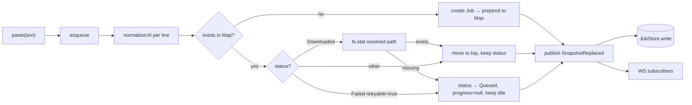
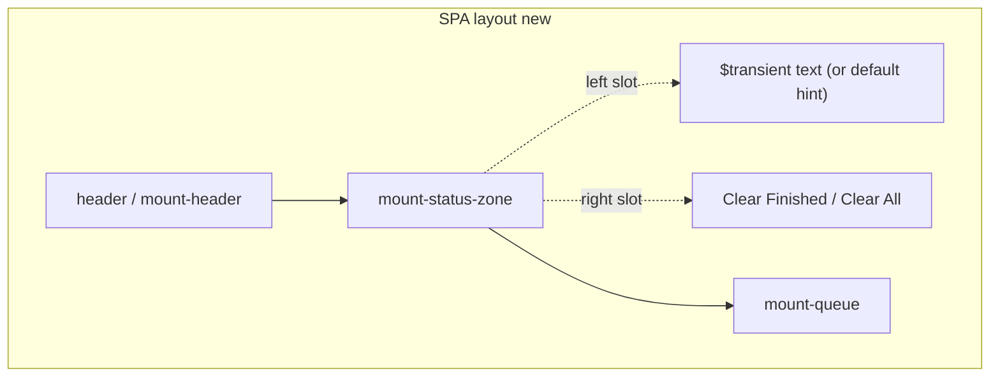

# feat: Queue polish — layout flip, dedup, clear actions

## Summary

Объединить три UX-улучшения очереди в одно изменение wire contract + SPA layout. Engine отдаёт snapshot newest-first, eager-проверяет существование файла при paste и дедуплицирует/реактивирует jobs; SPA убирает футер и нижний disconnect banner, вместо них — статус-зона под header с одним каналом нотификаций (`$transient` с severity) и кнопками `Clear Finished` / `Clear All`. Существующие `clearCompleted` / `clearFailed` в engine переиспользуются; добавляется `clearAll` с прерыванием активного `Downloading`. Item 2 покрывает кейс system notifications, deferred в `docs/plans/2026-06-11-004-feat-tauri-desktop-app-plan.md` (R5) — закрыть тот пункт как «не нужно».

## Problem Frame

Сейчас SPA имеет три разрозненных канала сигналов (нижний `mount-statusbar` с `Press Cmd+V…`, `mount-banner` с disconnect-сообщением, paste-feedback через `$transient` в нижнем статус-баре) и оrder очереди insertion-first (старые сверху). Дубликаты paste'а создают новые jobs; удалённый PDF на диске после повторного paste не переcкачивается. Clear All отсутствует — массовая очистка возможна только по одному. Цель — сделать ежедневный paste→download самообъяснимым: один канал нотификаций под header'ом, новые/недавно потроганные jobs сверху, явные кнопки очистки.

## Requirements

Из origin (`docs/brainstorms/2026-06-11-queue-polish-requirements.md`):

- **R1.** Очередь рендерится newest-first; источник order — `EngineSnapshot` (см. origin: Item 1).
- **R2.** Footer (`Press Cmd+V…`) и `mount-banner` удаляются; под header добавляется статус-зона: текст `$transient` слева, кластер `Clear Finished` / `Clear All` справа.
- **R3.** `$transient` расширяется до `{ severity: 'info' | 'warning' | 'error', message: string, sticky?: boolean } | null` с приоритетом перехвата (error > warning > info) и auto-dismiss таймером, зависящим от severity. `sticky=true` (disconnect) — без таймера.
- **R4.** Default-state статус-зоны (когда `$transient === null`) — статичная подсказка `Press Cmd+V to download links` слева; не значение `$transient`.
- **R5.** `enqueue(text)` дедуплицирует по нормализованному URL; дубликат → существующий job перемещается в начало очереди.
- **R6.** Для дубликата в статусе `Downloaded` engine eager-проверяет существование файла на диске; если файла нет — статус → `Queued`, `progress` сбрасывается, `displayTitle` сохраняется до первого нового scrape-результата.
- **R7.** Дубликат в статусе `Failed (retryable=true)` + paste = implicit retry (статус → `Queued`); `Failed (retryable=false)` — только move-to-top, статус не трогаем.
- **R8.** Mixed batch paste: новые добавляются в начало в порядке появления в paste-тексте; дубликаты группируются под новыми, сохраняя относительный порядок внутри paste-блока.
- **R9.** После любой mutation (enqueue, clear, remove, retry) engine отправляет в WS полный `EngineSnapshot` одним событием (см. KTD-1).
- **R10.** `Clear Finished` удаляет terminal-jobs (`Downloaded` + `Failed` любой retryable) без подтверждения. Существующие `clearCompleted` + `clearFailed` объединяются в одну операцию.
- **R11.** `Clear All` удаляет всё, включая активные `Downloading` и `Queued`. Active fiber прерывается через scope (см. KTD-2). Подтверждение — native dialog (`tauri-plugin-dialog` в desktop, `window.confirm` в SPA).
- **R12.** Кнопки disable при отсутствии relevant-jobs (`Clear Finished` — нет terminal; `Clear All` — пустая очередь). Без counter в label.
- **R13.** Файлы на диске НИКОГДА не удаляются — инвариант обеих clear-операций.
- **R14.** Persistence: clear-операции пишут `jobs.jsonl` через обычный `JobStore` snapshot-flush; не soft-delete.
- **R15.** `mount-banner` удаляется; disconnect показывается через sticky-error `$transient`.

## Key Technical Decisions

### KTD-1. WS broadcast: добавить `SnapshotReplaced` event, не вводить `JobMoved`

После enqueue/clear engine публикует один WS event `{ _tag: "SnapshotReplaced", snapshot }` вместо набора fine-grained событий. Брейншторм отверг отдельный `JobMoved` тэг (origin: Item 1, Wire/contract impact). `SnapshotReplaced` — единственная additive правка `JobEvent` union в `packages/shared/src/jobs.ts`. Существующие тонкие события (`JobStarted`, `JobCompleted`, `JobProgress`, `JobTitleUpdated`) сохраняются для in-flight worker-сигналов.

Клиентская сторона: SPA `applySnapshot` уже умеет diff'ить — обработчик `SnapshotReplaced` вызывает её напрямую. Альтернатива (множественные `JobMoved` + `JobRequeued` per element) выбрасывается: больше типов, больше WS-трафика, больше logic на клиенте, и брейншторм её явно отверг.

### KTD-2. `clearAll`: захватить per-job fiber handle, не прерывать сам worker

Worker — `Effect.forkScoped(Effect.forever(...))` (DownloadEngine.ts:263, 292). Простое `Fiber.interrupt(workerFiber)` сломало бы `forever`-loop и engine-scope целиком. Вместо этого внутри worker'а каждый job запускается через `Effect.fork` с handle, сохраняемым в `Ref<Option<Fiber>>` (`activeFiberRef`). `clearAll`:

1. Читает `activeFiberRef`, если есть — `Fiber.interrupt`.
2. Сбрасывает `Ref<Map>` jobs в пустое состояние.
3. Публикует `SnapshotReplaced` с пустым snapshot.
4. `JobStore.write` сохраняет пустое состояние.

`Layer.scoped` PuppeteerSg гарантирует, что при interrupt'е текущего job-fiber'а browser closes без leak'а — этот инвариант уже есть, мы лишь используем его явно.

### KTD-3. URL normalization для dedup

Дедупликация по нормализованному URL: lowercase host, drop trailing slash, drop URL fragment (`#…`), сохранить query как есть (Scribd document'ы используют path-based identification, query чаще metadata). Реализация — отдельная чистая функция `normalizeUrl(raw)` в `packages/engine/src/utils/url.ts` (с тестами). Используется в `enqueue` для dedup-lookup и при file-existence check.

### KTD-4. File-existence path resolution

Path резолвится точно так же, как сейчас при сохранении PDF — `outputFolder + '/' + filename + '.pdf'`, где `filename` рендерится из job-метаданных через ту же формулу, что в `ScribdDownloader`. Если формула ещё не extract'нута — вынести в `packages/engine/src/utils/io/pdfPath.ts` хелпер, используемый и сохранением, и dedup-check'ом. Это устраняет риск drift'а между двумя путями.

### KTD-5. Engine — единственный источник order; клиенты не сортируют

`snapshot()` в `DownloadEngine` сериализует `Ref<Map<JobId, Job>>` через массив insertion-order, который mutate-методы поддерживают newest-first (новые/перемещённые prepend, не append). TUI и web получают готовый порядок и просто рендерят. Это переносит ответственность за order в engine — единственное место, знающее семантику "недавно потрогано".

### KTD-6. `$transient` priority overwrite

`showTransient(severity, message, opts?)` устанавливает значение **только если** `severity ≥ текущему` (error > warning > info; sticky_error перебивается только error). При прибытии низкоприоритетного сообщения — silently drop. При прибытии равного/высокого — заменить и пересбросить таймер. `dismissSticky()` явно очищает sticky без проверок (используется на reconnect).

## High-Level Technical Design





Старый layout: `mount-header / mount-banner / mount-queue / mount-statusbar`. Новый: `mount-header / mount-status-zone / mount-queue`. `mount-banner` и `mount-statusbar` удаляются.

## Output Structure

Сильно новых файлов нет; ниже изменяющиеся узлы.

```text
packages/engine/src/
  service/DownloadEngine.ts       # enqueue rewrite, clearAll, activeFiberRef, snapshot order
  service/JobStore.ts             # без изменений API; flush после новых mutations
  utils/url.ts                    # NEW: normalizeUrl
  utils/io/pdfPath.ts             # NEW: resolved PDF path helper (used by ScribdDownloader + enqueue)
  server/routes.ts                # +DELETE /jobs route (clearAll), reuse completed/failed → finished
packages/shared/src/
  jobs.ts                         # +SnapshotReplaced JobEvent variant
  http.ts                         # без новых типов (ClearResponse уже есть)
apps/web/
  index.html                      # mount-banner / mount-statusbar → mount-status-zone
  src/store.ts                    # $transient shape + showTransient signature
  src/lib/api.ts                  # +clearFinished, +clearAll
  src/engineClient.ts             # WS handler: SnapshotReplaced; clear command wrappers
  src/views/status-zone.ts        # NEW (replaces statusbar.ts + disconnect-banner.ts)
  src/views/statusbar.ts          # DELETE
  src/views/disconnect-banner.ts  # DELETE
  src/main.ts                     # wiring (mount + subscriptions)
  src/styles.css                  # statusbar/banner styles → status-zone styles
```

## Implementation Units

### U1. `normalizeUrl` helper + tests

**Goal:** чистая функция для url-канонизации, используется dedup-lookup'ом и pdfPath helper'ом.
**Requirements:** R5, R8, KTD-3.
**Dependencies:** —
**Files:**
- `packages/engine/src/utils/url.ts` (create)
- `packages/engine/test/url.test.ts` (create)

**Approach:** export `normalizeUrl(raw: string): string`. Trim, lowercase host (через `URL` API), drop trailing slash на pathname, drop fragment, query сохранить. Invalid URL → return raw trim'нутый (caller проверяет валидность в существующем `https?://` regex'е).

**Patterns to follow:** существующие utils в `packages/engine/src/utils/` (чистые функции, без Effect).

**Test scenarios:**
- Identical inputs возвращают идентичный output (idempotent).
- `https://scribd.com/document/123/title/` и `https://scribd.com/document/123/title` нормализуются в одно.
- `https://SCRIBD.com/document/123` и `https://scribd.com/document/123` совпадают.
- Фрагмент `https://scribd.com/document/123#page=5` отбрасывается.
- Query сохраняется: `https://scribd.com/document/123?embed=true` != `https://scribd.com/document/123`.
- Невалидный URL (`not-a-url`) возвращается как trim'нутый исходник без падения.

**Verification:** все тесты зелёные; `normalizeUrl(normalizeUrl(x)) === normalizeUrl(x)` для типичных Scribd URLs.

---

### U2. `pdfPath` helper extract + ScribdDownloader rewire

**Goal:** единая формула resolved PDF-пути, чтобы dedup-check не дрейфовал относительно реального места сохранения.
**Requirements:** R6, KTD-4.
**Dependencies:** —
**Files:**
- `packages/engine/src/utils/io/pdfPath.ts` (create)
- `packages/engine/src/service/ScribdDownloader.ts` (rewire to helper)
- `packages/engine/test/pdfPath.test.ts` (create)

**Approach:** `resolvePdfPath({ outputFolder, filename, displayTitle, id }): string` — реплицирует текущую логику `ScribdDownloader` (path.join + sanitize + .pdf extension). Pure function. ScribdDownloader импортирует и использует вместо inline-формулы.

**Patterns to follow:** `packages/engine/src/utils/io/DirectoryIo.ts` (pure path-related helpers без Effect, тегированные ошибки опционально).

**Test scenarios:**
- Standard inputs дают предсказуемый путь с расширением `.pdf`.
- Filename collision-safe (если template включает id) — не падает.
- `outputFolder` с / без trailing slash дают идентичный результат.
- Sanitization особых символов в `displayTitle` (если такая логика есть в текущем downloader'е) сохраняется.

**Verification:** существующий `ScribdDownloader.test.ts` остаётся зелёным; новые tests pdfPath проходят.

---

### U3. `SnapshotReplaced` WS event + shared types

**Goal:** добавить новый event в `JobEvent` union для full-snapshot broadcast после mutations.
**Requirements:** R9, KTD-1.
**Dependencies:** —
**Files:**
- `packages/shared/src/jobs.ts` (extend `JobEvent` union)
- `packages/engine/test/DownloadEngine.test.ts` (assertions over new event will land in U4)

**Approach:** добавить вариант `{ readonly _tag: "SnapshotReplaced"; readonly snapshot: EngineSnapshot }` в конец union. Никаких других изменений.

**Patterns to follow:** существующая форма union в `jobs.ts` (readonly tagged variants).

**Test scenarios:** none — type-only change. Поведение тестируется в U4 (engine), U7 (web client).

**Verification:** `bun run lint` зелёный; downstream `packages/engine` и `apps/web` компилируются без правок типов (variant exhaustiveness может вызвать warnings в switch'ах — fix при обнаружении).

**Test expectation: none -- pure type extension; behavioural coverage в U4 и U7.**

---

### U4. DownloadEngine: enqueue rewrite + snapshot order + SnapshotReplaced

**Goal:** ядро Item 1 и Item 2 — enqueue теперь дедуплицирует, проверяет файл, реактивирует, и engine публикует `SnapshotReplaced` после mutations. `snapshot` отдаёт newest-first.
**Requirements:** R1, R5, R6, R7, R8, R9.
**Dependencies:** U1, U2, U3.
**Files:**
- `packages/engine/src/service/DownloadEngine.ts` (modify)
- `packages/engine/test/DownloadEngine.test.ts` (extend)

**Approach:**

- Внутренний `Ref<Map<JobId, Job>>` → переход на `Ref<{ order: JobId[], byId: Map<JobId, Job> }>` (или эквивалент), чтобы поддерживать insertion-order с prepend'ом и moves. Alternative — keep `Map`, but rely on `Map` iteration order и manually re-insert при move. Решаем при импле — обе формы рабочие.
- `enqueue(text)`: extract URLs (текущая толерантная логика — keep) → `normalizeUrl` per URL → для каждого: lookup существующего, ветви по статусу:
  - **Новый URL:** create Job, prepend в order.
  - **Существующий, status=`Downloaded`:** через `pdfPath` resolved path → `fs.stat`. Exists → move-to-top, status keep. Missing → status → `Queued`, `progress=null`, `displayTitle` keep; move-to-top.
  - **Существующий, status=`Failed` retryable=true:** status → `Queued`, `progress=null`, keep title; move-to-top.
  - **Существующий, status=`Failed` retryable=false / `Queued` / `Downloading`:** move-to-top only.
- Batch order: новые prepend'аются в порядке появления (первый URL paste'а оказывается top); дубликаты move-to-top **после** новых в их относительном порядке. Реализация — две прохода: первый создаёт/обновляет статусы, второй applies prepend в правильном порядке.
- После полной обработки enqueue: один `publish({ _tag: "SnapshotReplaced", snapshot })` и `JobStore.write(snapshot)`.
- `snapshot()` сериализует order как есть (newest-first уже инвариант хранения).
- Существующие `clearCompleted`, `clearFailed`, `remove`, `retry` — обновить, чтобы они тоже эмитили `SnapshotReplaced` (после своих текущих fine-grained events, либо вместо них — см. KTD-1). Решение: **add**, не replace, чтобы не ломать существующие тесты, полагающиеся на `JobRemoved` и тп. SPA смотрит только на `SnapshotReplaced` (см. U7).
- Worker fiber: внутри `Effect.forever`, перед запуском executor'а, текущий running fiber сохраняется в `activeFiberRef: Ref<Option<Fiber<…>>>` (используется U5).

**Execution note:** test-first для dedup-веток — поведение легко специфицируется тестами без UI.

**Patterns to follow:** существующий стиль `Effect.gen` + `Ref` mutations + `publish` в `DownloadEngine.ts`; `Layer.scoped` boundary.

**Test scenarios:**

- *Happy:*
  - Paste нового URL → создан job, status=`Queued`, snapshot first element = новый.
  - Paste двух новых URL → оба в snapshot, первый в paste-тексте сверху.
- *Dedup:*
  - Paste того же URL дважды → один job в snapshot, второй paste двигает в начало без изменения статуса.
  - Mixed batch `[new1, dup, new2]` → snapshot order `[new1, new2, dup]`.
  - Нормализация: `URL/` и `URL` считаются одним.
- *File existence:*
  - Существующий `Downloaded` + файл на диске присутствует → status keep, move-to-top.
  - Существующий `Downloaded` + файла нет → status=`Queued`, progress сброшен в undefined, displayTitle сохранён.
- *Failed re-paste:*
  - Существующий `Failed (retryable=true)` + paste → status=`Queued`, progress=null, title keep.
  - Существующий `Failed (retryable=false)` + paste → status=`Failed` сохранён, move-to-top.
- *Events:*
  - После любого enqueue получаем ровно один `SnapshotReplaced` (последний event в stream batch'е).
  - После `clearCompleted`/`clearFailed`/`remove`/`retry` — тоже эмитится `SnapshotReplaced` (после fine-grained event).
- *Order in snapshot:*
  - Свежесозданный job на index 0; ранее существующий job, не потроганный paste'ом, сохраняет относительный порядок среди других нетронутых.
- *Persistence:*
  - `JobStore.write` вызывается после каждой mutation; jobs.jsonl содержит snapshot в новом порядке.

**Patterns to follow:** существующие `bun:test` файлы в `packages/engine/test/` с `Layer.succeed(PuppeteerSg, …)` mocks.

**Verification:** все новые сценарии зелёные; существующие тесты `DownloadEngine.test.ts` адаптированы под новый order и `SnapshotReplaced` (где они проверяли snapshot).

---

### U5. DownloadEngine: `clearAll` + active-fiber interrupt

**Goal:** реализовать R11 — Clear All с прерыванием активного `Downloading`.
**Requirements:** R11, R13, R14, KTD-2.
**Dependencies:** U4 (нужен `activeFiberRef` и `SnapshotReplaced`).
**Files:**
- `packages/engine/src/service/DownloadEngine.ts` (extend interface + impl)
- `packages/engine/test/DownloadEngine.test.ts` (extend)

**Approach:**

- Добавить `readonly clearAll: Effect.Effect<number, never, never>` в `DownloadEngine` interface.
- Impl: прочитать `activeFiberRef`; если `Some(fiber)` → `Fiber.interrupt(fiber)` (await чтобы scope cleanup завершился до удаления state). Затем `Ref.set(stateRef, empty)`, `publish(SnapshotReplaced)`, `JobStore.write`. Возвращает count удалённых.
- Worker'у: после interrupt'а текущей job-effect, `Effect.forever` подберёт пустую очередь и await'ит следующий enqueue — стандартный flow.

**Patterns to follow:** существующий `clearCompleted` + правила `Fiber.interrupt` через scoped resources.

**Test scenarios:**
- Пустая очередь → `clearAll` возвращает 0, snapshot пустой, файлы не трогаются (через mock `DirectoryIo`).
- Очередь только с `Queued` jobs → все удалены, count=N.
- Очередь с одним `Downloading` (active fiber) → fiber interrupted, job удалён, browser cleanup observed (mock PuppeteerSg `release` called).
- После `clearAll` следующий `enqueue` работает нормально (worker не убит).
- Mixed (1 Downloading, 2 Queued, 1 Downloaded, 1 Failed) → все удалены, count=5.
- **Файлы на диске НЕ трогаются:** mock `DirectoryIo` фиксирует отсутствие вызовов `rm` / `unlink`.

**Verification:** все сценарии зелёные; нет flakiness через `Fiber.interrupt` timing (использовать `TestClock` если нужно, как в существующих тестах).

---

### U6. HTTP route: `DELETE /jobs` (clearAll) + объединение clear endpoints

**Goal:** обвязать `clearAll` HTTP-ом; consolidate clear-routes под consistent shape.
**Requirements:** R10, R11.
**Dependencies:** U5.
**Files:**
- `packages/engine/src/server/routes.ts` (add route)
- `packages/engine/test/routes.test.ts` (extend если файл существует; иначе integration через DownloadEngine.test.ts покрывает)

**Approach:**

- Добавить `clearAllRoute = HttpRouter.del("/jobs", …)` — возвращает `{ removed: number }` (тот же `ClearResponse`).
- Существующие `/jobs/completed` и `/jobs/failed` оставляем как есть (обратная совместимость — SPA вызовет оба для `Clear Finished`, см. U7).
- Зарегистрировать в `router` pipe.

**Patterns to follow:** существующие `clearCompletedRoute` / `clearFailedRoute` в том же файле.

**Test scenarios:** if routes.test.ts exists — стандартный happy-path для DELETE /jobs. Otherwise covered by U5 + U7 wiring.

**Verification:** ручной curl `DELETE :4747/jobs` возвращает 200 + `{ removed: N }`; integration test через web-client (U7) проходит.

---

### U7. SPA client: `clearFinished`, `clearAll`, WS `SnapshotReplaced` handler

**Goal:** клиентская сторона clear + замена fine-grained WS handling на full-snapshot apply.
**Requirements:** R9, R10, R11.
**Dependencies:** U3, U4, U6.
**Files:**
- `apps/web/src/lib/api.ts` (modify)
- `apps/web/src/engineClient.ts` (modify)
- `apps/web/src/store.ts` (no breaking change beyond U8; см. ниже)

**Approach:**

- В `api.ts`: добавить `clearFinished(baseUrl)` → две последовательные `DELETE /jobs/completed` + `DELETE /jobs/failed`, аккумулирующие `removed`. Альтернатива — single batched route; не делаем чтобы не плодить эндпоинты ради одной комбинации. И `clearAll(baseUrl)` → `DELETE /jobs`.
- В `engineClient.ts`: WS handler на `JobEvent` switch — добавить case `"SnapshotReplaced"` → `applySnapshot(event.snapshot)`. Существующие fine-grained события (`JobProgress`, `JobTitleUpdated`, `JobStarted`, `JobCompleted`, `JobFailed`, `JobAdded`, `JobRemoved`, `JobRequeued`, `OutputFolderChanged`) **сохраняются** для in-flight UI updates (progress bar, title). Это нужно потому что engine публикует fine-grained события из worker'а **между** snapshot-mutations.
- Экспортировать `commandClearFinished`, `commandClearAll` обёртки с try/catch → `showTransient('error', msg)` на провал.
- `commandClearAll` сначала вызывает `window.confirm("Remove all N jobs and cancel any active downloads?")` (с фактическим N из текущего `$jobs`). На desktop эта же логика, но Tauri может прозрачно подменить dialog'ом (вне scope этой PR — система Tauri-dialog уже работает в folder-modal context).

**Patterns to follow:** существующие команды в `engineClient.ts` (try/catch → `showTransient`), api.ts shape (fetch + status check).

**Test scenarios:**
- `clearFinished` вызывает оба DELETE endpoints и возвращает sum'у `removed`.
- `clearAll` вызывает DELETE /jobs.
- WS `SnapshotReplaced` handler передаёт snapshot в `applySnapshot`.
- WS не-`SnapshotReplaced` события (progress, title) обрабатываются как раньше — diff store accordingly.
- `commandClearAll` без подтверждения user'а (mock `window.confirm` → false) не делает HTTP-вызов.
- Ошибка HTTP при clear → `showTransient('error', …)` вызван.

**Patterns to follow:** Vitest tests в `apps/web/test/` (если каталог не существует — создать; см. CLAUDE.md).

**Verification:** unit-тесты зелёные; e2e через `bun run dev:spa` + paste + Clear All подтверждают behaviour визуально.

---

### U8. SPA store: `$transient` priority shape

**Goal:** реализовать R3, R6, KTD-6.
**Requirements:** R3, R4, R15, KTD-6.
**Dependencies:** —
**Files:**
- `apps/web/src/store.ts` (modify)
- `apps/web/test/transient.test.ts` (create)

**Approach:**

```ts
// directional, not implementation:
type Severity = 'info' | 'warning' | 'error';
type TransientState = { severity: Severity; message: string; sticky?: boolean } | null;
$transient: atom<TransientState>(null);
showTransient(severity, message, opts?: { sticky?: boolean }): void;
dismissSticky(): void;
```

`showTransient` сравнивает severity vs current; если current=null или severity≥current — set + reset timer (длительность по severity, константы вверху файла; e.g., `INFO_MS=2000`, `WARNING_MS=4000`, `ERROR_MS=6000`). Sticky → no timer. Sticky_error может быть перебит только error. На прибытие низкоприоритетного — silently drop.

`dismissSticky()` — set null, clear timer, безусловно (используется reconnect-обработчиком в U9).

**Patterns to follow:** существующий `store.ts` стиль (atom + helper functions, no React/класcный state).

**Test scenarios:**
- `showTransient('info', 'X')` устанавливает state, через INFO_MS → null.
- `showTransient('info', 'X')` → `showTransient('error', 'Y')` → state = error 'Y'.
- `showTransient('error', 'X')` → `showTransient('info', 'Y')` → state остаётся error 'X' (info dropped).
- `showTransient('error', 'X', {sticky:true})` → таймер не установлен; через INFO_MS state не меняется.
- Sticky_error + `showTransient('warning', 'Y')` → state остаётся sticky_error.
- Sticky_error + `showTransient('error', 'Y')` → state = error 'Y' (no longer sticky).
- `dismissSticky()` сбрасывает любое состояние в null.
- `clearTransient()` (legacy) или эквивалент удалён / переименован — uses обновлены.

**Verification:** unit tests зелёные; type-check через `bun --filter @scribd-dl/web tsc -- --noEmit` (если есть task; иначе через oxlint).

---

### U9. SPA layout: status-zone view + index.html mounts + WS connect handler

**Goal:** реализовать R2, R4, R15 — собрать layout и подключить disconnect-как-sticky-error.
**Requirements:** R2, R4, R15.
**Dependencies:** U7, U8.
**Files:**
- `apps/web/index.html` (modify mounts)
- `apps/web/src/views/status-zone.ts` (create)
- `apps/web/src/views/statusbar.ts` (delete)
- `apps/web/src/views/disconnect-banner.ts` (delete)
- `apps/web/src/main.ts` (rewire mounts + subscriptions)
- `apps/web/src/engineClient.ts` (на open/close WS → `dismissSticky` / `showTransient('error', 'Disconnected', {sticky:true})`)
- `apps/web/src/styles.css` (status-zone styles)

**Approach:**

- `index.html`: удалить `<div class="mount-banner">` и `<div class="terminal-footer">` (или статус-bar mount внутри него). Добавить `<div class="mount-status-zone">` сразу после `mount-header`.
- `status-zone.ts`: pure render function. Props: `{ transient: TransientState | null, jobs: Record<JobId, Job | undefined>, connected: boolean }`. Returns `Hole`:
  - Left slot: `transient?.message ?? DEFAULT_HINT`. CSS class по severity для visual cue (info/warning/error).
  - Right slot: две кнопки.
    - `Clear Finished` disable когда `terminalCount === 0`. onClick → `commandClearFinished`.
    - `Clear All` disable когда total === 0. onClick → `commandClearAll`.
- `main.ts`: один mount `.mount-status-zone`. Subscribe to `$transient`, `$jobs`, `$connected` (все три триггерят render). DEFAULT_HINT берётся из status-zone module.
- `engineClient.ts`: на `socket.onopen` → `$connected.set(true)` + `dismissSticky()`. На `socket.onclose` → `$connected.set(false)` + `showTransient('error', 'Disconnected from engine', {sticky:true})`.
- `styles.css`: уровень `.status-zone` с двумя slot'ами (flex row, текст слева flex:1, кнопки справа). По severity — color tint текста.

**Patterns to follow:**
- View shape: pure render с props, нет direct store reads (`apps/web/src/views/queue.ts`, `folder-modal.ts`).
- Mount + subscribe wiring в main.ts: `mount(...)` + `.listen(render)` + initial render call (см. CLAUDE.md: `apps/web` architecture section).
- CSS naming: без `sd-` prefix; class name = view root (CLAUDE.md).

**Test scenarios:**
- Visual smoke через `bun run dev:spa`:
  - Загрузка app: статус-зона видна под header, "Press Cmd+V…" слева, две кнопки справа disabled.
  - Paste двух валидных URLs: оба jobs появляются сверху, статус-зона очищена; Clear All становится enabled.
  - Paste пустого clipboard: "No links found in clipboard" мелькает 2s.
  - Kill engine (`kill -9 <pid>`): "Disconnected from engine" появляется в красном, висит. Restart engine: исчезает, кнопки соответствуют новому snapshot'у.
  - Clear All с активным download'ом: native confirm появляется; на confirm — очередь пустая, browser в логах engine закрылся, файлы в `output/` нетронуты.
  - Один Downloaded + один Queued: Clear Finished оставляет Queued, удаляет Downloaded.

**Verification:** скриншот / GIF в PR; нет console errors; smoke-сценарии выше выполнены.

**Test expectation:** unit tests минимальны — view-функции pure и тривиальные. Behaviour покрыт U7/U8 unit-тестами + ручным smoke.

---

### U10. TUI: верификация newest-first compatibility

**Goal:** убедиться, что TUI рендерит новый order корректно (или адаптировать).
**Requirements:** R1.
**Dependencies:** U4.
**Files:**
- `apps/tui/` (smoke только; правки если нужно)

**Approach:** запустить `bun run dev:tui`, paste URL, наблюдать что новый job появляется в позиции, которую видит ink-render (top/bottom — какая там договорённость). Если TUI рендерил snapshot insertion-order сверху-вниз и считает первый job как самый ранний — newest-first снимет это; правки косметические (если вообще нужны).

**Patterns to follow:** существующие правки в `apps/tui/src/` (Ink-React компоненты).

**Test scenarios:**
- Manual: paste 3 URLs последовательно — все три видны в TUI, верхний (или нижний — current convention) совпадает с самым свежим.
- Если convention требует reverse в TUI — добавить `[...jobs].reverse()` в render-time (без изменения engine snapshot order).

**Verification:** TUI smoke green; нет regression'а в `bun --filter @scribd-dl/tui test`.

**Test expectation: none -- smoke-only; правки минимальны или отсутствуют.**

---

### U11. Update Tauri plan: close R5 deferred item

**Goal:** документально пометить deferred R5 (system notifications) в Tauri plan как закрытый этим планом.
**Requirements:** R15 (косвенно — единый канал нотификаций покрывает кейс).
**Dependencies:** U9 merged.
**Files:**
- `docs/plans/2026-06-11-004-feat-tauri-desktop-app-plan.md` (modify)

**Approach:** найти раздел deferred R5 и добавить one-liner: «Закрыт планом `2026-06-11-005-feat-queue-polish-plan.md` — unified `$transient` покрывает кейс, отдельные OS notifications не требуются.»

**Test expectation: none -- documentation update.**

**Verification:** PR review reads the cross-reference correctly.

## Scope Boundaries

### In scope (this plan)

- URL dedup + file-existence реактивация.
- Newest-first snapshot order.
- `$transient` severity + sticky disconnect.
- Layout flip (footer удалён, status-zone под header).
- `Clear Finished` (UI обёртка над существующими endpoints) + `Clear All` (new method/route + worker interrupt).
- `SnapshotReplaced` WS event.
- Tauri plan cross-reference (U11).

### Deferred to Follow-Up Work

- Counter в кнопках Clear (если придёт запрос UX-wise).
- Toast-система отдельно от $transient (отвергнуто, не возвращаем без новой motivation).
- Per-job "open file" action для проверки существования lazy (origin Item 1 open question).

### Outside scope

- Soft-delete / trash для очищенных jobs.
- Удаление PDF-файлов на диске при Clear (R13).
- Cross-platform native dialog для Clear All beyond текущей tauri-plugin-dialog / window.confirm dichotomy.
- OS-level system notifications (deferred R5 в Tauri plan; теперь закрыт).
- Изменение TUI command-shape (TUI just consumes snapshot order).

## Open Questions

- **Severity таймеры — фактические числа.** Подобрать при импле; baseline предложение в U8 (`INFO_MS=2000` как сейчас, `WARNING_MS=4000`, `ERROR_MS=6000`). Если ощущается длинно/коротко — крутить в css/store, не в плане.
- **Clear Finished impl: один комбинированный route vs два sequential calls с клиента.** План default — sequential calls (U7); если выявится UX-issue (видимый "две запроса"), добавить combined endpoint в follow-up.
- **`window.confirm` text wording.** Финальный copy при импле. Baseline: "Remove all {N} jobs and cancel any active downloads? Files on disk are kept."
- **TUI order adjustment (U10).** Может оказаться, что TUI не требует ни одной правки. Подтвердить smoke'ом.

## Risks & Dependencies

- **Worker interrupt race (KTD-2).** Самый тонкий момент. Mitigation: тест через `TestClock` + observed mock `PuppeteerSg.release`. Если flaky — fallback: ввести poll-flag "cancelRequested" вместо `Fiber.interrupt` и проверять между шагами scrape. Менее красиво, но deterministic.
- **`SnapshotReplaced` дублирование.** Каждая mutation эмитит и fine-grained event, и `SnapshotReplaced`. SPA обработчики обоих типов могут привести к двойному re-render. Mitigation: `applySnapshot` уже idempotent через `jobsShallowEqual`; fine-grained handler работает на тех же ключах. Бенчмарк: at scale 100 jobs paste — два render'а вместо одного приемлемо.
- **TUI silent regression.** Если TUI рендерит порядок без явного reverse — он получит "новые сверху" автоматически. Если он явно reverse'ит — получит "новые снизу" (обратное намерению). U10 это проверяет.
- **`$transient` priority logic edge-case.** Если поступит две одновременных sticky_error — последний переcбрасывает предыдущий. Acceptable: единственный sticky use-case — disconnect; cross-disconnect scenarios не релевантны.
- **`enqueue` performance при больших paste.** 50 URLs → 50 normalize + до 50 fs.stat. Mitigation: stat вызовы для `Downloaded` only (типично малая доля); sync последовательно — приемлемо для self-use tool.

## Patterns and References

- **Effect/Layer patterns:** `packages/engine/src/service/DownloadEngine.ts` (existing scoped layer, Ref-based state, publish стрим).
- **Bun:test + Layer mocks:** `packages/engine/test/DownloadEngine.test.ts` (`Layer.succeed(PuppeteerSg, …)`).
- **HTTP routes:** `packages/engine/src/server/routes.ts` (HttpRouter.del / .post / catchTag pattern).
- **Wire contract:** `packages/shared/src/jobs.ts`, `http.ts` — добавляем строго в существующие unions.
- **SPA views:** `apps/web/src/views/folder-modal.ts` (event-handler closures, локальные nanostores, no DOM selectors).
- **SPA mount wiring:** `apps/web/src/main.ts` (mount + listen + initial render).
- **CLAUDE.md guidance:** uhtml islands, no nanotags, no `customElements.define`; CSS без `sd-` prefix; ESM extensionless imports.

## Sources & Research

- Origin brainstorm: `docs/brainstorms/2026-06-11-queue-polish-requirements.md` — single source of truth для product behaviour.
- Repo recon (Phase 1.1, inline): existing `clearCompleted`/`clearFailed` + `ClearResponse` + `JobRequeued` event обнаружены готовыми; план переиспользует их без дублирования.
- No external research — brainstorm не запрашивал; local pattern density (Effect/Layer + uhtml islands + bun:test) высокая, 3+ direct examples для каждого слоя.

## Sequencing

Логически: **U1, U2 параллельны** (helpers без deps) → **U3** (type extension) → **U4** (engine ядро) → **U5** (clearAll над U4) → **U6** (route над U5) → **U7, U8** параллельны → **U9** (layout над U7/U8) → **U10** (smoke) → **U11** (docs).

Один PR пригоден (всё связано через wire contract), либо два — `engine + shared` (U1–U6) и `web + tui + docs` (U7–U11) — на усмотрение `/ce-work`.
