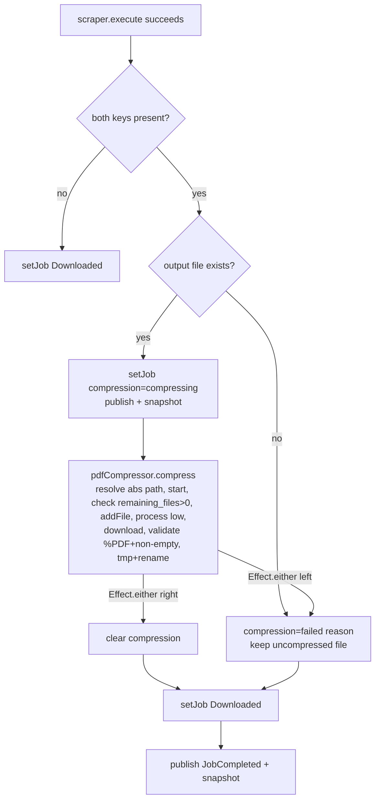

# iLovePDF Compress Downloads - Plan

## Goal Capsule

**Objective.** After a Scribd download produces its final merged PDF, compress it in place via the iLovePDF API when the user has configured valid API keys — with a visible per-job compression state across all clients.

**Product authority.** ce-brainstorm dialogue, 2026-07-04. Owner: Andrew Borisenko.

**Open blockers.** None. Both brainstorm-time Outstanding Questions are resolved (see Product Contract preservation note).

**Product Contract preservation.** Product Contract unchanged in intent. Two brainstorm-time forks resolved during planning: (1) settings-keys UI ships to **web + desktop + TUI** in v1 (full parity); (2) key inputs are **plain text, not masked**, which also settles the secret-key-exposure question — `GET /settings` returns both keys plainly (local self-use tool). One brainstorm assumption reversed by user during planning: the per-job compression state (`compressing` + a visible `failed` marker) is **in scope**, not silent.

---

## Product Contract

### Problem

Downloaded Scribd PDFs are large (page-per-PDF merges are not size-optimized). The user wants automatic compression using their own iLovePDF account, without leaving the app.

### Primary actor

The single local user running the engine (self-use tool). No multi-user or shared-account concerns.

### Desired outcome

When iLovePDF public + secret keys are set and valid, every **new** Scribd download lands as a compressed PDF at the same path/filename it would have had uncompressed. When keys are absent or invalid, downloads behave exactly as today.

### Requirements

- **R1.** Settings expose an iLovePDF **public key** and **secret key** (both plain-text inputs, no masking), persisted next to `outputFolder`.
- **R2.** Saving keys validates them against iLovePDF and surfaces valid/invalid in the settings UI.
- **R3.** When both keys are present and valid, each new download compresses its final PDF **in place** (same path/filename) at fixed `low` level (iLovePDF's least-aggressive, highest-quality setting), after the PDF is produced.
- **R4.** Compression is **best-effort**: any failure (network, quota, invalid-at-runtime) leaves the uncompressed PDF in place and the job still reaches `Downloaded`.
- **R5.** Each job shows a visible **`compressing`** indicator during the API call and a **persistent, visible failure marker** (reason shown inline; a tooltip may supplement but must not be the only delivery) when compression fails; the indicator clears on success. The failure marker is styled subordinate to the job's `Downloaded` status so a completed download is not misread as failed.
- **R6.** Keys entry and compression-state display reach the **web SPA, desktop (inherits web), and Ink TUI** in v1.
- **R7.** With empty keys, behavior is unchanged and **no iLovePDF API calls** are made.

### Out of scope

- Re-compressing files downloaded before keys were set (new downloads only; no batch/manual re-compress).
- A compression-level selector, or `extreme`/`low` modes.
- Keeping both the original and compressed files (compressed replaces original).
- Masking or encrypting stored keys.
- Any feature whose purpose is bypassing paywalls/DRM/ToS.

### Success criteria

- Valid keys set → the next Scribd download's output file is a compressed PDF, smaller than the pre-compression merge, at the same path and filename.
- Invalid keys → settings UI shows invalid; downloads still complete successfully, uncompressed.
- Empty keys → current behavior unchanged; zero iLovePDF API calls.
- During compression the job shows a `compressing` indicator; on failure it shows a visible failure marker with the reason, while the job still reaches `Downloaded` with the uncompressed PDF intact.

---

## Key Technical Decisions

- **KTD1 — Compress in the DownloadEngine worker, not in ScribdDownloader.** All three `execute` branches (slideshow, single-dimension, multi-dimension) converge on one `pdfPath` (`packages/engine/src/service/ScribdDownloader.ts:482`). Compressing in the worker after `scraper.execute` succeeds is a single insertion site, is scraper-agnostic, and is where job status + compression events already live. The worker recomputes `pdfPath` via `resolvePdfPath` (already imported at `DownloadEngine.ts:7` for the enqueue file-exists check).
  - **Path-consistency risk (review finding).** The recompute matches the scraper's actual output path only because both call the same `resolvePdfPath` with the same title/id — an emergent invariant nothing enforces. If the scraper later gains collision handling (`file (1).pdf`) or any path tweak, the recompute silently targets a nonexistent file and every compress "fails" invisibly. **Guard:** before compressing, the worker checks the recomputed path exists; if not, it records `compression: { status: "failed", reason: "output file not found" }` rather than calling the API on a missing file. **More robust follow-up (deferred):** have `scraper.execute` surface its concrete written path (an event like `TitleResolved`, or a return value) so the worker compresses the authoritative path instead of re-deriving it — see Outstanding Questions.
- **KTD2 — `PdfCompressor` as a `Context.Tag` + `Layer` service.** Mirrors `PdfGenerator`/`PuppeteerSg`. Wraps `@ilovepdf/ilovepdf-nodejs`, fails into a tagged `CompressionFailed`, and is consumed best-effort (`Effect.either`) by the worker so it never fails the job. Testable by mocking at the Layer boundary — no singletons.
- **KTD3 — Best-effort via `Effect.either` in the worker.** Compression runs while status is `Downloading`; the final `setJob` to `Downloaded` carries a `compression: { status: "failed", reason }` field on failure or omits it on success. Job status is never `Failed` due to compression (R4).
- **KTD4 — Transient `compressing` is never persisted; terminal `failed` on a `Downloaded` job is.** `JobStore.parseJobLine` reconstructs each `Job` from a field whitelist, so a mid-flight `compressing` flag is dropped on read (and its job normalizes `Downloading`→`Queued` anyway). But a **terminal** `compression: { status: "failed" }` on a `Downloaded` job **is** persisted (review P2-5): otherwise a restart makes an uncompressed output look fully successful, hiding from the user that the file was never compressed. U4 extends `parseJobLine`/`write` to keep `compression` only when `status === "Downloaded" && compression.status === "failed"`; `compressing` is always dropped.
- **KTD9 — Compression is gated on last-known validity, not just non-empty keys.** R3/R7 require invalid keys to "behave exactly as today". Checking only that both keys are non-empty would make invalid keys fail compression on *every* download (a failure marker per job), which is not "as today". `ConfigStore` persists an `ilovepdfKeysValid` flag set from the `POST /settings` validation; the worker compresses only when both keys are non-empty **and** `ilovepdfKeysValid`. A runtime `CompressionFailed` mapped to "invalid credentials" flips the flag to `false` and persists it, so subsequent downloads silently skip (behave as today) and the settings UI reflects invalidity. On startup the persisted flag is trusted (no re-probe — avoids the KTD5 quota concern); a runtime 401 self-corrects it.
- **KTD5 — Validation probe = `newTask('compress').start()`.** Cheapest auth check with no file upload; the secret key signs a JWT locally and `start()` is the first network call. Error mapping: `AxiosError` 401 → invalid credentials, 402/429 → quota/rate-limit, `AxiosError` with no `.response` → network error. **Caveat (review):** a malformed secret key can throw during **local JWT signing** (also no `.response`) — treat a no-response throw whose message points at signing/JWT as "invalid credentials", not "network". `POST /settings` saves then probes and returns validity. **Resolved (post-impl):** the iLovePDF core lib returns `remaining_files` *from* `start()` and only decrements quota *at* `process()` — so a `start()`ed-but-unprocessed task (the validation probe) does **not** consume quota. Re-probing on every save is quota-safe; no caching needed. This same fact powers KTD11's pre-flight guard.
- **KTD8 — Atomic, validated write-back (review finding, 4 reviewers).** `Bun.write(absPath, bytes)` overwriting the sole PDF non-atomically can truncate/destroy the original on a partial write, crash, or a non-throwing bad response (empty/garbage 200) — directly violating R4's "leaves the uncompressed PDF in place". The compressor writes to `${absPath}.tmp`, asserts the bytes are non-empty and start with the `%PDF` magic header, then `fs.rename`s over the original — mirroring the existing `ConfigStore`/`JobStore` tmp+rename idiom. A failed assertion maps to `CompressionFailed` (best-effort), leaving the original intact.
- **KTD6 — CJS interop + absolute path.** `@ilovepdf/ilovepdf-nodejs` is CJS-only with the class as default export; import as `import ILovePDFApi from '@ilovepdf/ilovepdf-nodejs'` (guard `mod.default ?? mod` if needed under Bun). `ILovePDFFile` requires an absolute path, so the compressor `path.resolve`s `pdfPath` (the output folder can be relative, e.g. `"output"`). To avoid a brittle deep type import (`@ilovepdf/ilovepdf-js-core/tasks/CompressTask`), type the task structurally in the wrapper.
- **KTD7 — Keys returned plainly over the wire, under the existing localhost origin gate.** No masking requested; `GET /settings` returns `{ publicKey, secretKey, valid }`. The engine binds `127.0.0.1` and `HttpServerLive.ts` already restricts CORS to `tauri://localhost` plus any origin whose hostname is `localhost`/`127.0.0.1` (allowed methods GET/POST/DELETE/OPTIONS). The secret-returning route inherits exactly that gate — no additional auth. **Accepted tradeoff (review P1-3):** any process or page on the loopback interface can read both keys via `GET /settings`; for a single-user local tool this matches the deliberate plaintext-storage posture. Not tightened further; if multi-user hardening is ever needed, `/settings` would need same-origin enforcement or a local token, tracked as out of scope here.
- **KTD11 — Pre-flight quota guard via `start()`'s `remaining_files` (post-impl).** The iLovePDF core lib exposes `task.remainingFiles`, populated from the `{ remaining_files }` payload that `start()` returns; quota is only decremented at `process()`. After `start()` the compressor checks `typeof task.remainingFiles === "number" && task.remainingFiles <= 0` and, if so, throws a `QuotaExhaustedError` sentinel (mapped to the fixed reason "quota exceeded") **before** `addFile`/`process`/`download` — so an exhausted monthly allowance fails fast without wasting an upload, and the original PDF is left untouched (best-effort, R4). When the field is absent (e.g. unlimited plans) the check is skipped and compression proceeds. There is no cheaper standalone quota endpoint in the lib (`getInfo`/`credits`/`balance` do not exist); `start()` is the sole signal and is already the first call. Compression level is fixed at `low` (highest quality) rather than `recommended` — a product choice to prefer fidelity over maximum size reduction.
- **KTD10 — Third-party trust boundary and alternatives (review Residual-2/3).** Compression uploads the full PDF to iLovePDF and writes their response back over the original. The `%PDF`+non-empty check (KTD8) guards against *corruption* (truncated/empty/garbage), not against a syntactically-valid-but-malicious or content-altered PDF — full content-safety of third-party bytes is **out of scope** (the user opts into the third party by entering keys). iLovePDF was chosen because the user named it explicitly in the brainstorm; local alternatives (Ghostscript, `pdf-lib` re-encode) would avoid the upload and key management but were not selected — noted so the tradeoff is on record, not reopened here.

---

## High-Level Technical Design

Compression insertion point in the worker, after a successful scrape:

*Directional — prose and unit fields are authoritative.*

---

## Implementation Units

### U1. Wire contract: compression state + settings shapes

**Goal.** Extend the shared contract so compression state and settings cross the wire; every consumer break surfaces via TypeScript.

**Requirements.** R1, R5, R7.

**Dependencies.** None.

**Files.**
- `packages/shared/src/jobs.ts` — add `JobCompression = { status: "compressing" } | { status: "failed"; reason: string }`; add optional `compression?: JobCompression` to `Job`; add `JobCompressing` and `JobCompressionFailed` variants to the `JobEvent` union. (No `JobCompressionCleared` — on success the worker clears the field and the existing `JobCompleted` + snapshot already carry the cleared state; a separate cleared event would have no producer or consumer.)
- `packages/shared/src/http.ts` — add `SettingsResponse = { publicKey: string; secretKey: string; valid: boolean | null }`, `SettingsRequest = { publicKey: string; secretKey: string }`, and `SaveSettingsResponse = { valid: boolean }` (the `POST /settings` return shape — named so it is not duplicated ad hoc in the route and client).
- `packages/shared/src/client.ts` — add `fetchSettings(baseUrl): Promise<SettingsResponse>` and `saveSettings(baseUrl, req): Promise<SaveSettingsResponse>`.
- `apps/web/src/lib/api.ts` — re-export `fetchSettings`, `saveSettings`.

**Approach.** Compression field is authoritative in the snapshot; the new events are supplementary (web/TUI already re-fetch the snapshot on unrecognized events). `GET /settings` returns the **persisted last-known validity** (`ilovepdfKeysValid`, per KTD9): `valid: true`/`false` when keys have been validated, `null` only when never validated (empty keys). U6/U7 render `null` as a neutral "unverified" state distinct from `false`/invalid. Keep `saveSettings` symmetric with `setFolder`.

**Patterns to follow.** Existing `FolderRequest`/`FolderResponse` in `http.ts`; `fetchFolder`/`setFolder` in `client.ts`.

**Test scenarios.** `Test expectation: none — type-only + thin fetch wrappers; behavior is exercised by U5's HTTP tests and U6/U7 view tests.`

**Verification.** `bun run test` and typecheck pass across workspaces with the new fields referenced.

---

### U2. ConfigStore: persist iLovePDF keys

**Goal.** Store the public/secret keys alongside `outputFolder`, with backward-compatible reads.

**Requirements.** R1, R7.

**Dependencies.** U1.

**Files.**
- `packages/engine/src/service/ConfigStore.ts` — extend `Settings` with `ilovepdfPublicKey: string`, `ilovepdfSecretKey: string`, and `ilovepdfKeysValid: boolean` (KTD9); update `parseSettings`, `fallback`, and the `write` body.
- `packages/engine/test/ConfigStore.test.ts` — new scenarios.

**Approach.** Default both keys to `""` and `ilovepdfKeysValid` to `false`. `parseSettings` tolerates missing fields (coerce absent/non-string keys to `""`, absent/non-boolean valid to `false`) so an existing `settings.json` with only `outputFolder` still parses — do not fall back to defaults just because the new fields are absent. `write` serializes all four fields. **The file holds a credential — write it owner-only** (review): create the tmp file with mode `0o600` and `fs.chmod(filePath, 0o600)` after rename, so the secret key is not world-readable on a shared machine. This is a separate at-rest control from the deliberate no-encryption tradeoff (KTD7).

**Patterns to follow.** Existing `Settings`/`parseSettings`/atomic tmp+rename in the same file.

**Test scenarios.**
- Round-trips `outputFolder` + both keys + `ilovepdfKeysValid` through write→read.
- Legacy `settings.json` with only `outputFolder` reads back with empty keys and `ilovepdfKeysValid: false` (no data loss, no fallback to default folder). `Covers R7.`
- Malformed JSON falls back to defaults (empty keys, valid false) with a warning.
- Non-string key / non-boolean valid values coerce to `""` / `false` rather than throwing.
- After `write`, `settings.json` has mode `0o600` (owner-only).

**Verification.** `bun --cwd packages/engine test test/ConfigStore.test.ts` green.

---

### U3. PdfCompressor service + CompressionFailed error + dependency

**Goal.** An Effect service that compresses a PDF in place and validates keys, wrapping `@ilovepdf/ilovepdf-nodejs`.

**Requirements.** R2, R3, R4.

**Dependencies.** U1.

**Files.**
- `packages/engine/package.json` — add dependency `@ilovepdf/ilovepdf-nodejs` (`^0.3.1`).
- `packages/engine/src/errors/DomainErrors.ts` — add `CompressionFailed` tagged error (`path`, `reason`, `cause`).
- `packages/engine/src/service/PdfCompressor.ts` — new `Context.Tag` + `*Live` Layer.
- `packages/engine/test/PdfCompressor.test.ts` — new.

**Approach.** Service surface:
- `compress(pdfPath: string, keys: { publicKey: string; secretKey: string }): Effect<void, CompressionFailed>` — `path.resolve` the input, `newTask('compress')` → `start` → **pre-flight quota check (KTD11): if `task.remainingFiles` is a number `<= 0`, throw a `QuotaExhaustedError` sentinel (mapped to "quota exceeded") before uploading** → `addFile(new ILovePDFFile(absPath))` → `process({ compression_level: 'low' })` → `download()` (`Uint8Array`). **Then validate + atomic write (KTD8):** assert `bytes.length > 0` and the first bytes are the `%PDF` magic header; write to `${absPath}.tmp`; `fs.rename` over `absPath`. `addFile` reads the source bytes into memory before the rename, and tmp+rename means a partial write, crash, or bad (empty/garbage) 200 never corrupts the original. Wrap the chain in `Effect.tryPromise`, mapping any throw or failed assertion to `CompressionFailed`. The user-facing `reason` is a **fixed, sanitized string** — never raw `err.message` (review FYI-1): `err.response?.status` 401 → "invalid credentials", 402/429 → "quota exceeded", no response + JWT/signing message → "invalid credentials", other no-response → "network error", failed byte assertion → "invalid response from compressor", anything else → generic "compression failed". Raw library text is retained only on the scrubbed `cause` (never surfaced to clients), so provider internals can't leak into the UI.
- `validate(keys): Effect<boolean, never>` — `newTask('compress').start()` only; return `true` on success, `false` on any throw (never fails the channel).
- Import CJS default: `import ILovePDFApi from '@ilovepdf/ilovepdf-nodejs'` and `import ILovePDFFile from '@ilovepdf/ilovepdf-nodejs/ILovePDFFile'`. Inject the `ILovePDFApi` factory through the Layer (constructor function as a field) so tests substitute a fake without network. Type the task structurally (`{ start(): Promise<unknown>; addFile(f): Promise<unknown>; process(p): Promise<unknown>; download(): Promise<Uint8Array> }`) instead of deep-importing core types (KTD6).
- **CompressionFailed.cause must not leak the bearer token** (review): the raw `AxiosError.config.headers.Authorization` carries the JWT signed from the secret key. Store only a scrubbed cause (message + `response?.status`), never the raw error, so a `console.warn` of the cause cannot print the token.

**Execution note.** Mostly integration/config wiring; unit-test the Effect wrapper and error mapping against an injected fake API. **First verify the imports resolve under Bun** (`bun -e "import('@ilovepdf/ilovepdf-nodejs/ILovePDFFile')"`); the `./ILovePDFFile` deep subpath may not be in the package `exports` map — if it isn't, use the package's own re-export instead. Real-key end-to-end is a manual smoke check, not a CI test.

**Patterns to follow.** `packages/engine/src/utils/io/PdfGenerator.ts` (Effect wrapper over a PDF lib); `PuppeteerSg` for factory injection through a Layer.

**Test scenarios.**
- `compress` happy path: fake API returns valid `%PDF` bytes → tmp file written then renamed over the resolved absolute path; Effect succeeds. `Covers R3.`
- `compress` maps a thrown 401 to `CompressionFailed` with reason "invalid credentials". `Covers R4.`
- `compress` maps a thrown 402/429 to reason "quota exceeded".
- `compress` maps a no-`.response` network throw to reason "network error", and a no-`.response` JWT-signing throw to "invalid credentials".
- `compress` rejects empty/non-`%PDF` download bytes as `CompressionFailed` ("invalid response from compressor") and leaves the original file untouched (no rename). `Covers R4, KTD8.`
- On any compress failure, a pre-existing original file at `absPath` is byte-for-byte unchanged (tmp+rename never truncates it). `Covers R4, KTD8.`
- `compress` resolves a relative `pdfPath` (e.g. `output/x.pdf`) to an absolute path before constructing `ILovePDFFile`.
- `compress` aborts with reason "quota exceeded" and **never calls `addFile`** when `start()` reports `remainingFiles === 0`, leaving the original untouched; it proceeds (calls `addFile`) when `remainingFiles > 0`. `Covers KTD11, R4.`
- `CompressionFailed.cause` contains no `Authorization`/bearer token.
- `validate` returns `true` when `start()` resolves, `false` when it throws — never fails the Effect channel. `Covers R2.`

**Verification.** `bun --cwd packages/engine test test/PdfCompressor.test.ts` green; `@ilovepdf/ilovepdf-nodejs` imports cleanly under Bun.

---

### U4. DownloadEngine: best-effort compress + keys state

**Goal.** Run compression in the worker after a successful scrape, drive compression state, and hold/persist keys.

**Requirements.** R3, R4, R5, R7.

**Dependencies.** U2, U3.

**Files.**
- `packages/engine/src/service/DownloadEngine.ts` — add `PdfCompressor` to the Layer requirements; seed a `keysRef` from `configStore.read`; add `settings`/`setSettings` to the service; insert the best-effort compress block in the worker; extend `persistSettings` to write keys.
- `packages/engine/src/composition.ts` — add `PdfCompressorLive` to `EngineDeps` (the `Layer.mergeAll(...)` that provides `DownloadEngineLive`'s requirements); without this the engine will not compile once `DownloadEngine` gains the `PdfCompressor` requirement.
- `packages/engine/src/service/JobStore.ts` — persist terminal `failed` compression only (KTD4): `write` includes `compression` when `status === "Downloaded" && compression?.status === "failed"`; `parseJobLine` re-hydrates it under the same condition and drops it otherwise (so a stale `compressing` never survives).
- `packages/engine/test/DownloadEngine.test.ts` — new scenarios with a mock `PdfCompressor` Layer.

**Approach.** Seed `keysRef` from `configStore.read` as `{ publicKey, secretKey, valid }` (KTD9). In the worker, after `Exit.isSuccess(exit)` and before the final `setJob` to `Downloaded`: read `keysRef`; **compress only when both keys are non-empty AND `valid` is true** — empty or known-invalid keys skip entirely (R7 and "invalid keys behave as today", review P1-1). When eligible, recompute `pdfPath` via `resolvePdfPath({ folder, displayTitle: after.displayTitle, fallbackId: scribdIdFromUrl(after.url) ?? after.id })` reusing the worker's captured `folder` local (not a fresh `Ref.get(folderRef)`, so a mid-download folder change can't retarget the compressor). If the file does not exist, set `compression: { status: "failed", reason: "output file not found" }` and skip the API (KTD1 guard). Otherwise set `compression: { status: "compressing" }`, publish `JobCompressing` + snapshot, then `pdfCompressor.compress(pdfPath, keys)` under `Effect.either`. On `Left`, set `compression: { status: "failed", reason }`, publish `JobCompressionFailed`, and **if the reason is "invalid credentials" flip `keysRef.valid` to `false` and persist** (KTD9 self-correction); on `Right`, clear `compression`. Then `setJob` to `Downloaded` carrying the resolved `compression`. `setSettings(req)` writes keys to `configStore`, calls `PdfCompressor.validate`, persists the resulting `ilovepdfKeysValid`, updates `keysRef`, and returns the validation result for the route.

**Execution note.** Add the mock-compressor DownloadEngine test first to pin the best-effort contract before wiring the real service.

**Patterns to follow.** Existing worker exit handling and `folderRef`/`persistSettings`/`setOutputFolder` in the same file; `progress` drop logic in `JobStore.ts`.

**Test scenarios.**
- Keys set + valid + compress succeeds → job ends `Downloaded` with no `compression` field; `compress` called with the correct resolved path. `Covers R3.`
- Keys set + valid + compress fails → job still ends `Downloaded` with `compression.status === "failed"` and the mapped reason; status is never `Failed`. `Covers R4.`
- Keys present but `ilovepdfKeysValid === false` → `PdfCompressor.compress` is never invoked; job ends `Downloaded` unchanged (behaves as today). `Covers R7, KTD9.`
- Keys empty → `compress` never invoked; job ends `Downloaded` unchanged. `Covers R7.`
- Runtime "invalid credentials" failure flips persisted `ilovepdfKeysValid` to `false`; the next download skips compression. `Covers KTD9.`
- Keys valid but recomputed output path does not exist → `compress` not called; job ends `Downloaded` with reason "output file not found". `Covers KTD1.`
- `compressing` state is published/observable during the call (via snapshot before resolution). `Covers R5.`
- `setSettings` persists keys + validity and returns the validation result.
- A `Downloaded` job with `compression.status === "failed"` survives a JobStore write→read round-trip; a `compressing` flag does not. `Covers KTD4, P2-5.`

**Verification.** `bun --cwd packages/engine test test/DownloadEngine.test.ts` green.

---

### U5. Settings HTTP routes

**Goal.** Expose `GET /settings` and `POST /settings` (save + validate).

**Requirements.** R1, R2, R7.

**Dependencies.** U4.

**Files.**
- `packages/engine/src/server/routes.ts` — add `settingsGetRoute` and `settingsPostRoute`; mount in `router`.
- `packages/engine/test/server/HttpServer.test.ts` — new scenarios.

**Approach.** `GET /settings` → `{ publicKey, secretKey, valid }` where `valid` is the persisted `ilovepdfKeysValid` (boolean, or `null` when never validated) — KTD7/KTD9, keys returned plainly. `POST /settings` reads `{ publicKey, secretKey }`, calls `engine.setSettings`, returns `SaveSettingsResponse` (`{ valid: boolean }`). **Both-empty is a valid clear operation** (clears keys + resets validity to false, no validation call) — do not block it. **Exactly one key filled → incomplete:** `setSettings` skips the API and returns `{ valid: false }` (never probes a half-entered pair). The clients guard the one-filled case before submitting but must still allow the both-empty clear (U6/U7, review P1-2). **Security (KTD7, review P1-3):** `/settings` returns the secret under the same localhost origin gate as every other route — engine bound to `127.0.0.1`, CORS in `HttpServerLive.ts` limited to `tauri://localhost` + `localhost`/`127.0.0.1` origins. Add a code comment on the route noting it returns a credential and relies on that loopback gate; no stricter auth is added (accepted local-tool tradeoff).

**Patterns to follow.** `folderGetRoute`/`folderPostRoute` in the same file.

**Test scenarios.**
- `GET /settings` returns stored keys and `valid: null`. `Covers R1.`
- `POST /settings` with valid keys (mock validate → true) returns `{ valid: true }` and persists. `Covers R2.`
- `POST /settings` with invalid keys returns `{ valid: false }` and still persists the entered keys.
- `POST /settings` with empty keys clears them and makes no validation call. `Covers R7.`
- `POST /settings` with exactly one key filled returns `{ valid: false }` and makes no validation call.

**Verification.** `bun --cwd packages/engine test test/server/HttpServer.test.ts` green.

---

### U6. Web + desktop: settings UI and compression state

**Goal.** Let web/desktop users enter keys (plain text, with validity feedback) and see per-job compression state.

**Requirements.** R1, R2, R5, R6.

**Dependencies.** U1, U5.

**Files.**
- `apps/web/src/store.ts` — add `$settings` atom (`{ publicKey; secretKey; valid }`); add `"settings"` to `ModalMode`; include `compression` in `jobsShallowEqual`.
- `apps/web/src/engineClient.ts` — `loadSettings`/`saveSettings` commands using the U1 client fns; load settings on WS open (alongside `loadFolder`).
- `apps/web/src/views/settings-modal.ts` — new view (two plain-text inputs + Save, valid/invalid indicator), following `folder-modal.ts`.
- `apps/web/src/views/queue-item.ts` — render a `compressing` indicator and a failed error icon with a `title` tooltip carrying the reason.
- `apps/web/src/views/header.ts` — entry point to open the settings modal.
- `apps/web/src/main.ts` — wire the settings mount/subscription.
- `apps/web/src/styles.css` — styles for the new states.
- `apps/web/test/*` — Vitest for store equality + view rendering + settings save.

**Approach.** Mirror the folder-modal island pattern (module-level draft/error atoms, `$modal` mode switch). Inputs are plain `type="text"` (no masking, KTD7). Settings-UI validity has **four** states, not two (review): `null`/unknown → neutral "unverified" (shown on first open, since `GET /settings` returns `valid: null`), `validating` → spinner + disabled Save during the `POST /settings` round-trip, `valid`, `invalid`. **The modal stays open after Save** to show the result (unlike folder-modal's close-on-save) — dismissal is an explicit Close/Cancel; otherwise the validity indicator R2 requires would be dismissed the instant it renders. **Save is enabled when both keys are non-empty (validate) OR both are empty (clear); disabled only when exactly one is filled** (incomplete) — the both-empty clear path must not be blocked (review P1-2). Compression indicator keys off `job.compression`: `compressing` → spinner/label **that replaces the Downloading progress line** (gate `progressLine` on `!job.compression`, since compression runs while status is still `Downloading` per KTD3, else the row shows a full progress bar and a spinner at once); `failed` → a **persistent, visible** subordinate warning (an icon plus a short "compression failed, file kept" label rendered inline, `title=${job.compression.reason}` supplementing but not replacing the visible text — review P2-4), visually distinct from the job-level `Failed`/`reasonLine` styling so a `Downloaded` job is not misread as failed.

**Patterns to follow.** `apps/web/src/views/folder-modal.ts`, `queue-item.ts` (`progressLine`/`reasonLine`), `store.ts` `jobsShallowEqual`.

**Test scenarios.**
- `jobsShallowEqual` returns false when only `compression` differs (compressing vs cleared vs failed). `Covers R5.`
- `queueItem` renders the compressing indicator (and suppresses the progress line) when `compression.status === "compressing"`. `Covers R5.`
- `queueItem` renders the subordinate warning icon with the reason in a tooltip when `compression.status === "failed"`, distinct from `Failed`-status styling. `Covers R5.`
- Settings modal: first open shows the persisted validity (`unverified` when null); Save shows `validating` then resolves to valid/invalid and stays open. `Covers R2.`
- Save is disabled only when exactly one key is filled; enabled for both-filled and both-empty (clear). `Covers R1.`
- `queueItem` failure marker renders visible inline text (not tooltip-only). `Covers R5.`
- Settings inputs render key values as plain text (not masked). `Covers R1.`

**Verification.** `bun --filter @scribd-dl/web test` green; manual: open settings, enter keys, see validity, download shows compressing then settles.

---

### U7. TUI: settings popup and compression state

**Goal.** TUI parity — enter keys in a popup and see per-job compression state.

**Requirements.** R1, R2, R5, R6.

**Dependencies.** U1, U5.

**Files.**
- `apps/tui/src/tui/SettingsPopup.tsx` — new, following `ChangeFolderPopup.tsx` (two plain-text fields — public, secret — plus Cancel/Save, validity line).
- `apps/tui/src/tui/App.tsx` — a keybinding/mode to open the popup; call `saveSettings`; hold `$settings`-equivalent state.
- `apps/tui/src/tui/QueueItem.tsx` — render `compressing` (e.g. cyan "compressing…") and a failed marker with the reason line (mirroring the existing `Failed`/`Reason:` block).
- `apps/tui/src/hooks/useEngineState.ts` — surface settings + ensure snapshot updates carry `compression`.
- `apps/tui/src/tui/Header.tsx` — hint for the settings key.
- `apps/tui/test/*` — ink-testing-library coverage if present in the workspace.

**Approach.** Reuse `ChangeFolderPopup`'s `useInput` text-entry pattern for two fields (Tab cycles public → secret → cancel → save). Plain text, no masking (KTD7). The popup **stays open after Save** and renders the same four validity states as web (unverified/validating/valid/invalid) as a status line; Save acts on both-filled (validate) or both-empty (clear) and is inert only when exactly one field is filled (review P1-2). `QueueItem` reads `job.compression`: `compressing` → a marker (e.g. cyan "compressing…") shown **instead of** the progress bar (gate `showProgress` on `!job.compression`, since status is still `Downloading` per KTD3); `failed` → a subordinate warning line ("compression failed, file kept") — already an inline visible line (TUI has no hover), consistent with the web's visible-marker requirement (review P2-4) — visually distinct from the existing red `Failed`/`Reason:` block so a `Downloaded` job is not misread as failed.

**Patterns to follow.** `apps/tui/src/tui/ChangeFolderPopup.tsx`, `QueueItem.tsx` status/reason rendering (`showProgress` gate, `Reason:` block), `App.tsx` popup wiring (`ChangeFolderPopup` import + mode at `App.tsx:196`).

**Test scenarios.**
- `QueueItem` renders a compressing marker (and no progress bar) when `compression.status === "compressing"`. `Covers R5.`
- `QueueItem` renders a subordinate failed marker + reason when `compression.status === "failed"`, distinct from `Failed` styling. `Covers R5.`
- Settings popup accepts two plain-text fields, guards only single-field entry (allows both-empty clear), and calls `saveSettings` on Save. `Covers R1.`
- Popup stays open after Save and renders unverified → validating → valid/invalid. `Covers R2.`

**Verification.** `bun run tui` manual: open settings, enter keys, see validity; a download shows compressing then settles. Workspace tests green.

---

## Outstanding Questions

- **~~Does a `start()`ed-but-unprocessed iLovePDF task consume monthly quota?~~ RESOLVED (post-impl).** The `@ilovepdf/ilovepdf-js-core` `Task.start()` returns `{ task, server, remaining_files }` and populates `task.remainingFiles`; quota is decremented at `process()`, not `start()`. A started-but-unprocessed task (the validation probe and any pre-flight check) does **not** consume quota, so re-probing on every `POST /settings` is safe and no validity caching is required. This also enabled the KTD11 pre-flight guard. A real-account smoke check remains the only end-to-end confirmation, but the library source is unambiguous.
- **Should the scraper propagate its written path instead of the worker re-deriving it?** KTD1 adds a file-exists guard as the near-term safety net, but the more robust design has `scraper.execute` surface its concrete output path (event or return value) so no re-derivation invariant exists. Deferred as a follow-up refactor; adopt if scraper path logic ever diverges from `resolvePdfPath`.
- **What are iLovePDF's retention/deletion guarantees for uploaded PDFs?** (review Deferred-3) Compression uploads the full document to a third party (KTD10). Their retention window and deletion policy govern how long user content persists on iLovePDF servers — per their ToS, not verified here. Worth surfacing to the user in the settings UI copy (a one-line "documents are uploaded to iLovePDF for compression" notice) so opting in is informed; the exact policy text is out of scope for this plan.

---

## Scope Boundaries

**In scope.** R1–R7 as specified across U1–U7.

**Deferred to Follow-Up Work.**
- Batch/manual re-compression of previously downloaded files (including a manual retry of a `failed` compression).
- Compression-level selector (`low`/`extreme`).
- Background re-validation of stored keys on startup (current design trusts the persisted validity flag and self-corrects on a runtime 401).

**Out of this product's identity.** Any paywall/DRM/ToS-bypass behavior (per `README.md` legal scope).

---

## Verification Contract

- `bun run lint` and `bun run format:check` pass.
- `bun run test` green across workspaces (engine `bun:test` + web Vitest), including the new ConfigStore, PdfCompressor, DownloadEngine, and HttpServer scenarios.
- `@ilovepdf/ilovepdf-nodejs` imports and runs under Bun (CJS interop).
- Manual smoke: with valid keys, a Scribd download produces a smaller PDF at the same path; with invalid keys, settings shows invalid and the download still completes uncompressed; with empty keys, behavior is unchanged and no API calls occur.

## Definition of Done

- All U1–U7 units landed with their test scenarios implemented and green.
- Web, desktop (via web), and TUI can enter keys (plain text), clear keys (both-empty), and show persisted validity (unverified/valid/invalid).
- Per-job `compressing` and `failed` states render on all three surfaces, with the failure reason **visibly delivered** (not tooltip-only) and styled subordinate to `Downloaded`.
- Compression runs only for non-empty, last-known-valid keys; invalid keys behave as today (no per-download failure markers).
- A terminal `failed` compression survives an engine restart; a transient `compressing` does not.
- Compression is best-effort: no compression failure ever moves a job to `Failed`.
- No iLovePDF calls when keys are empty or known-invalid.

---

## Sources & Research

- **iLovePDF library API** (external research, open-source-librarian, 2026-07-04): `@ilovepdf/ilovepdf-nodejs@0.3.1`, CJS-only, class as default export. Auth JWT signed locally with the secret key; first network call at `task.start()`. Compress sequence `newTask('compress')` → `start` → `addFile(ILovePDFFile absPath)` → `process({compression_level})` → `download()` (`Uint8Array`). Validation probe = `start()` with no file. Errors surface as `AxiosError`; distinguish by `err.response?.status` (401 keys / 402·429 quota / no response = network).
  - Compress sample: https://github.com/ilovepdf/ilovepdf-nodejs/blob/0c8249496ccc5c655bf9bc9fcb077fff4c075026/src/samples/compress.ts
  - `CompressTask` params: https://github.com/ilovepdf/ilovepdf-js-core/blob/4794709b9b436c8b3fe8b126184d495cc74f736d/src/tasks/CompressTask.ts
  - JWT local signing: https://github.com/ilovepdf/ilovepdf-js-core/blob/4794709b9b436c8b3fe8b126184d495cc74f736d/src/auth/JWT.ts
  - `download()` → `Uint8Array`: https://github.com/ilovepdf/ilovepdf-js-core/blob/4794709b9b436c8b3fe8b126184d495cc74f736d/src/tasks/Task.ts#L172
  - `ILovePDFFile` (absolute path): https://github.com/ilovepdf/ilovepdf-js-core/blob/4794709b9b436c8b3fe8b126184d495cc74f736d/src/utils/ILovePDFFile.ts
- **Codebase grounding**: convergent `pdfPath` in `ScribdDownloader.ts:482`; worker exit handling in `DownloadEngine.ts`; `resolvePdfPath`/`scribdIdFromUrl` in `pdfPath.ts`; settings pattern in `ConfigStore.ts`; folder routes in `routes.ts`; web re-export shim `apps/web/src/lib/api.ts`; folder UI patterns in `folder-modal.ts` / `ChangeFolderPopup.tsx`.
